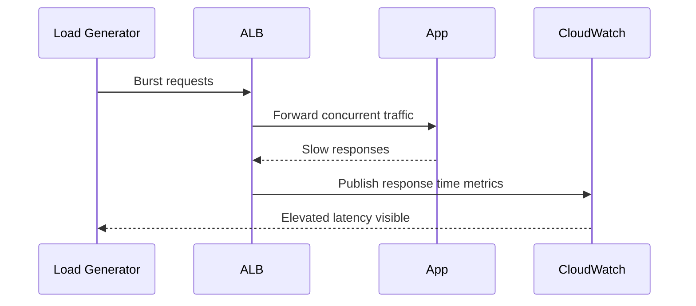

# Lab: High Latency Under Load

Create controlled request pressure that keeps the environment serving traffic but drives p95 latency and queueing high enough to practice saturation diagnosis.

## Lab Metadata
| Attribute | Value |
|---|---|
| Difficulty | Intermediate |
| Duration | 40 minutes |
| Tier | Load-balanced web server environment |
| Failure Mode | Application responds slowly under concurrent load, causing elevated latency and intermittent `Warning` health |
| Skills Practiced | CloudWatch metric interpretation, ALB latency correlation, access log review, scaling signal analysis |

## 1) Background
### 1.1 Why this lab exists
Latency incidents are often gradual rather than catastrophic. This lab builds the habit of proving saturation with metrics and logs before changing scaling settings.

### 1.2 Platform behavior model
As request concurrency rises, worker time, CPU, and connection pressure can push response time above the health model threshold. EB may remain available while reporting `Warning` or `Degraded` because the service is slow rather than down.

### 1.3 Diagram (Mermaid)


## 2) Hypothesis
### 2.1 Original hypothesis
High latency is caused by application saturation under concurrent load rather than networking failure.

### 2.2 Causal chain
Increased load -> longer application processing time -> ALB target response time rises -> EB health moves to `Warning` or `Degraded` -> users experience slow responses.

### 2.3 Proof criteria
- CloudWatch metrics show increased response time and request count during the trigger window.
- Access logs confirm slow but successful responses.
- Instance CPU or request backlog rises with the same timing.

### 2.4 Disproof criteria
- Latency rises without load or resource pressure, suggesting downstream dependency or network path failure instead.

## 3) Runbook
1. Deploy the healthy baseline and record normal latency.

```bash
eb deploy "$ENV_NAME" --staged
aws cloudwatch get-metric-statistics \
    --namespace AWS/ApplicationELB \
    --metric-name TargetResponseTime \
    --dimensions Name=LoadBalancer,Value="$LOAD_BALANCER_DIMENSION" \
    --statistics Average \
    --extended-statistics p95 \
    --start-time 2026-04-07T03:00:00Z \
    --end-time 2026-04-07T03:15:00Z \
    --period 60
```

2. Trigger controlled load.

```bash
bash "trigger.sh"
```

3. Watch health and ALB metrics during the test.

```bash
aws elasticbeanstalk describe-environment-health \
    --environment-name "$ENV_NAME" \
    --attribute-names Status Color Causes ApplicationMetrics

aws cloudwatch get-metric-statistics \
    --namespace AWS/ApplicationELB \
    --metric-name RequestCount \
    --dimensions Name=LoadBalancer,Value="$LOAD_BALANCER_DIMENSION" \
    --statistics Sum \
    --start-time 2026-04-07T03:15:00Z \
    --end-time 2026-04-07T03:30:00Z \
    --period 60
```

4. Collect access and application evidence.

```bash
eb logs --environment-name "$ENV_NAME" --all
sudo less /var/log/nginx/access.log
sudo less /var/log/web.stdout.log
```

5. Query access logs with Logs Insights if streaming is enabled.

```bash
aws logs start-query \
    --log-group-name "/aws/elasticbeanstalk/$ENV_NAME/var/log/nginx/access.log" \
    --start-time 1712477700 \
    --end-time 1712481300 \
    --query-string 'fields @timestamp, @message | filter @message like /GET/ | sort @timestamp desc | limit 50'
```

## 4) Experiment Log
| Time (UTC) | Observation | Evidence |
|---|---|---|
| 13:00 | Baseline latency remains low | CloudWatch `TargetResponseTime` |
| 13:05 | Load generator starts sustained concurrency | `trigger.sh` output |
| 13:09 | p95 latency and request count rise together | CloudWatch metrics |
| 13:12 | EB health shifts to `Warning` | `describe-environment-health` |
| 13:15 | Access logs show slower completion times but mostly successful requests | access logs |

## Expected Evidence
### Before Trigger (Baseline)
- Low average and p95 response time.
- Health is `Ok`.

### During Incident
- Request count and target response time rise together.
- Health causes mention elevated latency.
- Access logs show long request durations rather than immediate connection failures.

### After Recovery
- Removing load returns latency to baseline.
- Health returns to `Ok` without infrastructure changes.

### Evidence Timeline (Mermaid sequence diagram)


### Evidence Chain: Why This Proves the Hypothesis
When request volume rises, latency rises in lockstep and then falls after the load stops. That temporal relationship, combined with slow-successful access log entries, supports a saturation explanation rather than a binary failure such as a routing or certificate issue.

## Clean Up
```bash
eb terminate "$ENV_NAME"
aws cloudformation delete-stack --stack-name "$STACK_NAME" --region "$AWS_REGION"
```

## Related Playbook
- [High Latency Under Load](../playbooks/performance/high-latency-under-load.md)

## See Also
- [Hands-on Labs](./index.md)
- [CPU and Memory Exhaustion](./cpu-memory-exhaustion.md)
- [Instance Degraded Health](./instance-degraded-health.md)

## Sources
- [Monitoring Elastic Beanstalk environment metrics with Amazon CloudWatch](https://docs.aws.amazon.com/elasticbeanstalk/latest/dg/health-enhanced-cloudwatch.html)
- [Enhanced health reporting](https://docs.aws.amazon.com/elasticbeanstalk/latest/dg/health-enhanced.html)
- [CloudWatch Logs Insights query syntax](https://docs.aws.amazon.com/AmazonCloudWatch/latest/logs/CWL_QuerySyntax.html)
- [Elastic Beanstalk logs](https://docs.aws.amazon.com/elasticbeanstalk/latest/dg/using-features.logging.html)
