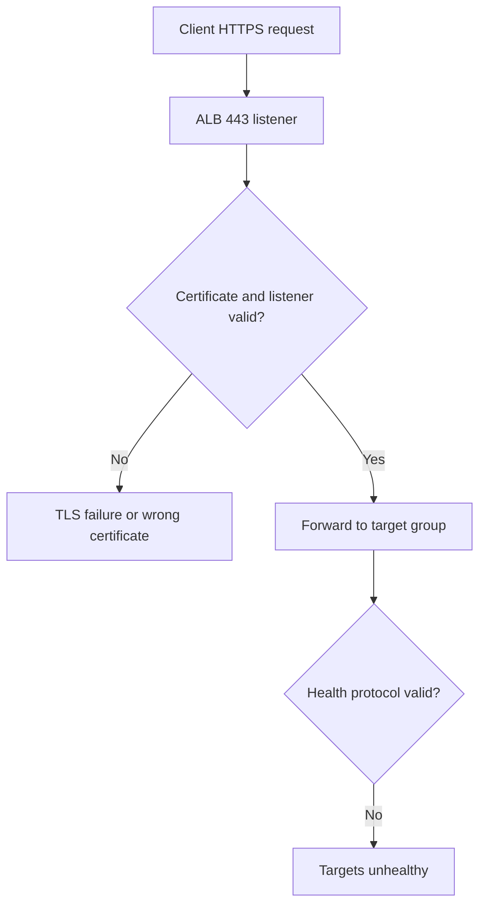
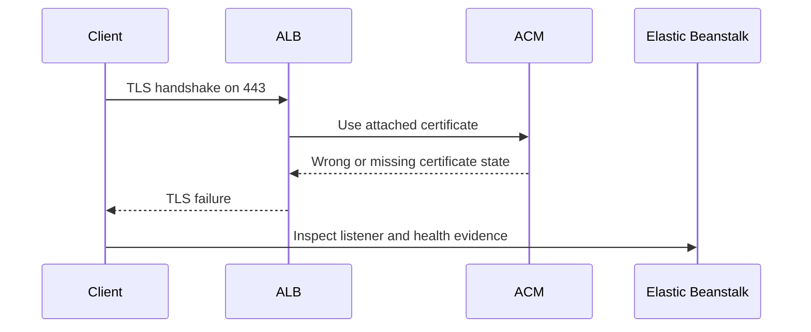

# Lab: HTTPS Termination Issues

Reproduce a TLS failure on the Elastic Beanstalk load balancer by attaching incomplete HTTPS configuration and then prove which part of the termination path is broken.

## Lab Metadata
| Attribute | Value |
|---|---|
| Difficulty | Intermediate |
| Duration | 40 minutes |
| Tier | Load-balanced web server environment |
| Failure Mode | HTTPS listener, certificate, or redirect configuration prevents successful TLS access |
| Skills Practiced | ACM certificate inspection, ALB listener review, redirect validation, backend health protocol checks |

## 1) Background
### 1.1 Why this lab exists
HTTPS incidents mix certificate, listener, and health-check concerns. This lab teaches how to separate those layers and prove the exact termination failure point.

### 1.2 Platform behavior model
In a standard EB web environment, TLS normally terminates at the load balancer. EB depends on a valid ACM certificate, correct listener actions, and backend health checks that still match the application after HTTPS-related changes.

### 1.3 Diagram (Mermaid)


## 2) Hypothesis
### 2.1 Original hypothesis
HTTPS fails because the TLS termination path is incomplete or misconfigured at the load balancer.

### 2.2 Causal chain
Wrong certificate or listener rule -> TLS handshake or routing fails -> clients cannot use HTTPS reliably -> optional redirect or health protocol problems amplify impact.

### 2.3 Proof criteria
- ACM or listener inspection reveals a missing or wrong configuration.
- HTTPS request fails while HTTP may still work.
- Fixing the listener or certificate restores successful TLS access.

### 2.4 Disproof criteria
- Certificate and listeners are correct, and failures instead come from backend application behavior or DNS outside the EB stack.

## 3) Runbook
1. Deploy the baseline environment and capture healthy HTTP behavior.

```bash
eb deploy "$ENV_NAME" --staged
curl --silent --show-error --location "http://$HOSTNAME/"
```

2. Trigger the broken HTTPS configuration.

```bash
bash "trigger.sh"
```

3. Inspect certificate and listener state.

```bash
aws acm describe-certificate --certificate-arn "$CERTIFICATE_ARN"
aws elbv2 describe-listeners --load-balancer-arn "$LOAD_BALANCER_ARN"
aws elbv2 describe-rules --listener-arn "$HTTP_LISTENER_ARN"
```

4. Validate target group health after the TLS change.

```bash
aws elbv2 describe-target-groups --target-group-arns "$TARGET_GROUP_ARN"
aws elbv2 describe-target-health --target-group-arn "$TARGET_GROUP_ARN"
aws elasticbeanstalk describe-environment-health \
    --environment-name "$ENV_NAME" \
    --attribute-names Status Color Causes
```

5. Test HTTP and HTTPS outcomes explicitly.

```bash
curl --silent --show-error --location "http://$HOSTNAME/"
curl --silent --show-error --location "https://$HOSTNAME/"
```

## 4) Experiment Log
| Time (UTC) | Observation | Evidence |
|---|---|---|
| 18:00 | Baseline HTTP path works | curl output |
| 18:06 | Broken HTTPS configuration applied | `trigger.sh` output |
| 18:09 | HTTPS request fails or returns wrong certificate | curl/TLS output |
| 18:11 | Listener or ACM inspection reveals mismatch | `describe-listeners`, `describe-certificate` |
| 18:16 | Fixing listener or certificate restores HTTPS | retest output |

## Expected Evidence
### Before Trigger (Baseline)
- HTTP access works.
- Target health is healthy.

### During Incident
- HTTPS handshake or routing fails.
- Listener, certificate, or redirect evidence shows the misconfiguration.
- Depending on the change, EB health may remain `Ok` or shift to `Warning` if target health also breaks.

### After Recovery
- HTTPS requests succeed with the correct certificate.
- Redirect and health checks behave as intended.

### Evidence Timeline (Mermaid sequence diagram)


### Evidence Chain: Why This Proves the Hypothesis
The failure appears at the entry point before the request can complete normally. Certificate and listener inspection reveal the broken termination configuration, and correcting that configuration restores HTTPS without changing the application bundle.

## Clean Up
```bash
eb terminate "$ENV_NAME"
aws cloudformation delete-stack --stack-name "$STACK_NAME" --region "$AWS_REGION"
```

## Related Playbook
- [HTTPS Termination Issues](../playbooks/networking/https-termination-issues.md)

## See Also
- [Hands-on Labs](./index.md)
- [Load Balancer 5xx](./load-balancer-5xx.md)
- [VPC Connectivity Issues](./vpc-connectivity-issues.md)

## Sources
- [Configuring HTTPS termination at the load balancer](https://docs.aws.amazon.com/elasticbeanstalk/latest/dg/configuring-https-elb.html)
- [AWS Certificate Manager public certificates](https://docs.aws.amazon.com/acm/latest/userguide/acm-public-certificates.html)
- [Application Load Balancer listeners](https://docs.aws.amazon.com/elasticloadbalancing/latest/application/load-balancer-listeners.html)
- [Application Load Balancer listener rules](https://docs.aws.amazon.com/elasticloadbalancing/latest/application/listener-rules.html)
