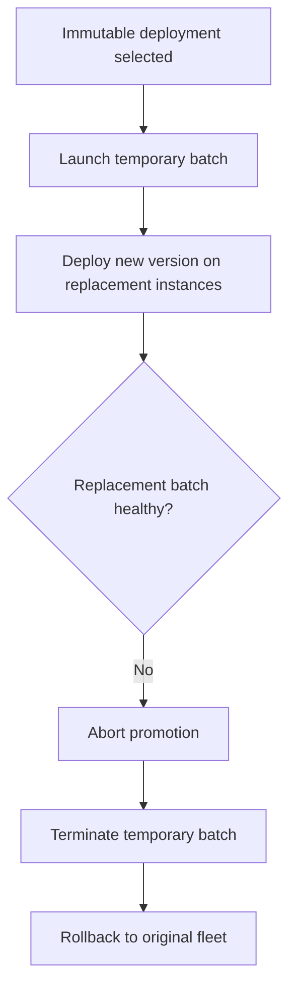
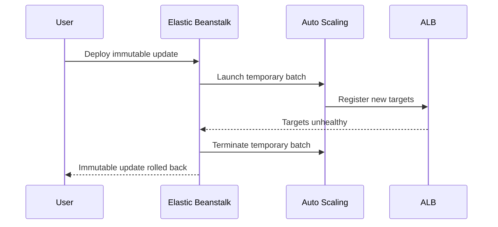

# Lab: Immutable Update Rollback

Practice diagnosing an immutable deployment that launches a replacement batch but rolls back before promotion because the new instances never pass health checks.

## Lab Metadata
| Attribute | Value |
|---|---|
| Difficulty | Advanced |
| Duration | 45 minutes |
| Tier | Load-balanced web server environment |
| Failure Mode | Immutable deployment replacement batch stays unhealthy and EB aborts promotion |
| Skills Practiced | Deployment policy analysis, batch health verification, Auto Scaling activity review, rollback interpretation |

## 1) Background
### 1.1 Why this lab exists
Immutable deployments reduce blast radius but consume extra capacity and depend on replacement instances becoming healthy. This lab teaches how to prove why the replacement batch never became promotable.

### 1.2 Platform behavior model
During an immutable update, EB launches a temporary Auto Scaling group, deploys the new version there, and waits for healthy instances before switching traffic. If that batch remains unhealthy, EB discards it and preserves the old fleet.

### 1.3 Diagram (Mermaid)


## 2) Hypothesis
### 2.1 Original hypothesis
The immutable update rolls back because replacement instances start, but the new application version never becomes healthy enough for promotion.

### 2.2 Causal chain
Immutable policy -> extra instances launched -> bad version on temporary batch -> target health never stabilizes -> EB aborts immutable update -> original instances remain in service.

### 2.3 Proof criteria
- Deployment policy shows `Immutable`.
- Auto Scaling and EB events show temporary replacement capacity creation and later termination.
- Target health for the replacement batch is unhealthy until rollback.

### 2.4 Disproof criteria
- Replacement batch becomes healthy and rollback instead results from quota, launch, or unrelated control-plane failure.

## 3) Runbook
1. Confirm immutable deployment policy.

```bash
aws elasticbeanstalk describe-configuration-settings \
    --application-name "$APP_NAME" \
    --environment-name "$ENV_NAME"
```

2. Deploy the failing immutable update.

```bash
bash "trigger.sh"
eb deploy "$ENV_NAME" --staged
```

3. Watch EB events and scaling activities.

```bash
eb events --environment-name "$ENV_NAME" --all

aws autoscaling describe-scaling-activities \
    --auto-scaling-group-name "$ASG_NAME" \
    --max-items 50
```

4. Validate replacement batch health.

```bash
aws elbv2 describe-target-health --target-group-arn "$TARGET_GROUP_ARN"
aws elasticbeanstalk describe-environment-health \
    --environment-name "$ENV_NAME" \
    --attribute-names Status Color Causes InstancesHealth
```

5. Inspect deployment logs from one failed replacement instance.

```bash
eb logs --environment-name "$ENV_NAME" --all
sudo less /var/log/eb-engine.log
sudo less /var/log/web.stdout.log
```

## 4) Experiment Log
| Time (UTC) | Observation | Evidence |
|---|---|---|
| 11:00 | Environment configured for immutable updates | `describe-configuration-settings` |
| 11:05 | Temporary instances launch for replacement batch | `describe-scaling-activities` |
| 11:11 | Replacement targets remain unhealthy | `describe-target-health` |
| 11:14 | EB aborts immutable update and terminates new batch | `eb events` |
| 11:18 | Original fleet still serves traffic and health returns to `Ok` | `describe-environment-health` |

## Expected Evidence
### Before Trigger (Baseline)
- Existing instances are healthy.
- Current deployment policy is immutable.

### During Incident
- Temporary capacity appears in Auto Scaling activities.
- New targets do not pass health checks.
- EB event stream reports immutable rollback or abort.

### After Recovery
- Temporary instances disappear.
- Original version remains active.
- Environment health returns to its pre-change state.

### Evidence Timeline (Mermaid sequence diagram)


### Evidence Chain: Why This Proves the Hypothesis
The environment only rolls back after the replacement batch fails health evaluation. Auto Scaling evidence proves the extra immutable capacity existed, and ALB plus EB health evidence proves that the replacement fleet, not the original fleet, was the failing component.

## Clean Up
```bash
eb terminate "$ENV_NAME"
aws cloudformation delete-stack --stack-name "$STACK_NAME" --region "$AWS_REGION"
```

## Related Playbook
- [Immutable Update Rolled Back](../playbooks/deployment-availability/immutable-update-rollback.md)

## See Also
- [Hands-on Labs](./index.md)
- [Deployment Failure](./deployment-failure.md)
- [Environment Launch Failed](./environment-launch-failed.md)

## Sources
- [Deployment policies and settings](https://docs.aws.amazon.com/elasticbeanstalk/latest/dg/using-features.rolling-version-deploy.html)
- [Enhanced health for Elastic Beanstalk](https://docs.aws.amazon.com/elasticbeanstalk/latest/dg/health-enhanced.html)
- [Application Load Balancer target group health checks](https://docs.aws.amazon.com/elasticloadbalancing/latest/application/target-group-health-checks.html)
- [Elastic Beanstalk logs](https://docs.aws.amazon.com/elasticbeanstalk/latest/dg/using-features.logging.html)
