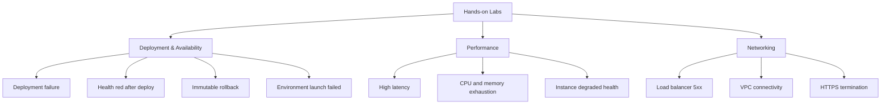

# Hands-on Labs

CloudFormation-based reproduction environments for each troubleshooting scenario.



## How Labs Work

1. `template.yaml` — CloudFormation template
2. `app/` — Application code to reproduce symptom
3. `trigger.sh` — Script to trigger the symptom
4. `verify.sh` — Script to verify signals
5. Documentation page

## Available Labs

### Deployment & Availability

| Lab | Symptom | Related Playbook |
|---|---|---|
| [Deployment Failure](./deployment-failure.md) | Application version deploy fails and EB rolls back | [Deployment Failed and Environment Rolled Back](../playbooks/deployment-availability/deployment-failed.md) |
| [Health Red After Deploy](./health-red-after-deploy.md) | Deploy completes but environment turns `Severe` or `Degraded` | [Health Turns Red After Successful Deploy](../playbooks/deployment-availability/health-red-after-deploy.md) |
| [Immutable Update Rollback](./immutable-update-rollback.md) | Immutable deployment cannot promote replacement batch | [Immutable Update Rolled Back](../playbooks/deployment-availability/immutable-update-rollback.md) |
| [Environment Launch Failed](./environment-launch-failed.md) | New environment cannot finish launch workflow | [Environment Launch Failed](../playbooks/deployment-availability/environment-launch-failed.md) |

### Performance

| Lab | Symptom | Related Playbook |
|---|---|---|
| [High Latency Under Load](./high-latency-under-load.md) | p95 latency rises sharply during load surge | [High Latency Under Load](../playbooks/performance/high-latency-under-load.md) |
| [CPU and Memory Exhaustion](./cpu-memory-exhaustion.md) | Sustained saturation causes slow requests and process restarts | [CPU and Memory Exhaustion](../playbooks/performance/cpu-memory-exhaustion.md) |
| [Instance Degraded Health](./instance-degraded-health.md) | One or more instances remain `Degraded` while environment still serves traffic | [Instance Degraded Health](../playbooks/performance/instance-degraded-health.md) |

### Networking

| Lab | Symptom | Related Playbook |
|---|---|---|
| [Load Balancer 5xx](./load-balancer-5xx.md) | ALB returns `502` or `504` while instances appear to run | [Load Balancer Returns 5xx Errors](../playbooks/networking/load-balancer-5xx.md) |
| [VPC Connectivity Issues](./vpc-connectivity-issues.md) | EB instances cannot reach dependencies or required endpoints | [VPC Connectivity Issues](../playbooks/networking/vpc-connectivity-issues.md) |
| [HTTPS Termination Issues](./https-termination-issues.md) | TLS listener, certificate, or redirect path is broken | [HTTPS Termination Issues](../playbooks/networking/https-termination-issues.md) |

## Prerequisites

- AWS account with permission to create Elastic Beanstalk, CloudFormation, EC2, Auto Scaling, Elastic Load Balancing, IAM, and CloudWatch resources
- AWS CLI configured for the target account and region
- EB CLI installed for application packaging and environment operations
- Bash shell for `trigger.sh` and `verify.sh`

## General Workflow

```bash
export LAB_NAME="deployment-failure"
export AWS_REGION="ap-northeast-2"
export STACK_NAME="eb-lab-${LAB_NAME}"
export APP_NAME="eb-lab-${LAB_NAME}"
export ENV_NAME="eb-lab-${LAB_NAME}-env"

aws cloudformation deploy \
    --stack-name "$STACK_NAME" \
    --template-file "template.yaml" \
    --capabilities CAPABILITY_NAMED_IAM \
    --region "$AWS_REGION"

eb init "$APP_NAME" \
    --platform "Python 3.11 running on 64bit Amazon Linux 2023" \
    --region "$AWS_REGION"

eb deploy "$ENV_NAME" --staged

bash "trigger.sh"
bash "verify.sh"

eb events --environment-name "$ENV_NAME" --all
eb logs --environment-name "$ENV_NAME" --all
```

!!! warning
    These labs intentionally create unhealthy or broken Elastic Beanstalk environments.
    Stop the lab after collecting evidence.
    Load balancers, EC2 instances, NAT gateways, and CloudWatch log ingestion can generate cost until you delete the stack and terminate the environment.

## See Also

- [Troubleshooting Hub](../index.md)
- [Troubleshooting Playbooks Hub](../playbooks/index.md)
- [Decision Tree](../decision-tree.md)
- [Troubleshooting Method](../methodology/troubleshooting-method.md)

## Sources

-    https://docs.aws.amazon.com/elasticbeanstalk/latest/dg/troubleshooting.html
-    https://docs.aws.amazon.com/AWSCloudFormation/latest/UserGuide/Welcome.html
-    https://docs.aws.amazon.com/elasticbeanstalk/latest/dg/using-features.logging.html
