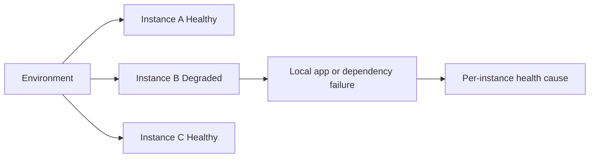
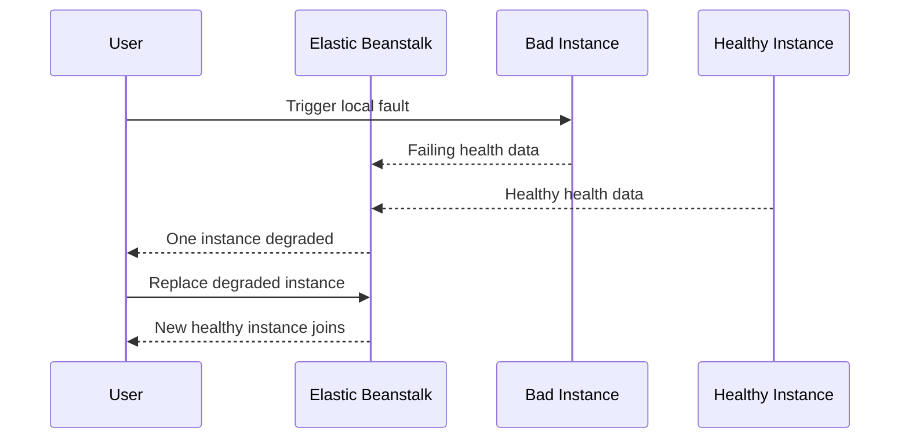

# Lab: Instance Degraded Health

Reproduce a partial-fleet problem where one Elastic Beanstalk instance remains `Degraded` while the environment still has enough healthy capacity to serve traffic.

## Lab Metadata
| Attribute | Value |
|---|---|
| Difficulty | Intermediate |
| Duration | 35 minutes |
| Tier | Load-balanced web server environment |
| Failure Mode | One instance reports degraded health because of repeated local failures while peers stay healthy |
| Skills Practiced | Instance-level health cause analysis, per-instance log comparison, replacement decision making |

## 1) Background
### 1.1 Why this lab exists
Fleet-wide dashboards can hide single-instance issues. This lab builds the habit of drilling from environment health to instance health before scaling or redeploying unnecessarily.

### 1.2 Platform behavior model
Enhanced health tracks both environment and individual instance conditions. If one node has repeated local failures, EB can mark that node `Degraded` or `Severe` while the environment remains partially available.

### 1.3 Diagram (Mermaid)


## 2) Hypothesis
### 2.1 Original hypothesis
One instance is degraded because its local application behavior differs from the rest of the fleet.

### 2.2 Causal chain
Localized fault on one instance -> repeated health check or app failures on that node -> instance health becomes `Degraded` -> environment remains available because other nodes stay healthy.

### 2.3 Proof criteria
- `describe-environment-health` shows per-instance health divergence.
- The degraded instance has different logs or health cause details than healthy peers.
- Replacing the bad instance clears the symptom.

### 2.4 Disproof criteria
- All instances exhibit the same failure, meaning the issue is environment-wide rather than instance-local.

## 3) Runbook
1. Deploy the baseline lab environment.

```bash
eb deploy "$ENV_NAME" --staged
```

2. Trigger a failure path on only one instance.

```bash
bash "trigger.sh"
```

3. Review instance-level health.

```bash
aws elasticbeanstalk describe-environment-health \
    --environment-name "$ENV_NAME" \
    --attribute-names Status Color Causes InstancesHealth
```

4. Compare logs from degraded and healthy nodes.

```bash
eb logs --environment-name "$ENV_NAME" --all
sudo less /var/log/eb-activity.log
sudo less /var/log/web.stdout.log
```

5. Force instance replacement and confirm recovery.

```bash
aws autoscaling terminate-instance-in-auto-scaling-group \
    --instance-id "$INSTANCE_ID" \
    --should-decrement-desired-capacity false
```

## 4) Experiment Log
| Time (UTC) | Observation | Evidence |
|---|---|---|
| 15:00 | Fleet starts healthy | `describe-environment-health` |
| 15:06 | Single-instance trigger applied | `trigger.sh` output |
| 15:10 | One instance moves to `Degraded`, peers remain healthy | `InstancesHealth` output |
| 15:13 | Degraded node logs differ from healthy nodes | `eb logs` bundle |
| 15:20 | Replacing the bad instance restores full `Ok` state | Auto Scaling replacement evidence |

## Expected Evidence
### Before Trigger (Baseline)
- All instances report healthy.
- No divergent health causes.

### During Incident
- One node shows `Degraded` or `Severe`.
- Its logs contain unique errors or failing requests.
- Other nodes continue to serve healthy responses.

### After Recovery
- Replacement node joins and becomes healthy.
- Environment health returns to all-healthy capacity.

### Evidence Timeline (Mermaid sequence diagram)


### Evidence Chain: Why This Proves the Hypothesis
The environment remains partially healthy while one instance diverges. That split, plus the unique logs on the failing node and recovery after replacement, demonstrates a localized instance problem instead of a platform-wide issue.

## Clean Up
```bash
eb terminate "$ENV_NAME"
aws cloudformation delete-stack --stack-name "$STACK_NAME" --region "$AWS_REGION"
```

## Related Playbook
- [Instance Degraded Health](../playbooks/performance/instance-degraded-health.md)

## See Also
- [Hands-on Labs](./index.md)
- [CPU and Memory Exhaustion](./cpu-memory-exhaustion.md)
- [Health Red After Deploy](./health-red-after-deploy.md)

## Sources
- [Environment health monitoring in Elastic Beanstalk](https://docs.aws.amazon.com/elasticbeanstalk/latest/dg/health-enhanced-status.html)
- [Enhanced health reporting](https://docs.aws.amazon.com/elasticbeanstalk/latest/dg/health-enhanced.html)
- [Elastic Beanstalk logs](https://docs.aws.amazon.com/elasticbeanstalk/latest/dg/using-features.logging.html)
- [Auto Scaling instance replacement](https://docs.aws.amazon.com/autoscaling/ec2/userguide/ec2-auto-scaling-health-checks.html)
