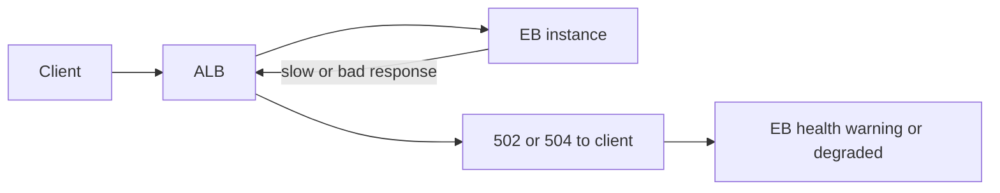
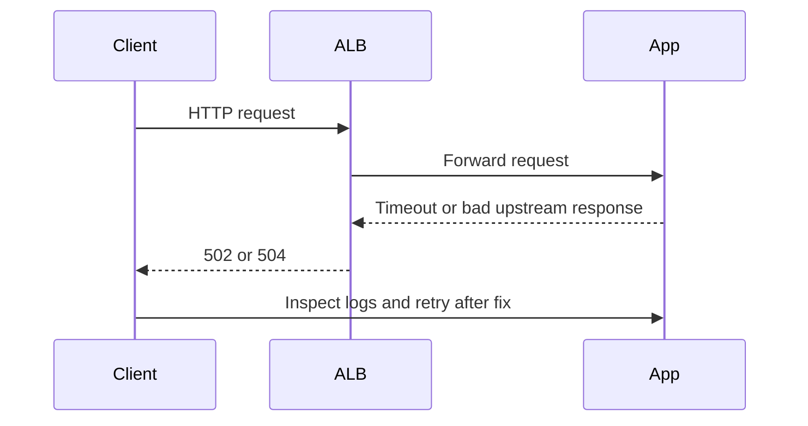

# Lab: Load Balancer 5xx

Reproduce a case where the Application Load Balancer returns `502` or `504` because the backend instances respond incorrectly or too slowly to complete the request.

## Lab Metadata
| Attribute | Value |
|---|---|
| Difficulty | Intermediate |
| Duration | 40 minutes |
| Tier | Load-balanced web server environment |
| Failure Mode | ALB returns `502` or `504` while instances are reachable |
| Skills Practiced | ALB access log analysis, target health inspection, timeout correlation, backend log review |

## 1) Background
### 1.1 Why this lab exists
Load balancer 5xx errors are frequently misread as immediate instance crashes. This lab teaches how to prove whether the ALB is failing because backend responses are malformed, reset, or too slow.

### 1.2 Platform behavior model
The ALB sits between clients and EB instances. If targets close connections, return invalid responses, or exceed timeout expectations, the ALB can emit `502` or `504` even when instances still appear online.

### 1.3 Diagram (Mermaid)


## 2) Hypothesis
### 2.1 Original hypothesis
The ALB returns 5xx because the backend application response behavior is invalid or too slow for successful proxying.

### 2.2 Causal chain
Request forwarded to target -> target times out, resets, or returns bad upstream response -> ALB emits `502` or `504` -> user sees edge-side failure.

### 2.3 Proof criteria
- ALB access logs or metrics show `HTTPCode_ELB_5XX_Count` rise.
- Target health or app logs reveal the backend cause.
- Reproducing the request directly against the instance shows the same slow or broken behavior.

### 2.4 Disproof criteria
- Backend responses are normal and the issue instead comes from listener, certificate, or client routing configuration.

## 3) Runbook
1. Deploy the baseline version and confirm successful requests.

```bash
eb deploy "$ENV_NAME" --staged
curl --silent --show-error --location "$BASE_URL/"
```

2. Trigger the broken backend behavior.

```bash
bash "trigger.sh"
```

3. Review ALB and EB health evidence.

```bash
aws cloudwatch get-metric-statistics \
    --namespace AWS/ApplicationELB \
    --metric-name HTTPCode_ELB_5XX_Count \
    --dimensions Name=LoadBalancer,Value="$LOAD_BALANCER_DIMENSION" \
    --statistics Sum \
    --start-time 2026-04-07T05:00:00Z \
    --end-time 2026-04-07T05:20:00Z \
    --period 60

aws elbv2 describe-target-health --target-group-arn "$TARGET_GROUP_ARN"
```

4. Collect backend logs.

```bash
eb logs --environment-name "$ENV_NAME" --all
sudo less /var/log/nginx/error.log
sudo less /var/log/web.stdout.log
```

5. Query ALB or nginx logs with Logs Insights if enabled.

```bash
aws logs start-query \
    --log-group-name "/aws/elasticbeanstalk/$ENV_NAME/var/log/nginx/access.log" \
    --start-time 1712484000 \
    --end-time 1712486400 \
    --query-string 'fields @timestamp, @message | filter @message like / 502 / or @message like / 504 / | sort @timestamp desc | limit 20'
```

## 4) Experiment Log
| Time (UTC) | Observation | Evidence |
|---|---|---|
| 16:00 | Baseline requests succeed | `curl` output |
| 16:05 | Broken route or timeout behavior triggered | `trigger.sh` output |
| 16:09 | ALB 5xx count rises | CloudWatch metric |
| 16:11 | Backend logs show timeout or upstream failure signature | nginx or app logs |
| 16:14 | Fixing backend restores successful responses | retest output |

## Expected Evidence
### Before Trigger (Baseline)
- ALB 5xx count is zero or near zero.
- Target health is healthy.

### During Incident
- `502` or `504` responses appear at the ALB.
- Backend logs show matching timeouts or malformed responses.
- EB health may move to `Warning` or `Degraded`.

### After Recovery
- ALB 5xx metric falls back to baseline.
- Direct and ALB-routed requests both succeed.

### Evidence Timeline (Mermaid sequence diagram)


### Evidence Chain: Why This Proves the Hypothesis
The proxy-layer symptom and backend-layer logs point to the same failing request path. Because the ALB 5xx spike aligns with backend errors and clears after backend correction, the load balancer is exposing an application-side failure rather than originating it.

## Clean Up
```bash
eb terminate "$ENV_NAME"
aws cloudformation delete-stack --stack-name "$STACK_NAME" --region "$AWS_REGION"
```

## Related Playbook
- [Load Balancer Returns 5xx Errors](../playbooks/networking/load-balancer-5xx.md)

## See Also
- [Hands-on Labs](./index.md)
- [High Latency Under Load](./high-latency-under-load.md)
- [HTTPS Termination Issues](./https-termination-issues.md)

## Sources
- [Application Load Balancer troubleshooting](https://docs.aws.amazon.com/elasticloadbalancing/latest/application/load-balancer-troubleshooting.html)
- [Elastic Beanstalk logs](https://docs.aws.amazon.com/elasticbeanstalk/latest/dg/using-features.logging.html)
- [Enhanced health for Elastic Beanstalk](https://docs.aws.amazon.com/elasticbeanstalk/latest/dg/health-enhanced.html)
- [CloudWatch Logs Insights query syntax](https://docs.aws.amazon.com/AmazonCloudWatch/latest/logs/CWL_QuerySyntax.html)
