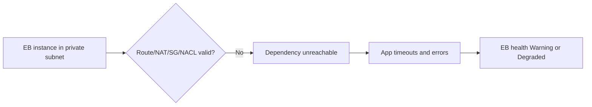
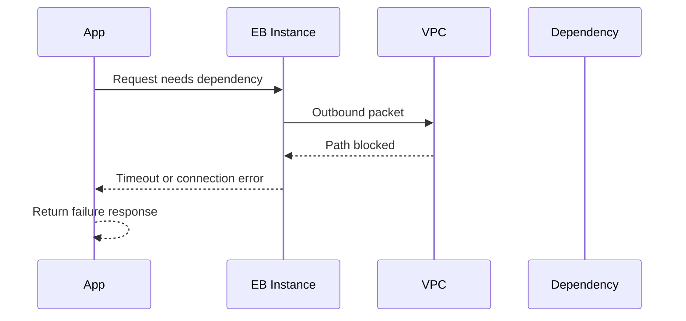

# Lab: VPC Connectivity Issues

Build a lab where Elastic Beanstalk instances run but cannot reach a required dependency because route, subnet, or security controls block outbound connectivity.

## Lab Metadata
| Attribute | Value |
|---|---|
| Difficulty | Advanced |
| Duration | 45 minutes |
| Tier | Load-balanced web server environment in a custom VPC |
| Failure Mode | Instances fail outbound dependency calls because VPC pathing is incorrect |
| Skills Practiced | Route table inspection, security group and NACL review, instance-side connectivity testing, dependency failure triage |

## 1) Background
### 1.1 Why this lab exists
Networking incidents frequently surface as vague app errors. This lab teaches how to prove that the application is healthy locally but cannot reach something outside its instance because the VPC path is broken.

### 1.2 Platform behavior model
Elastic Beanstalk relies on the surrounding VPC design for outbound connectivity to databases, package mirrors, APIs, and AWS endpoints. If routes, NAT, security groups, or NACLs are wrong, the application can start yet still fail at runtime.

### 1.3 Diagram (Mermaid)


## 2) Hypothesis
### 2.1 Original hypothesis
The environment experiences runtime failures because instances cannot reach an external or VPC-local dependency due to incorrect network controls.

### 2.2 Causal chain
Bad route or security policy -> outbound dependency call times out or is refused -> application returns errors or slow responses -> health degrades.

### 2.3 Proof criteria
- Instance-side tests to the dependency fail.
- Route tables, security groups, or NACLs show a blocking condition.
- Restoring the network path immediately clears application errors.

### 2.4 Disproof criteria
- Network path is open and dependency remains reachable, meaning the fault lies inside the app or dependency service itself.

## 3) Runbook
1. Deploy the VPC lab stack and healthy baseline.

```bash
aws cloudformation deploy \
    --stack-name "$STACK_NAME" \
    --template-file "template.yaml" \
    --capabilities CAPABILITY_NAMED_IAM \
    --region "$AWS_REGION"

eb deploy "$ENV_NAME" --staged
```

2. Trigger the connectivity break.

```bash
bash "trigger.sh"
```

3. Validate app symptoms and EB health.

```bash
aws elasticbeanstalk describe-environment-health \
    --environment-name "$ENV_NAME" \
    --attribute-names Status Color Causes ApplicationMetrics

eb logs --environment-name "$ENV_NAME" --all
```

4. Inspect VPC controls.

```bash
aws ec2 describe-route-tables --route-table-ids "$ROUTE_TABLE_ID"
aws ec2 describe-security-groups --group-ids "$INSTANCE_SECURITY_GROUP_ID"
aws ec2 describe-network-acls --network-acl-ids "$NETWORK_ACL_ID"
```

5. Test connectivity from an instance.

```bash
curl --silent --show-error --max-time 5 "$DEPENDENCY_URL"
```

## 4) Experiment Log
| Time (UTC) | Observation | Evidence |
|---|---|---|
| 17:00 | Baseline dependency call succeeds | curl output |
| 17:07 | Connectivity break applied | `trigger.sh` output |
| 17:10 | Application requests begin timing out | app logs |
| 17:12 | Instance-side connectivity tests fail | curl output |
| 17:18 | Correcting route or SG restores dependency access | retest output |

## Expected Evidence
### Before Trigger (Baseline)
- Dependency reachable from the instance.
- Health is `Ok`.

### During Incident
- Dependency calls fail or time out.
- Route table or security policy reveals the path break.
- Application logs show downstream connection errors.

### After Recovery
- Instance connectivity tests succeed again.
- Application errors stop and health improves.

### Evidence Timeline (Mermaid sequence diagram)


### Evidence Chain: Why This Proves the Hypothesis
The application is functional enough to start and accept requests, but dependency calls fail from the instance until the network policy is corrected. That before-and-after network behavior isolates the issue to VPC connectivity rather than deployment or TLS configuration.

## Clean Up
```bash
eb terminate "$ENV_NAME"
aws cloudformation delete-stack --stack-name "$STACK_NAME" --region "$AWS_REGION"
```

## Related Playbook
- [VPC Connectivity Issues](../playbooks/networking/vpc-connectivity-issues.md)

## See Also
- [Hands-on Labs](./index.md)
- [Environment Launch Failed](./environment-launch-failed.md)
- [HTTPS Termination Issues](./https-termination-issues.md)

## Sources
- [Elastic Beanstalk VPC configuration](https://docs.aws.amazon.com/elasticbeanstalk/latest/dg/using-features.managing.vpc.html)
- [Amazon VPC route tables](https://docs.aws.amazon.com/vpc/latest/userguide/VPC_Route_Tables.html)
- [Security groups for your VPC](https://docs.aws.amazon.com/vpc/latest/userguide/vpc-security-groups.html)
- [Network ACLs](https://docs.aws.amazon.com/vpc/latest/userguide/vpc-network-acls.html)
