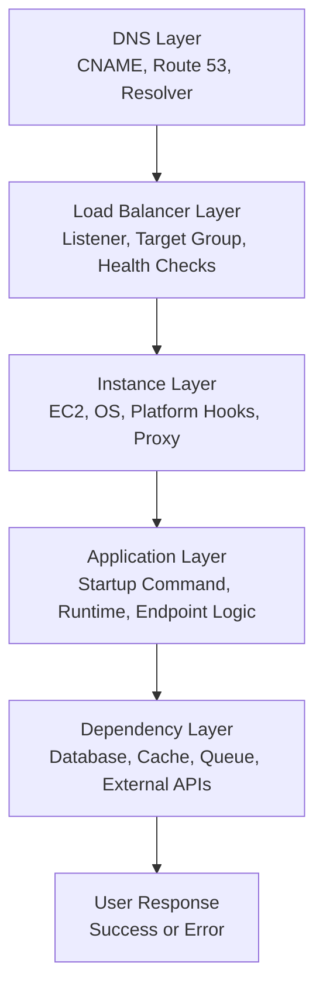
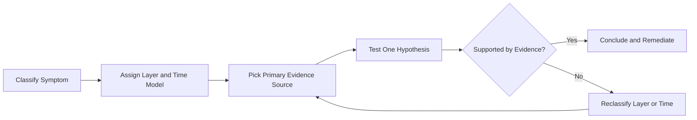

---
hide:
  - toc
---

# Troubleshooting Mental Model

Fast troubleshooting in Elastic Beanstalk depends on two perspectives:

-    A layer model (where the request can fail).
-    A time model (when the failure appears).

## Layer Model: Outside-In Diagnosis

Diagnose from outer request path toward inner dependency path:

1.    DNS
2.    Load Balancer
3.    Instance Host
4.    Application Process
5.    Dependencies

### Layer Symptoms and Signals

| Layer | Common Symptom | Primary Signal |
|---|---|---|
| DNS | Name does not resolve or wrong endpoint | resolver output, CNAME records |
| Load Balancer | 502/503/504, intermittent failures | target health, listener rules |
| Instance | health turns yellow/red, process restarts | host logs, EB health details |
| Application | 500 responses, startup failures | application and web/proxy logs |
| Dependencies | timeouts, connection refused, slow responses | app traces, dependency metrics |

## Time Model: Failure Phase Classification

Treat failures by phase to avoid mixing unrelated causes.

### Deploy-Time Failures

-    Trigger during environment updates, deployment commands, or configuration changes.
-    Typical evidence: Elastic Beanstalk events, CloudFormation stack events, `eb-engine.log`.
-    Typical causes: bad build artifact, invalid Procfile/start command, hook failures, missing packages.

### Runtime Failures

-    Trigger after a seemingly successful deployment while serving traffic.
-    Typical evidence: ALB target health, application logs, dependency errors, health cause messages.
-    Typical causes: code defects, memory exhaustion, database connectivity, timeout configuration mismatch.

### Scaling-Time Failures

-    Trigger during scale-out/in, instance replacement, rolling deployments.
-    Typical evidence: Auto Scaling activities, instance warm-up behavior, health transitions.
-    Typical causes: slow startup, insufficient capacity, unhealthy new instances, aggressive scaling thresholds.

## Observation-to-Cause Mapping

| Observation | Probable Layer | Probable Time Model |
|---|---|---|
| Deploy command fails immediately | Instance/Application setup | Deploy-time |
| Health turns red during update | Load balancer + instance readiness | Deploy-time or scaling-time |
| Sporadic 504 under load | Dependency or capacity bottleneck | Runtime or scaling-time |
| App unreachable after DNS change | DNS layer | Runtime |
| Queue backlog growth (worker tier) | Instance/App throughput or dependency latency | Runtime or scaling-time |

## Practical Rules

-    Never start with "the app is broken"; always classify layer and time first.
-    Preserve timeline precision in UTC so events, logs, and metrics align.
-    Make one hypothesis per test cycle and invalidate aggressively.
-    Prefer evidence from managed service signals before manual host-level assumptions.

## Minimal Diagnostic Loop

## Example Thinking Pattern

-    Symptom: 503 after deployment.
-    Layer guess: Load balancer to instance readiness boundary.
-    Time model: Deploy-time.
-    Evidence path: environment events -> target health -> `eb-engine.log` -> web/proxy logs.
-    Likely causes to test first: startup command failure, wrong health check path, application not listening on expected port.

## See Also

-    [Troubleshooting Hub](./index.md)
-    [Decision Tree](./decision-tree.md)
-    [Architecture Overview](./architecture-overview.md)
-    [First 10 Minutes: Deployment Failures](./first-10-minutes/deployment-failures.md)
-    [Troubleshooting Method](./methodology/troubleshooting-method.md)
-    [Log Sources Map](./methodology/log-sources-map.md)

## Sources

-    https://docs.aws.amazon.com/elasticbeanstalk/latest/dg/troubleshooting.html
-    https://docs.aws.amazon.com/elasticbeanstalk/latest/dg/health-enhanced.html
-    https://docs.aws.amazon.com/elasticbeanstalk/latest/dg/using-features.logging.html
-    https://docs.aws.amazon.com/elasticbeanstalk/latest/dg/using-features.managing.elb.html
-    https://docs.aws.amazon.com/elasticbeanstalk/latest/dg/using-features.managing.as.html
