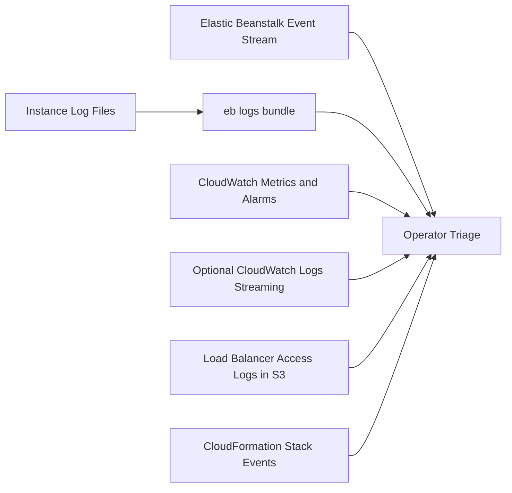
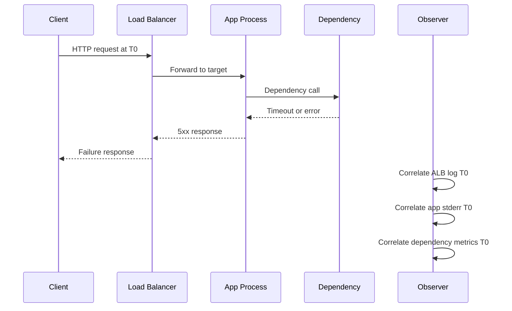

# Log Sources Map

Use this map to quickly determine where each Elastic Beanstalk troubleshooting signal is generated and how to retrieve it.

## Log Flow Overview



## Key Log Locations on Elastic Beanstalk Instances

| Path | Typical Contents | Primary Use |
|---|---|---|
| `/var/log/eb-engine.log` | Deployment engine command execution and hook output | Deploy/update failure analysis |
| `/var/log/eb-hooks.log` | Platform hook script execution details | Hook troubleshooting |
| `/var/log/eb-commandprocessor.log` | Command processor lifecycle and task results | Environment command failures |
| `/var/log/web.stdout.log` | Application process standard output | Startup and runtime diagnostics |
| `/var/log/web.stderr.log` | Application process standard error | Exception and crash diagnostics |
| `/var/log/nginx/access.log` | HTTP access records through proxy | Request path, latency, and status patterns |
| `/var/log/nginx/error.log` | NGINX proxy errors and upstream failures | 502/504 and proxy layer debugging |
| `/var/log/httpd/access_log` | Apache access logs (platform dependent) | Access diagnostics on Apache-based stacks |
| `/var/log/httpd/error_log` | Apache error logs (platform dependent) | Proxy/server error diagnostics |
| `/var/log/messages` | OS and system service messages | Host-level incidents and restarts |
| `/var/log/cfn-init.log` | CloudFormation init logs | Launch/bootstrap issues |
| `/var/log/cfn-init-cmd.log` | CloudFormation command logs | Initialization command failures |
| `/var/log/docker` (platform dependent) | Docker runtime logs | Container platform troubleshooting |
| `/var/log/aws-sqsd/default.log` | Worker daemon activity | Worker queue processing diagnostics |

## Retrieval Methods

### Method 1: Elastic Beanstalk CLI

```bash
eb logs --environment "$ENV_NAME" --profile "eb-ops"

eb logs --environment "$ENV_NAME" --all --zip --profile "eb-ops"
```

Use this method for fast centralized retrieval during active incidents.

### Method 2: Elastic Beanstalk Console Requested Logs

-    Request full logs from environment console.
-    Download archived bundle from generated link.
-    Correlate log generation time with incident timeline.

### Method 3: CloudWatch Logs (if enabled)

-    Stream selected instance logs continuously to log groups.
-    Use log insights for multi-instance correlation.
-    Retain historical logs beyond short-lived host files.

### Method 4: Load Balancer Access Logs (S3)

-    Enable ALB access logs to S3 bucket.
-    Use request-level fields to correlate 5xx, latency, and target behavior.
-    Confirm source IP masking and retention policy requirements.

## Signal-to-Source Mapping

| Symptom | Start With | Expand To |
|---|---|---|
| Deployment failed | `eb-engine.log` | `eb-hooks.log`, CloudFormation events |
| Health turns red | `eb health` causes + web stderr | NGINX error log, system messages |
| 5xx responses | NGINX error + app stderr | ALB access logs, dependency logs |
| High latency | NGINX access timing + app logs | CloudWatch metrics, dependency metrics |
| Worker backlog | `aws-sqsd` log | queue metrics and app worker logs |

## Timeline Correlation Pattern



## Common Retrieval Pitfalls

-    Pulling logs too late after instance replacement causes signal loss.
-    Assuming all platforms use identical proxy log paths.
-    Ignoring timezone normalization when comparing logs and metrics.
-    Reading only one instance log in multi-instance incidents.

## Recommended Log Collection Order

1.    `eb events` and health causes.
2.    `eb logs` bundle from all instances.
3.    Proxy and app error logs by failing timestamp window.
4.    System and bootstrap logs for startup/launch anomalies.
5.    ALB access logs and CloudWatch metrics for correlation.

## Command Reference

```bash
eb logs --environment "$ENV_NAME" --all --zip --profile "eb-ops"

aws logs describe-log-groups \
    --log-group-name-prefix "/aws/elasticbeanstalk" \
    --profile "eb-ops" \
    --region "$REGION"

aws s3 ls "s3://my-alb-logs-bucket/AWSLogs/<account-id>/elasticloadbalancing/$REGION/" \
    --profile "eb-ops"
```

## See Also

-    [Troubleshooting Method](./troubleshooting-method.md)
-    [Decision Tree](../decision-tree.md)
-    [First 10 Minutes: Deployment Failures](../first-10-minutes/deployment-failures.md)
-    [First 10 Minutes: Health Degradation](../first-10-minutes/health-degradation.md)
-    [First 10 Minutes: Connectivity Issues](../first-10-minutes/connectivity-issues.md)

## Sources

-    https://docs.aws.amazon.com/elasticbeanstalk/latest/dg/using-features.logging.html
-    https://docs.aws.amazon.com/elasticbeanstalk/latest/dg/eb-cli3.html
-    https://docs.aws.amazon.com/elasticbeanstalk/latest/dg/using-features.managing.ec2.html
-    https://docs.aws.amazon.com/elasticloadbalancing/latest/application/load-balancer-access-logs.html
-    https://docs.aws.amazon.com/AmazonCloudWatch/latest/logs/WhatIsCloudWatchLogs.html
