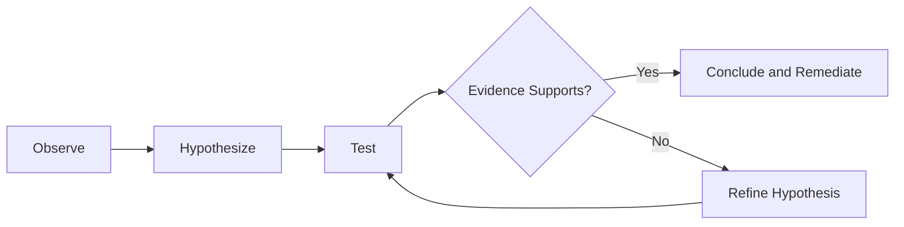
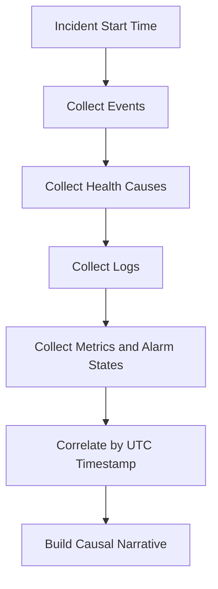

# Troubleshooting Method

Use a repeatable method to avoid random changes during incidents: Observe -> Hypothesize -> Test -> Conclude.

## Core Method



## Step 1: Observe

Collect objective signals before acting:

-    Elastic Beanstalk events (`eb events`, `describe-events`).
-    Health state and causes (`eb health`, enhanced health APIs).
-    Logs (`eb logs` bundles and key files).
-    CloudWatch metrics and alarms.
-    CloudFormation stack events for environment lifecycle failures.

Observation checklist:

-    Exact symptom and first timestamp (UTC).
-    Blast radius (single endpoint, single instance, whole environment, multiple environments).
-    Last known-good timestamp.
-    Recent changes (deploy, config update, scaling activity, platform update).

## Step 2: Hypothesize

Create one testable hypothesis at a time.

Good hypothesis examples:

-    "Deploy failed because a postdeploy hook exits non-zero on missing file path."
-    "503 responses occur because targets fail health checks on a wrong path."
-    "Latency spike is caused by dependency timeout, not CPU saturation."

Bad hypothesis examples:

-    "AWS is down."
-    "The app is probably broken."

## Step 3: Test

Design low-risk tests that isolate one variable.

-    Prefer read-only checks first.
-    Apply one controlled change if required.
-    Measure immediate impact using health/events/metrics.
-    Stop and revert if blast radius increases.

Common test patterns:

-    Validate startup command separately from full deployment.
-    Compare health check endpoint behavior from instance and via load balancer.
-    Temporarily scale out to determine capacity bottleneck involvement.
-    Re-run deployment with known-good artifact to isolate artifact regressions.

## Step 4: Conclude

Conclude only when evidence chain is consistent.

-    Record symptom, hypothesis, test, outcome, and final remediation.
-    Capture preventive follow-up tasks (monitoring, guardrails, automation).
-    Link to the playbook used or created.

## EB-Specific Tool Usage Guide

### `eb events`

-    Best for control-plane chronology and immediate failure clues.
-    Use first when deployment/update behavior is involved.

### `eb health`

-    Best for real-time environment and instance health causes.
-    Use during runtime incidents and after every remediation action.

### `eb logs`

-    Best for pulling instance-side and application logs quickly.
-    Use after events indicate host, process, or hook-level errors.

### CloudWatch Metrics and Alarms

-    Best for trend analysis and correlation with load/latency/error rates.
-    Use to distinguish transient spikes from persistent degradation.

## Evidence Collection Guide



Minimum evidence bundle:

-    Environment metadata: name, region, platform branch, tier.
-    Event timeline excerpt.
-    Health cause messages and per-instance state.
-    Key log excerpts from proxy, app, and deployment engine.
-    CloudWatch metric snapshots around incident window.
-    Remediation attempts and outcomes.

## Command Reference

```bash
eb events --environment "$ENV_NAME" --profile "eb-ops"

eb health --environment "$ENV_NAME" --profile "eb-ops" --refresh

eb logs --environment "$ENV_NAME" --profile "eb-ops"

aws cloudwatch describe-alarms \
    --alarm-name-prefix "awseb-" \
    --profile "eb-ops" \
    --region "$REGION"
```

## See Also

-    [Troubleshooting Hub](../index.md)
-    [Decision Tree](../decision-tree.md)
-    [Mental Model](../mental-model.md)
-    [Log Sources Map](./log-sources-map.md)
-    [First 10 Minutes Index](../first-10-minutes/index.md)
-    [Playbooks Hub](../playbooks/index.md)

## Sources

-    https://docs.aws.amazon.com/elasticbeanstalk/latest/dg/troubleshooting.html
-    https://docs.aws.amazon.com/elasticbeanstalk/latest/dg/eb-cli3.html
-    https://docs.aws.amazon.com/elasticbeanstalk/latest/dg/health-enhanced.html
-    https://docs.aws.amazon.com/elasticbeanstalk/latest/dg/using-features.logging.html
-    https://docs.aws.amazon.com/AmazonCloudWatch/latest/monitoring/WhatIsCloudWatch.html
