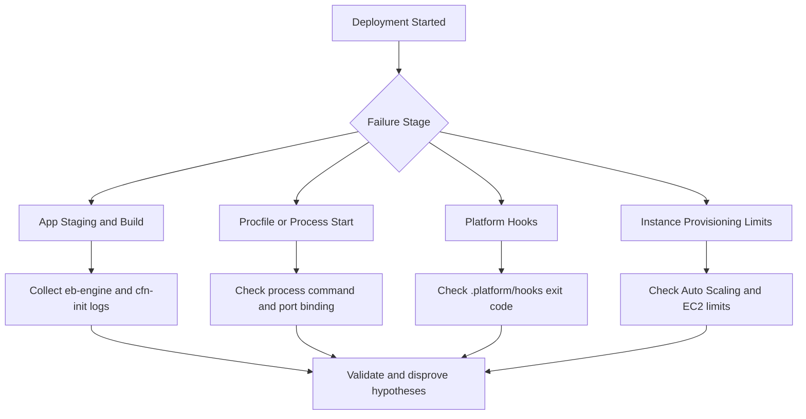

# Deployment Failed and Environment Rolled Back

## 1. Summary

Deployment reached a failed state, and Elastic Beanstalk (EB) rolled back to the last known-good application version or canceled the update.

- Primary symptom: `eb deploy` or console deployment shows failure and rollback events.
- Primary risk: repeated deploy attempts amplify outage duration and hide the first error signal.
- Typical blast radius: one environment, but shared dependencies can affect multiple environments.
- Investigation goal: isolate the first failing stage in deployment lifecycle, then map it to one falsifiable hypothesis.



## 2. Common Misreadings

- "Rollback means the previous version is broken." In many cases rollback indicates the *new* version could not pass deployment lifecycle checks.
- "No HTTP errors means deployment is healthy." Deploy failure can happen before traffic shift.
- "Green in one instance means all instances succeeded." One bad batch can force environment-wide rollback.
- "EB events are enough." Root cause is usually in instance logs, especially `/var/log/eb-engine.log`.
- "Hook script ran, so it succeeded." Non-zero exits in hook scripts trigger failure.
- "It worked locally, so dependencies are fine." Platform image, package manager lockfiles, and runtime versions differ.
- "Re-run deploy immediately." Repeating deploy without new evidence can rotate logs and lose the first-failure context.

## 3. Competing Hypotheses

| ID | Hypothesis | Mechanism | Predictive Signal |
|---|---|---|---|
| H1 | Bad application code | App cannot compile, bootstrap, or pass startup checks | Runtime stack traces in `web.stdout.log` or startup command failure |
| H2 | Missing dependencies | Required packages or system libs not present at deploy time | Package install errors in `eb-engine.log` |
| H3 | Procfile error | Invalid command, wrong working directory, or wrong process type | Process manager start failures, command not found, non-zero exit |
| H4 | Platform hook failure | `.platform/hooks` script exits non-zero or uses unavailable binary | Hook execution failure in `eb-engine.log` |
| H5 | Resource limit exceeded | Instance launch or scaling blocked by quota/capacity constraints | Auto Scaling/EC2 events show insufficient capacity or limits |

## 4. What to Check First

1. Snapshot EB event timeline first.

```bash
eb events --environment-name $ENV_NAME --all
aws elasticbeanstalk describe-events --environment-name $ENV_NAME --max-items 200
```

2. Identify the first failed command in instance deployment engine logs.

```bash
eb logs --environment-name $ENV_NAME --all
```

3. If SSH is enabled, inspect primary logs directly on one failed instance.

```bash
sudo less /var/log/eb-engine.log
sudo less /var/log/cfn-init.log
sudo less /var/log/cfn-init-cmd.log
```

4. Validate app process startup definition and platform branch assumptions.

```bash
aws elasticbeanstalk describe-configuration-settings \
    --application-name $APP_NAME \
    --environment-name $ENV_NAME
```

5. Check environment and instance capacity constraints.

```bash
aws autoscaling describe-scaling-activities --auto-scaling-group-name $ASG_NAME --max-items 50
aws service-quotas get-service-quota --service-code ec2 --quota-code L-1216C47A
```

## 5. Evidence to Collect

Collect evidence before making changes so you can compare before and after state.

| Evidence | Command | Why it matters |
|---|---|---|
| EB event chronology | `eb events --environment-name $ENV_NAME --all` | Shows the control-plane sequence and first visible failure |
| Deployment engine log | `eb logs --environment-name $ENV_NAME --all` | Captures package install, hook execution, and app start lifecycle |
| CloudFormation initialization logs | `sudo less /var/log/cfn-init.log` | Explains provisioning and config execution failures |
| CloudFormation stack events | `aws cloudformation describe-stack-events --stack-name $STACK_NAME --max-items 200` | Correlates infra failures with app deploy stage |
| Auto Scaling activities | `aws autoscaling describe-scaling-activities --auto-scaling-group-name $ASG_NAME --max-items 50` | Confirms launch/replace behavior and capacity errors |

Minimal evidence bundle checklist:

- Event timestamp (UTC) for first failure.
- Deployment ID or application version label.
- One failed instance ID (`i-xxxxxxxxxxxxxxxxx`) and matching logs.
- Exit code and failing command from `eb-engine.log`.
- CloudFormation event logical resource and status reason.

## 6. Validation and Disproof by Hypothesis

### H1: Bad application code

Validate:

- Look for traceback, uncaught exception, or fatal startup crash in app logs.
- Confirm crash appears immediately after process launch in deploy timeline.

Disprove:

- App process starts and serves health check path with HTTP 200 on new instances.

```bash
curl --silent --show-error --location --max-time 5 http://127.0.0.1/health
```

### H2: Missing dependencies

Validate:

- Detect package install failures (`No package`, `Could not resolve`, lockfile mismatch).
- Confirm failure happens before process startup.

Disprove:

- Build/install phase completes cleanly, and runtime libraries resolve.

### H3: Procfile errors

Validate:

- `Procfile` command references missing binary or wrong script path.
- Web process does not bind expected port for platform/ALB checks.

Disprove:

- Process command runs manually on instance with exit code `0` and binds expected port.

### H4: Platform hook failures

Validate:

- `.platform/hooks/prebuild`, `predeploy`, or `postdeploy` script exits non-zero.
- Hook script depends on command not available on current platform image.

Disprove:

- All hooks complete successfully in log sequence with explicit success markers.

### H5: Resource limit exceeded

Validate:

- Auto Scaling activity reports capacity errors or account limits.
- CloudFormation events include launch failures tied to quota/capacity.

Disprove:

- Instances launch without delay and deployment still fails at app stage.

## 7. Likely Root Cause Patterns

- Runtime version drift between local and EB platform branch.
- Dependency install pipeline changed (lockfile, private package access, missing OS package).
- Process start command changed without matching app structure.
- Hook scripts assumed root packages or legacy platform paths.
- Rolling/immutable batch replaced too many instances for current capacity envelope.
- Late discovery of quota constraints during replacement surge.

## 8. Immediate Mitigations

- Redeploy last known-good application version to stabilize service.

```bash
aws elasticbeanstalk describe-application-versions --application-name $APP_NAME --max-items 20
aws elasticbeanstalk update-environment --environment-name $ENV_NAME --version-label $LAST_GOOD_VERSION
```

- Reduce deployment blast radius (smaller batch or all-at-once only in non-production test environments).
- Temporarily disable non-critical hook steps to isolate failing stage.
- Increase timeout settings if deployment is timing out but progressing normally.
- Pre-scale environment capacity before retry when limits are suspected.

## 9. Prevention

- Add CI artifact validation for `Procfile`, runtime version, lockfiles, and hook script executable bits.
- Run staging environment smoke tests with identical platform branch before production deploy.
- Monitor deployment health using EB events plus CloudFormation event alarms.
- Keep hook scripts idempotent, explicit on dependencies, and verbose on failure.
- Define and review EC2/Auto Scaling quotas before immutable or rolling-with-additional-batch updates.
- Maintain a known-good rollback runbook with version labels and decision criteria.

## See Also

- [Health Red After Deploy](./health-red-after-deploy.md)
- [Immutable Update Rollback](./immutable-update-rollback.md)
- [Environment Launch Failed](./environment-launch-failed.md)
- [Instance Degraded Health](../performance/instance-degraded-health.md)
- [Load Balancer 5xx](../networking/load-balancer-5xx.md)

## Sources

- [Deploying to Elastic Beanstalk environments](https://docs.aws.amazon.com/elasticbeanstalk/latest/dg/using-features.deploy-existing-version.html)
- [Elastic Beanstalk logs](https://docs.aws.amazon.com/elasticbeanstalk/latest/dg/using-features.logging.html)
- [Extending Linux platforms with platform hooks](https://docs.aws.amazon.com/elasticbeanstalk/latest/dg/platforms-linux-extend.hooks.html)
- [Troubleshooting Elastic Beanstalk](https://docs.aws.amazon.com/elasticbeanstalk/latest/dg/troubleshooting.html)
- [AWS CloudFormation stack events](https://docs.aws.amazon.com/AWSCloudFormation/latest/UserGuide/view-stack-events.html)
- [Amazon EC2 service quotas](https://docs.aws.amazon.com/AWSEC2/latest/UserGuide/ec2-resource-limits.html)
