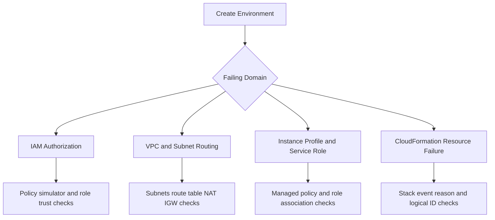

# Environment Launch Failed

## 1. Summary

Creating a new Elastic Beanstalk environment failed during provisioning or initial deployment.

- Primary symptom: environment transitions to `Terminated` or `Terminating` with launch failure events.
- Primary risk: platform onboarding blocked and repeated failures consume time without isolating root cause.
- Typical blast radius: new environment only, but shared IAM/VPC standards may affect all new launches.
- Investigation goal: determine whether failure originates in IAM role setup, VPC/subnet design, instance profile, service role, or CloudFormation stack resources.



## 2. Common Misreadings

- "Launch failed means EB platform is unavailable." Most failures are account configuration issues.
- "Default VPC exists, so networking is valid." Wrong subnet type or missing routes can still block launch.
- "Role exists, so permissions are enough." Missing managed policies or trust relationships still fail.
- "CloudFormation failed at one resource, so ignore earlier events." First error in timeline is often causal.
- "Environment terminated means no evidence remains." Stack events and EB events persist and should be exported.

## 3. Competing Hypotheses

| ID | Hypothesis | Mechanism | Predictive Signal |
|---|---|---|---|
| H1 | IAM insufficient | Caller or service role lacks required actions | Access denied events in EB or CloudFormation |
| H2 | VPC/subnet misconfiguration | No route/NAT/IGW or incompatible subnet selection | Instances fail to initialize or cannot reach required endpoints |
| H3 | Instance profile missing | EC2 instance role absent or not attached to environment | Launch config/instance startup failures mentioning profile |
| H4 | Service role missing | EB cannot manage resources without service role | Environment creation event references missing service role |
| H5 | CloudFormation stack failure | Dependent resource creation fails | Stack events show `CREATE_FAILED` with reason |

## 4. What to Check First

1. Pull environment and stack events immediately.

```bash
eb events --environment-name $ENV_NAME --all
aws cloudformation describe-stack-events --stack-name $STACK_NAME --max-items 200
```

2. Validate service role and instance profile assignments.

```bash
aws elasticbeanstalk describe-configuration-settings \
    --application-name $APP_NAME \
    --environment-name $ENV_NAME
aws iam get-role --role-name $SERVICE_ROLE_NAME
aws iam get-role --role-name $INSTANCE_PROFILE_ROLE_NAME
```

3. Confirm instance profile exists and is attached.

```bash
aws iam get-instance-profile --instance-profile-name $INSTANCE_PROFILE_NAME
```

4. Verify VPC, subnet, and route assumptions.

```bash
aws ec2 describe-subnets --subnet-ids $SUBNET_ID_1 $SUBNET_ID_2
aws ec2 describe-route-tables --filters Name=association.subnet-id,Values=$SUBNET_ID_1,$SUBNET_ID_2
```

5. Use IAM policy simulation for denied actions.

```bash
aws iam simulate-principal-policy \
    --policy-source-arn arn:aws:iam::<account-id>:role/$SERVICE_ROLE_NAME \
    --action-names elasticbeanstalk:CreateEnvironment ec2:RunInstances autoscaling:CreateAutoScalingGroup
```

## 5. Evidence to Collect

| Evidence | Command | Why it matters |
|---|---|---|
| EB launch events | `eb events --environment-name $ENV_NAME --all` | Provides high-level launch stage and failure category |
| CloudFormation `CREATE_FAILED` resources | `aws cloudformation describe-stack-events --stack-name $STACK_NAME --max-items 200` | Identifies exact logical resource and reason |
| IAM role definitions | `aws iam get-role --role-name $SERVICE_ROLE_NAME` | Confirms trust policy and role existence |
| IAM simulation results | `aws iam simulate-principal-policy ...` | Proves allowed/denied actions for critical APIs |
| VPC route coverage | `aws ec2 describe-route-tables --filters Name=association.subnet-id,Values=$SUBNET_ID_1,$SUBNET_ID_2` | Shows internet/NAT path for private/public subnet model |

Evidence package minimum:

- Stack ID and first `CREATE_FAILED` event with reason text.
- Role names used by environment (`ServiceRole`, instance profile role).
- Subnet IDs selected and their route table summary.
- Any explicit `AccessDenied` API action names.

## 6. Validation and Disproof by Hypothesis

### H1: IAM insufficient

Validate:

- `AccessDenied` or unauthorized operation appears in events.
- Policy simulation denies one required action used during launch.

Disprove:

- Simulation allows all required actions and failure occurs in networking/resource domain.

### H2: VPC/subnet misconfiguration

Validate:

- Subnets lack required route to internet/NAT for package retrieval and service calls.
- Health checks fail because instances are unreachable in selected subnets.

Disprove:

- Route tables and subnet placement align with EB load balancer and instance model.

### H3: Instance profile missing

Validate:

- Environment references missing profile or role during EC2 launch.
- CloudFormation resource for launch configuration/profile fails.

Disprove:

- Instance profile exists, role attached, and EC2 can assume role.

### H4: Service role missing

Validate:

- EB event explicitly reports missing or invalid service role.
- Role trust policy lacks `elasticbeanstalk.amazonaws.com` service principal.

Disprove:

- Service role is valid and used successfully in API calls.

### H5: CloudFormation stack failure

Validate:

- Stack event reason identifies failing dependent resource.
- Reproducing with same template/options yields same resource failure.

Disprove:

- Stack completes after fixing IAM/network settings, indicating prior dependency issue.

## 7. Likely Root Cause Patterns

- Service role was deleted or replaced without required managed policies.
- Custom VPC uses private subnets without NAT gateway route.
- Instance profile role exists but missing core EB managed policies.
- Environment configuration references stale subnet IDs.
- CloudFormation stack execution role restrictions block dependent resources.

## 8. Immediate Mitigations

- Recreate or reattach required service role and instance profile policies.
- Use known-good VPC/subnet pair validated by an existing healthy environment.
- Launch a minimal sample app environment to separate platform setup from app code issues.
- If CloudFormation fails repeatedly, terminate failed stack and relaunch with corrected parameters.
- Capture all stack events before retry to avoid losing first-failure evidence.

## 9. Prevention

- Manage IAM roles and VPC settings as code with review and drift detection.
- Create account bootstrap checklist for EB prerequisites (service role, instance profile, subnet model).
- Add pre-flight validation script for role existence, trust policy, subnet routes, and required quotas.
- Maintain reusable environment templates with validated networking and role parameters.
- Alert on IAM role/policy changes affecting EB service and instance profiles.

## See Also

- [Deployment Failed and Rolled Back](./deployment-failed.md)
- [Immutable or Rolling Update Triggered Rollback](./immutable-update-rollback.md)
- [VPC Connectivity Issues](../networking/vpc-connectivity-issues.md)
- [HTTPS Termination Issues](../networking/https-termination-issues.md)
- [Instance Degraded Health](../performance/instance-degraded-health.md)

## Sources

- [Managing Elastic Beanstalk service roles](https://docs.aws.amazon.com/elasticbeanstalk/latest/dg/iam-servicerole.html)
- [Managing Elastic Beanstalk instance profiles](https://docs.aws.amazon.com/elasticbeanstalk/latest/dg/iam-instanceprofile.html)
- [Using Elastic Beanstalk with Amazon VPC](https://docs.aws.amazon.com/elasticbeanstalk/latest/dg/using-features.managing.vpc.html)
- [Elastic Beanstalk troubleshooting](https://docs.aws.amazon.com/elasticbeanstalk/latest/dg/troubleshooting.html)
- [IAM policy simulator](https://docs.aws.amazon.com/IAM/latest/UserGuide/access_policies_testing-policies.html)
- [CloudFormation stack events](https://docs.aws.amazon.com/AWSCloudFormation/latest/UserGuide/view-stack-events.html)
