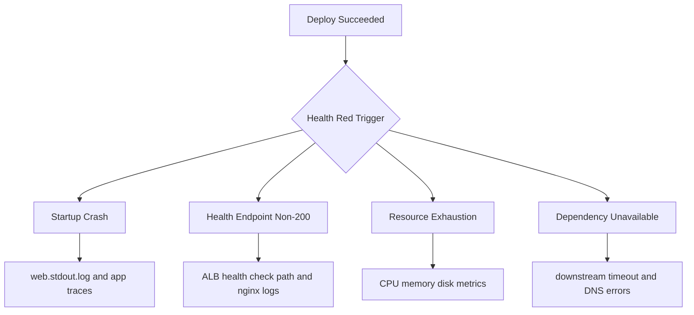

# Health Turns Red After Successful Deploy

## 1. Summary

Deployment reports success, but EB enhanced health turns red shortly after traffic starts.

- Primary symptom: application version updated, then severe or red health appears.
- Primary risk: false confidence from successful deployment event.
- Typical blast radius: full environment if all instances take the same startup path.
- Investigation goal: determine whether failure is app process, health check contract, resource pressure, or external dependency.



## 2. Common Misreadings

- "Deploy success means production healthy." Deploy success only confirms deployment workflow completed.
- "ALB 5xx means only load balancer issue." ALB often surfaces target failures.
- "One unhealthy instance is noise." In rolling updates, one unhealthy batch can cascade.
- "Health path is static forever." Route changes and auth middleware can break health checks.
- "Red health always means code regression." It can be dependency or resource exhaustion.
- "Nginx 502 always means nginx misconfiguration." Usually upstream app is down or too slow.

## 3. Competing Hypotheses

| ID | Hypothesis | Mechanism | Predictive Signal |
|---|---|---|---|
| H1 | App crashes on startup | New code path throws exception before readiness | `web.stdout.log` shows crash loop |
| H2 | Health check path returns non-200 | ALB checks wrong path/protocol or app route changed | Target health reason indicates bad status code |
| H3 | Resource exhaustion | CPU, memory, or disk pressure prevents timely responses | CloudWatch spikes align with red transition |
| H4 | Dependency unavailable | DB/cache/API unreachable after deploy | Timeout and connect errors in app logs |

## 4. What to Check First

1. Confirm EB enhanced health transition timeline.

```bash
eb health --environment-name $ENV_NAME --refresh
aws elasticbeanstalk describe-environment-health --environment-name $ENV_NAME --attribute-names All
```

2. Verify load balancer health check path and target health reasons.

```bash
aws elbv2 describe-target-health --target-group-arn $TARGET_GROUP_ARN
aws elbv2 describe-target-groups --target-group-arns $TARGET_GROUP_ARN
```

3. Inspect application and proxy logs on affected instances.

```bash
eb logs --environment-name $ENV_NAME --all
sudo less /var/log/web.stdout.log
sudo less /var/log/nginx/access.log
sudo less /var/log/nginx/error.log
```

4. Correlate red transition with system metrics.

```bash
aws cloudwatch get-metric-statistics --namespace AWS/EC2 --metric-name CPUUtilization --dimensions Name=AutoScalingGroupName,Value=$ASG_NAME --statistics Average --period 60 --start-time $START_TIME --end-time $END_TIME
```

## 5. Evidence to Collect

| Evidence | Command | Why it matters |
|---|---|---|
| Enhanced health detail | `aws elasticbeanstalk describe-environment-health --environment-name $ENV_NAME --attribute-names All` | Shows instance-level cause categories and color transitions |
| EB health stream | `eb health --environment-name $ENV_NAME --refresh` | Detects unstable flapping versus sustained failure |
| Application stdout/stderr | `sudo less /var/log/web.stdout.log` | Captures startup crash, timeout, or dependency exceptions |
| Nginx logs | `sudo less /var/log/nginx/error.log` | Distinguishes upstream reset, timeout, and bad gateway patterns |
| Target health status | `aws elbv2 describe-target-health --target-group-arn $TARGET_GROUP_ARN` | Confirms protocol/path/status mismatch versus timeout |

Evidence quality checks:

- Use a single UTC interval for metrics and logs.
- Capture one healthy and one unhealthy instance for side-by-side comparison.
- Save first red transition event, not only latest state.

## 6. Validation and Disproof by Hypothesis

### H1: App crashes on startup

Validate:

- Crash loop in `web.stdout.log` after deployment timestamp.
- Process exits before handling first health request.

Disprove:

- Process remains running and serves local health path consistently.

### H2: Health check path returns non-200

Validate:

- Target health reason includes response code mismatch.
- Direct request to configured path returns redirect, auth challenge, or non-200.

Disprove:

- Configured health endpoint returns deterministic HTTP 200 with low latency.

### H3: Resource exhaustion

Validate:

- CPU, memory pressure, or disk saturation coincides with red transition.
- Nginx upstream timeout or application worker starvation appears.

Disprove:

- Metrics remain below thresholds while health still fails.

### H4: Dependency unavailable

Validate:

- Application logs show connection refused, DNS failure, or timeout to dependency.
- Failures concentrated in code paths exercised by health route or startup.

Disprove:

- Dependency checks succeed from instance shell and app logs show no related errors.

## 7. Likely Root Cause Patterns

- Health endpoint moved behind auth or redirect after route changes.
- App boot sequence added mandatory external call before readiness.
- Worker/process count exceeds memory budget, causing OOM restart loops.
- ALB health check timeout too short for new cold-start profile.
- Background migration or startup job blocks request handling thread.

## 8. Immediate Mitigations

- Point health check to a lightweight internal endpoint that always returns 200 when core app is ready.

```bash
aws elasticbeanstalk update-environment \
    --environment-name $ENV_NAME \
    --option-settings Namespace=aws:elasticbeanstalk:application,OptionName=Application Healthcheck URL,Value=/health
```

- Roll back to previous app version if crash regression is clear.
- Scale out temporarily to absorb load while tuning startup or dependency retries.
- Increase ALB health check timeout/interval only after confirming app eventually responds correctly.
- Disable non-critical startup tasks and move them out of request path.

## 9. Prevention

- Define strict readiness contract: health endpoint excludes heavy dependency checks and remains fast.
- Add post-deploy canary checks before full traffic confidence.
- Baseline memory/CPU per instance type and worker count for each runtime.
- Use dependency timeouts/circuit breakers so transient downstream failures do not turn environment red.
- Alert on target health degradation and startup exception rates, not only deployment status.

## See Also

- [Deployment Failed and Rolled Back](./deployment-failed.md)
- [Immutable Update Rollback](./immutable-update-rollback.md)
- [High Latency Under Load](../performance/high-latency-under-load.md)
- [Instance Degraded Health](../performance/instance-degraded-health.md)
- [Load Balancer 5xx](../networking/load-balancer-5xx.md)

## Sources

- [Elastic Beanstalk enhanced health reporting](https://docs.aws.amazon.com/elasticbeanstalk/latest/dg/health-enhanced.html)
- [Elastic Beanstalk environment health API](https://docs.aws.amazon.com/elasticbeanstalk/latest/api/API_DescribeEnvironmentHealth.html)
- [Elastic Beanstalk logs](https://docs.aws.amazon.com/elasticbeanstalk/latest/dg/using-features.logging.html)
- [Application Load Balancer target health](https://docs.aws.amazon.com/elasticloadbalancing/latest/application/target-group-health-checks.html)
- [Troubleshooting Elastic Beanstalk](https://docs.aws.amazon.com/elasticbeanstalk/latest/dg/troubleshooting.html)
