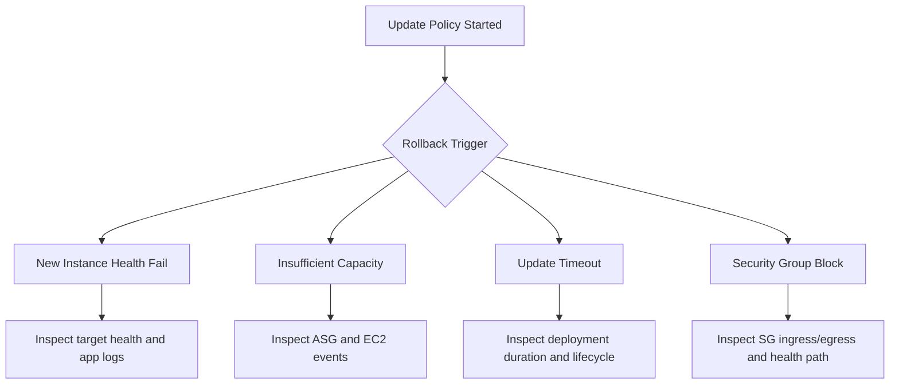

# Immutable or Rolling Update Triggered Rollback

## 1. Summary

An immutable update or rolling update started, replacement capacity was created, then update rolled back before completion.

- Primary symptom: update policy executes partially and then environment reverts.
- Primary risk: capacity churn, longer recovery window, and repeated failed replacement attempts.
- Typical blast radius: environment-wide when minimum healthy thresholds are violated.
- Investigation goal: identify whether rollback came from failed health checks, capacity shortage, timeout, or network policy blocks.



## 2. Common Misreadings

- "Immutable is always safer, so rollback means a platform bug." Immutable still depends on new instances becoming healthy.
- "New instances launched, so capacity is fine." Launch can succeed while registration/health fails.
- "Rollback after timeout means app is healthy but slow." Timeout can hide deadlock or blocked health checks.
- "Security groups are unchanged, so not relevant." New target group/instance path can expose latent SG gaps.
- "Only app logs matter." Auto Scaling and CloudFormation events often provide first root-cause clue.

## 3. Competing Hypotheses

| ID | Hypothesis | Mechanism | Predictive Signal |
|---|---|---|---|
| H1 | New instances fail health checks | Startup/readiness mismatch or health endpoint issue | Target health stays `unhealthy` for replacement instances |
| H2 | Insufficient capacity | AZ/instance-type capacity or account quota constraints | ASG activity includes capacity-related errors |
| H3 | Timeout exceeded | Batch never reaches healthy count before policy timeout | EB/CFN events show timeout and rollback |
| H4 | Security group blocks | ALB-to-instance or instance-to-dependency path blocked | Health checks timeout, connection errors in logs |

## 4. What to Check First

1. Capture policy and deployment events.

```bash
eb events --environment-name $ENV_NAME --all
aws elasticbeanstalk describe-events --environment-name $ENV_NAME --max-items 200
```

2. Review Auto Scaling replacement activities.

```bash
aws autoscaling describe-auto-scaling-groups --auto-scaling-group-names $ASG_NAME
aws autoscaling describe-scaling-activities --auto-scaling-group-name $ASG_NAME --max-items 100
```

3. Inspect CloudFormation stack events.

```bash
aws cloudformation describe-stack-events --stack-name $STACK_NAME --max-items 200
```

4. Verify target group health during update window.

```bash
aws elbv2 describe-target-health --target-group-arn $TARGET_GROUP_ARN
```

5. Check relevant security group rules.

```bash
aws ec2 describe-security-groups --group-ids $ALB_SECURITY_GROUP_ID $INSTANCE_SECURITY_GROUP_ID
```

## 5. Evidence to Collect

| Evidence | Command | Why it matters |
|---|---|---|
| EB update timeline | `eb events --environment-name $ENV_NAME --all` | Establishes when rollback decision happened |
| ASG launch and terminate activity | `aws autoscaling describe-scaling-activities --auto-scaling-group-name $ASG_NAME --max-items 100` | Shows whether replacement instances failed at launch or health stage |
| CloudFormation resource events | `aws cloudformation describe-stack-events --stack-name $STACK_NAME --max-items 200` | Correlates orchestration failures and timeout reason |
| Target group health reason codes | `aws elbv2 describe-target-health --target-group-arn $TARGET_GROUP_ARN` | Confirms protocol/status/timeout cause |
| Instance deployment logs | `eb logs --environment-name $ENV_NAME --all` | Connects infra events with app startup behavior |

Checklist for usable evidence:

- Include update policy type in notes (immutable, rolling, rolling with additional batch).
- Record minimum healthy threshold and batch size at failure time.
- Capture one failed replacement instance ID and its startup logs.
- Keep all timestamps in UTC to correlate service events.

## 6. Validation and Disproof by Hypothesis

### H1: New instances fail health checks

Validate:

- Replacement targets remain unhealthy with repeated check failures.
- Instance logs show readiness endpoint unavailable or non-200.

Disprove:

- New instances pass target health but rollback still occurs for other reasons.

### H2: Insufficient capacity

Validate:

- ASG activity indicates unavailable capacity or quota limitation.
- Launch attempts repeatedly fail before app startup phase.

Disprove:

- Capacity is provisioned normally and failures occur post-launch.

### H3: Timeout exceeded

Validate:

- Events explicitly reference timeout while waiting for healthy instances.
- Startup and migration logs show long-running operations.

Disprove:

- Rollback occurs quickly due to immediate hard failures.

### H4: Security group blocks

Validate:

- ALB cannot reach instance health port or path due to SG restrictions.
- Network errors align with failed health-check interval.

Disprove:

- SG rules permit required traffic and direct checks succeed.

## 7. Likely Root Cause Patterns

- Readiness endpoint behavior changed without updating ALB health check expectations.
- New AMI/platform branch increased startup time beyond update timeout.
- Capacity headroom too small for immutable surge requirements.
- Security group refactor omitted ALB-to-instance ingress on health port.
- Background startup tasks scale with data size and exceed fixed timeout windows.

## 8. Immediate Mitigations

- Switch to safer, slower rollout only after confirming healthy startup behavior in staging.
- Temporarily increase desired capacity to create headroom for replacement batches.
- Extend health check grace period and update timeout where appropriate.
- Reopen required security group paths for ALB health probes.
- Roll back to last stable application version if regression confirmed.

```bash
aws elasticbeanstalk update-environment --environment-name $ENV_NAME --version-label $LAST_GOOD_VERSION
```

## 9. Prevention

- Capacity-plan immutable updates with explicit surge budget and quota review.
- Add automated pre-deploy readiness verification on new instances.
- Keep startup path deterministic; move migrations and heavy warm-up out of first-request lifecycle.
- Validate security groups as code with tests for ALB health check traffic.
- Alert on target registration failures during deployment windows.

## See Also

- [Deployment Failed and Rolled Back](./deployment-failed.md)
- [Health Turns Red After Successful Deploy](./health-red-after-deploy.md)
- [Environment Launch Failed](./environment-launch-failed.md)
- [Load Balancer 5xx](../networking/load-balancer-5xx.md)
- [CPU and Memory Exhaustion](../performance/cpu-memory-exhaustion.md)

## Sources

- [Deployment policies and settings for Elastic Beanstalk](https://docs.aws.amazon.com/elasticbeanstalk/latest/dg/using-features.rollingupdates.html)
- [Immutable updates in Elastic Beanstalk](https://docs.aws.amazon.com/elasticbeanstalk/latest/dg/environmentmgmt-updates-immutable.html)
- [Elastic Beanstalk enhanced health](https://docs.aws.amazon.com/elasticbeanstalk/latest/dg/health-enhanced.html)
- [Amazon EC2 Auto Scaling troubleshooting](https://docs.aws.amazon.com/autoscaling/ec2/userguide/ts-as-healthchecks.html)
- [Application Load Balancer health checks](https://docs.aws.amazon.com/elasticloadbalancing/latest/application/target-group-health-checks.html)
