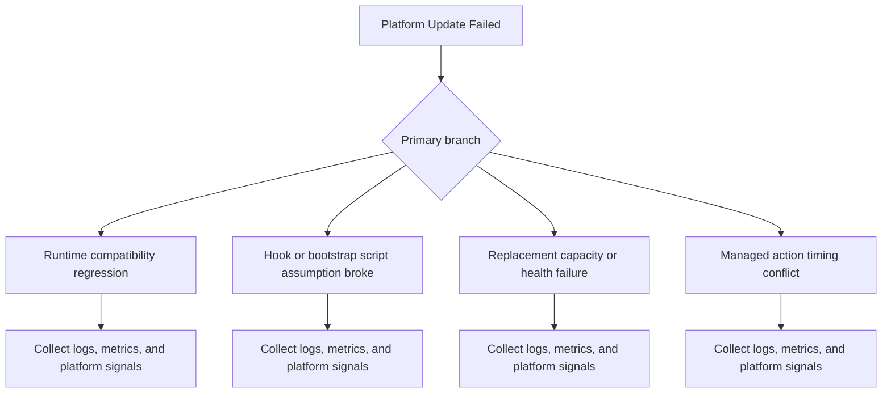
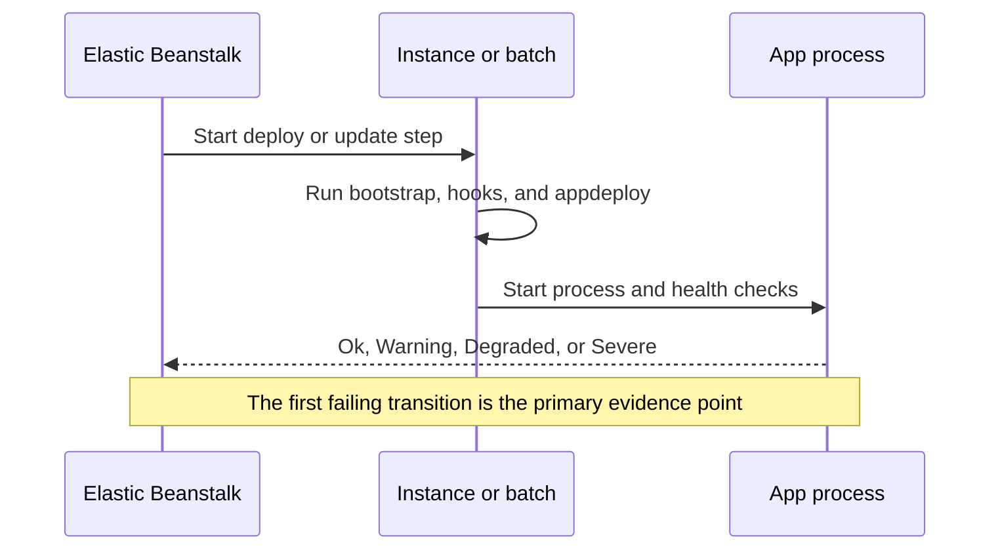

# Platform Update Failed

## 1. Summary
An Elastic Beanstalk platform update fails while applying a newer platform version or managed update.



## 2. Common Misreadings
- Rollback means the old version is broken.
- The last event is always the root cause.
- A successful upload proves the rollout is safe.
- No user-facing 5xx means the deployment was healthy.
- Local success makes platform differences irrelevant.

## 3. Competing Hypotheses
- - H1: Runtime compatibility regression — Primary evidence should confirm or disprove whether runtime compatibility regression.
- - H2: Hook or bootstrap script assumption broke — Primary evidence should confirm or disprove whether hook or bootstrap script assumption broke.
- - H3: Replacement capacity or health failure — Primary evidence should confirm or disprove whether replacement capacity or health failure.
- - H4: Managed action timing conflict — Primary evidence should confirm or disprove whether managed action timing conflict.

## 4. What to Check First
### Metrics
- Check EB health colors and instance counts during the rollout window.
- Check deployment-policy behavior: All at Once, Rolling, Rolling with Additional Batch, or Immutable.
- Check whether replacement capacity converged or stalled.

### Logs
- Read `eb-activity.log` for the first failing lifecycle stage.
- Read `eb-engine.log` for package, hook, and appdeploy details.
- Read `web.stdout.log` and `nginx/error.log` only after confirming the issue reached process start or health checks.

### Platform Signals
- Run `eb status --environment-name $ENV_NAME` and preserve `eb events --environment-name $ENV_NAME --all` before retrying.
- Capture the first `Warning`, `Degraded`, or `Severe` transition in UTC.
- Record whether the issue is one batch, one instance, or the entire environment.

| Signal | Normal | Abnormal | Why it matters |
| --- | --- | --- | --- |
| EB events | Clear start, deploy, and stable `Ok` state | Warnings, rollbacks, or unhealthy transitions appear | Separates clean rollouts from failing lifecycle stages |
| Enhanced health | Brief `Warning` is followed by `Ok` | `Warning`, `Degraded`, or `Severe` persists | Shows whether the failure reached runtime readiness |
| Platform logs | Ordered deploy steps complete successfully | A hook, deploy step, or bootstrap action exits non-zero | Reveals the first failing stage |
| Replacement capacity | Desired and in-service counts converge quickly | Launches stall or batches never stabilize | Distinguishes app failure from capacity failure |

## 5. Evidence to Collect
### Required Evidence
- First symptom timestamp in UTC.
- One healthy comparison sample if available.
- Relevant EB health color transitions (`Ok`, `Warning`, `Degraded`, `Severe`).
- Exact app version, platform branch, and environment name.

### Useful Context
- Whether the symptom started after deploy, config change, platform update, or traffic change.
- Whether the issue is isolated to one instance, one batch, one subnet, or the full environment.
- Any recent changes to health checks, listeners, routes, worker counts, dependencies, or deployment policy.

### CLI Investigation Commands
#### 1. Capture deployment state, health, and events

```bash
eb status --environment-name $ENV_NAME
eb events --environment-name $ENV_NAME --all
aws elasticbeanstalk describe-environment-health --environment-name $ENV_NAME --attribute-names All
```

Example output:

```text
Environment details for: $ENV_NAME
  Status: Ready
  Health: Warning
2026-04-07 09:14:11    INFO    Environment update is starting.
2026-04-07 09:15:08    WARN    Environment health has transitioned from Ok to Warning.
```

!!! tip
    Use the first warning or severe transition as the anchor timestamp for every later query.

#### 2. Pull deployment and instance logs

```bash
eb logs --environment-name $ENV_NAME --all
aws elasticbeanstalk request-environment-info --environment-name $ENV_NAME --info-type tail
```

Example output:

```text
Logs were saved to /var/folders/.../logs-20260407.zip
INFO: Retrieved tail logs for i-xxxxxxxxxxxxxxxxx
```

!!! tip
    If platform logs fail before application logs show normal traffic, stay on platform lifecycle hypotheses first.

#### 3. Inspect configuration and replacement activity

```bash
aws elasticbeanstalk describe-configuration-settings --application-name $APP_NAME --environment-name $ENV_NAME
aws autoscaling describe-scaling-activities --auto-scaling-group-name $ASG_NAME --max-items 20
```

Example output:

```text
OptionSettings:
  - Namespace: aws:autoscaling:updatepolicy:rollingupdate
    OptionName: RollingUpdateType
    Value: Health
Activities:
  - Description: Launching a new EC2 instance. StatusCode: Failed
```

!!! tip
    Read this output against the exact incident window; stale success from another window can mislead you.


### Evidence Timeline


### Sample Log Patterns
```text
2026/04/07 09:15:06 [ERROR] Deployment step failed with non-zero exit status
2026/04/07 09:15:17 [ERROR] Environment rollback initiated for i-xxxxxxxxxxxxxxxxx
2026/04/07 09:15:21 [error] 4110#4110: *7 connect() failed (111: Connection refused) while connecting to upstream
2026/04/07 09:15:28 [WARN] Environment health has transitioned from Warning to Severe
```

### CloudWatch Logs Insights Queries with Example Output
#### Query 1. Find the earliest incident evidence

```sql
fields @timestamp, @message
| filter @message like /platform update|No module named/
| sort @timestamp asc
| limit 20
```

Example results:

| @timestamp | @message |
| --- | --- |
| 2026-04-07 09:15:06 | platform update |
| 2026-04-07 09:15:17 | No module named |

!!! tip
    How to Read This: The first row is usually the best root-cause anchor; later rows are often downstream consequences.

#### Query 2. Find the most visible failure signatures

```sql
fields @timestamp, @message
| filter @message like /managed platform update|health checks/
| sort @timestamp desc
| limit 20
```

Example results:

| @timestamp | @message |
| --- | --- |
| 2026-04-07 09:15:21 | managed platform update |
| 2026-04-07 09:15:28 | health checks |

!!! tip
    How to Read This: Compare these rows with EB health color transitions and deployment or traffic timing before acting.

## 6. Validation and Disproof by Hypothesis
### H1: Runtime compatibility regression

Confirm:
- Logs, metrics, and platform state all point directly at this branch.
- The first failing timestamp lines up with evidence expected for `Runtime compatibility regression`.

Disprove:
- The expected log or state change for this branch never appears.
- Another branch has earlier, stronger, and more direct evidence.

### H2: Hook or bootstrap script assumption broke

Confirm:
- Logs, metrics, and platform state all point directly at this branch.
- The first failing timestamp lines up with evidence expected for `Hook or bootstrap script assumption broke`.

Disprove:
- The expected log or state change for this branch never appears.
- Another branch has earlier, stronger, and more direct evidence.

### H3: Replacement capacity or health failure

Confirm:
- Logs, metrics, and platform state all point directly at this branch.
- The first failing timestamp lines up with evidence expected for `Replacement capacity or health failure`.

Disprove:
- The expected log or state change for this branch never appears.
- Another branch has earlier, stronger, and more direct evidence.

### H4: Managed action timing conflict

Confirm:
- Logs, metrics, and platform state all point directly at this branch.
- The first failing timestamp lines up with evidence expected for `Managed action timing conflict`.

Disprove:
- The expected log or state change for this branch never appears.
- Another branch has earlier, stronger, and more direct evidence.

## 7. Likely Root Cause Patterns
- A recent change shifted the failure into this playbook's domain.
- The earliest warning was ignored and later symptoms obscured the first cause.
- A platform, configuration, or dependency assumption drifted from the known-good state.
- The environment had too little safety margin for rollout, load, or path changes.

## 8. Immediate Mitigations
1. Preserve the first-failure evidence before retrying or restarting anything.
2. Contain user impact with the smallest safe rollback, scale, or routing change.
3. Change only one suspected variable at a time and re-check health colors, logs, and metrics.
4. Confirm that the symptom, not just the dashboard noise, has improved.

## 9. Prevention
- Keep environment configuration, health checks, and rollout assumptions under version control.
- Test the same path in staging with the same platform branch and deployment policy.
- Alert on the earliest signal for this failure mode, not only the final outage symptom.
- Review baselines regularly so abnormal behavior is obvious during incidents.

## See Also
- [Troubleshooting Playbooks Hub](../index.md)
- [Load Balancer Returns 5xx Errors](../networking/load-balancer-5xx.md)
- [Instance Shows Degraded or Severe Health](../performance/instance-degraded-health.md)

## Sources
- [Viewing Elastic Beanstalk events](https://docs.aws.amazon.com/elasticbeanstalk/latest/dg/using-features.events.html)
- [Elastic Beanstalk logs](https://docs.aws.amazon.com/elasticbeanstalk/latest/dg/using-features.logging.html)
- [Elastic Beanstalk enhanced health reporting](https://docs.aws.amazon.com/elasticbeanstalk/latest/dg/health-enhanced.html)
- [Troubleshooting Elastic Beanstalk](https://docs.aws.amazon.com/elasticbeanstalk/latest/dg/troubleshooting.html)
