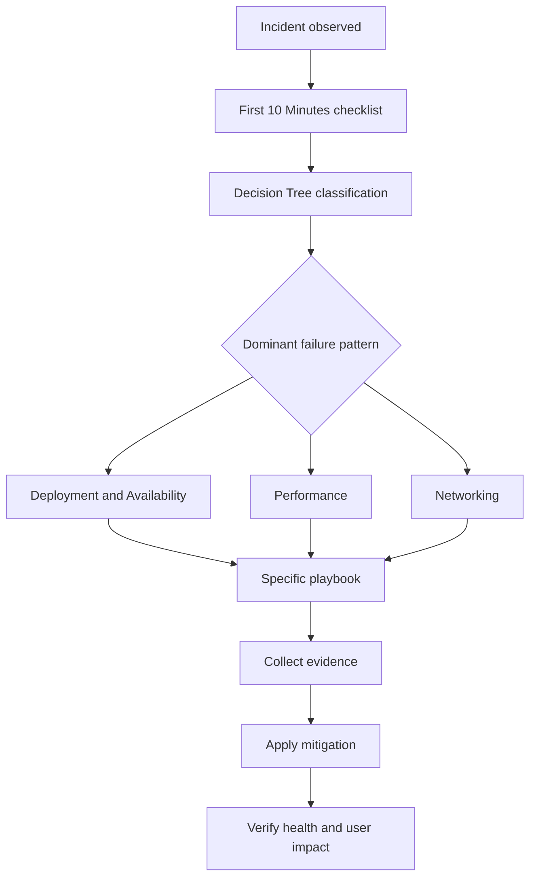

---
hide:
  - toc
---

# Troubleshooting Playbooks Hub

This hub groups Elastic Beanstalk remediation playbooks by failure pattern so responders can move from diagnosis to evidence-backed action without skipping verification.

## How to Use Playbooks

- Start from [Decision Tree](../decision-tree.md) to classify the incident before picking a remediation path.
- Run one of the [First 10 Minutes](../first-10-minutes/index.md) checklists to preserve the first evidence.
- Choose the playbook that best matches the dominant symptom and disprove competing hypotheses before changing configuration.
- Execute one playbook at a time, then verify health, user impact, and rollback readiness before continuing.

## Playbook Standard

All 16 playbooks use the same responder-oriented structure:

- 9 sections from Summary through Prevention.
- 2 Mermaid diagrams: decision flow and evidence timeline.
- EB CLI and AWS CLI investigation commands with sample output.
- CloudWatch Logs Insights queries with example output tables.
- Normal vs Abnormal comparison tables plus Common Misreadings.

## Category Index

### Deployment and Availability

- [Deployment Failed and Environment Rolled Back](deployment-availability/deployment-failed.md)
- [Health Turns Red After Successful Deploy](deployment-availability/health-red-after-deploy.md)
- [Immutable or Rolling Update Triggered Rollback](deployment-availability/immutable-update-rollback.md)
- [Environment Launch Failed](deployment-availability/environment-launch-failed.md)
- [Rolling Update Stuck](deployment-availability/rolling-update-stuck.md)
- [Platform Update Failed](deployment-availability/platform-update-failed.md)
- [Blue/Green Swap Issues](deployment-availability/blue-green-swap-issues.md)

### Performance

- [High Latency Under Load](performance/high-latency-under-load.md)
- [Instance Shows Degraded or Severe Health](performance/instance-degraded-health.md)
- [CPU or Memory Consistently at Capacity](performance/cpu-memory-exhaustion.md)
- [Disk Full](performance/disk-full.md)
- [Connection Pool Exhaustion](performance/connection-pool-exhaustion.md)

### Networking

- [Load Balancer Returns 5xx Errors](networking/load-balancer-5xx.md)
- [VPC Connectivity Issues](networking/vpc-connectivity-issues.md)
- [HTTPS Termination Issues](networking/https-termination-issues.md)
- [NAT Gateway Issues](networking/nat-gateway-issues.md)

## See Also

- [Troubleshooting Hub](../index.md)
- [Decision Tree](../decision-tree.md)
- [Mental Model](../mental-model.md)
- [First 10 Minutes](../first-10-minutes/index.md)
- [Troubleshooting Method](../methodology/troubleshooting-method.md)
- [Log Sources Map](../methodology/log-sources-map.md)

## Sources

- [Troubleshooting Elastic Beanstalk](https://docs.aws.amazon.com/elasticbeanstalk/latest/dg/troubleshooting.html)
- [Viewing Elastic Beanstalk events](https://docs.aws.amazon.com/elasticbeanstalk/latest/dg/using-features.events.html)
- [Elastic Beanstalk logs](https://docs.aws.amazon.com/elasticbeanstalk/latest/dg/using-features.logging.html)
- [Elastic Beanstalk enhanced health reporting](https://docs.aws.amazon.com/elasticbeanstalk/latest/dg/health-enhanced.html)
