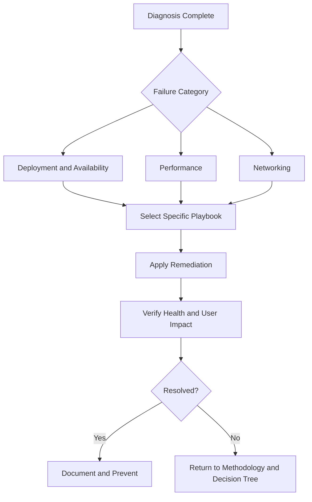

# Troubleshooting Playbooks Hub

This hub organizes remediation playbooks by failure category so responders can execute targeted recovery procedures after diagnosis.

## How to Use Playbooks

-    Start from [Decision Tree](../decision-tree.md) to classify the incident.
-    Run one of the [First 10 Minutes](../first-10-minutes/index.md) checklists first.
-    Enter the category below that matches confirmed evidence.
-    Execute one playbook at a time and verify impact before continuing.

## Category Index

### Deployment and Availability

Use this category when deployment execution, environment readiness, or runtime availability is directly affected.

-    Path: `troubleshooting/playbooks/deployment-availability/`
-    Typical symptoms: failed deployments, unhealthy replacements, recurring 5xx during rollout.
-    Prerequisite pages:
    -    [First 10 Minutes: Deployment Failures](../first-10-minutes/deployment-failures.md)
    -    [First 10 Minutes: Health Degradation](../first-10-minutes/health-degradation.md)

### Performance

Use this category when latency, throughput, or saturation constraints are the dominant issue.

-    Path: `troubleshooting/playbooks/performance/`
-    Typical symptoms: high response time, request queueing, autoscaling not matching demand.
-    Prerequisite pages:
    -    [First 10 Minutes: Health Degradation](../first-10-minutes/health-degradation.md)
    -    [Troubleshooting Method](../methodology/troubleshooting-method.md)

### Networking

Use this category when traffic cannot reach the environment reliably or securely.

-    Path: `troubleshooting/playbooks/networking/`
-    Typical symptoms: DNS failures, TLS/listener issues, SG/NACL/routing blocks, intermittent timeouts.
-    Prerequisite pages:
    -    [First 10 Minutes: Connectivity Issues](../first-10-minutes/connectivity-issues.md)
    -    [Architecture Overview](../architecture-overview.md)

## Execution Checklist Before Any Playbook

-    Capture incident start time and user impact statement.
-    Preserve key events and logs before making changes.
-    Confirm rollback option for each planned change.
-    Assign incident owner and communication channel.
-    Define success criteria before execution.

## Required Evidence After Playbook Execution

-    Health state transition (before and after).
-    Error/latency metric impact.
-    Exact change performed and timestamp.
-    Residual risk and follow-up tasks.

## Planned Playbook Detail Structure

When playbook detail pages are added, each should include:

-    Scope and trigger conditions.
-    Safety checks and rollback criteria.
-    Step-by-step remediation commands.
-    Verification and post-incident hardening actions.

## Playbook Entry Criteria

Only start a detailed playbook after these are true:

-    The symptom category is confirmed by evidence, not assumption.
-    Incident owner and communication path are established.
-    A rollback or containment option is known.
-    Current environment state is captured for comparison after changes.

## See Also

-    [Troubleshooting Hub](../index.md)
-    [Decision Tree](../decision-tree.md)
-    [Mental Model](../mental-model.md)
-    [First 10 Minutes](../first-10-minutes/index.md)
-    [Troubleshooting Method](../methodology/troubleshooting-method.md)
-    [Log Sources Map](../methodology/log-sources-map.md)

## Sources

-    https://docs.aws.amazon.com/elasticbeanstalk/latest/dg/troubleshooting.html
-    https://docs.aws.amazon.com/elasticbeanstalk/latest/dg/using-features.events.html
-    https://docs.aws.amazon.com/elasticbeanstalk/latest/dg/using-features.logging.html
-    https://docs.aws.amazon.com/elasticbeanstalk/latest/dg/health-enhanced.html
