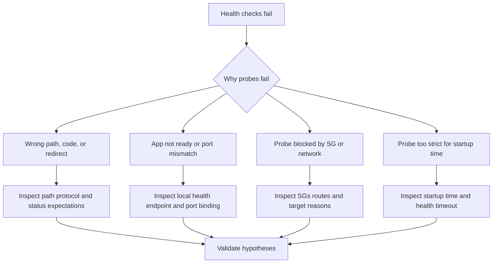

# ELB Health Check Failures

## 1. Summary

Application Load Balancer or Classic Load Balancer health checks fail against Elastic Beanstalk instances, causing targets to become unhealthy and traffic capacity to collapse. This is confusing because the application may appear reachable from a browser or locally, yet the specific health contract used by the load balancer is failing.



**Limitations**

-    Some environments use ALB target groups while older ones may use CLB health settings.
-    Exact reason codes differ slightly by load balancer type.
-    Use the configured health path, not an assumed default, when validating.

**Quick Conclusion**

-    Ask what exact path, code, port, and protocol the load balancer expects.
-    Most health-check failures are bad health endpoint behavior, slow startup, or blocked traffic.

## 2. Common Misreadings

-    "The site loads in a browser, so health checks should pass." The health path may differ.
-    "Health checks only test availability." Status code and timeout rules matter.
-    "A redirect is fine for health checks." ALB expects configured success codes.
-    "If one target passes, all should pass." Startup timing and host-local issues can differ.
-    "Probe failures mean the app is completely down." Some routes can still work while the health contract fails.

## 3. Competing Hypotheses

| ID | Hypothesis | Mechanism | Predictive Signal |
|---|---|---|---|
| H1 | Wrong health path or status behavior | Configured path redirects, authenticates, or returns non-success code | Target-health reason reports response-code mismatch |
| H2 | App not ready or wrong port binding | Process is not listening where/when the probe expects | Local health call or port probe fails |
| H3 | Probe path is blocked by network controls | ALB cannot reach target on the probe path | Timeout or unreachable reason plus SG evidence |
| H4 | Probe timing is too strict for startup behavior | App becomes healthy eventually but not within grace/timeout | Failures cluster during startup or deployments |

## 4. What to Check First

1. Inspect target-health reason codes.

```bash
aws elbv2 describe-target-health --target-group-arn $TARGET_GROUP_ARN
```

2. Confirm target-group health settings.

```bash
aws elbv2 describe-target-groups --target-group-arns $TARGET_GROUP_ARN
```

3. Pull application and proxy logs.

```bash
eb logs --environment-name $ENV_NAME --all
sudo less /var/log/web.stdout.log
sudo less /var/log/nginx/error.log
```

4. Verify local health path behavior from the instance.

```bash
curl --silent --show-error --location --max-time 5 http://127.0.0.1/health
```

## 5. Evidence to Collect

### Required Evidence

-    Target-group health configuration and reason codes.
-    The exact application health path or default path in use.
-    Local response of that path from an instance.
-    App/proxy logs during probe failures.

### Useful Context

-    Recent route, auth, redirect, or middleware changes.
-    Startup duration and deployment timing.
-    Security group changes between ALB and instances.

### CLI Investigation Commands

```bash
aws elbv2 describe-target-groups --target-group-arns $TARGET_GROUP_ARN
aws elbv2 describe-target-health --target-group-arn $TARGET_GROUP_ARN
aws elasticbeanstalk describe-configuration-settings \
    --application-name $APP_NAME \
    --environment-name $ENV_NAME
aws ec2 describe-security-groups --group-ids $ALB_SECURITY_GROUP_ID $INSTANCE_SECURITY_GROUP_ID
```

### CloudWatch Logs Insights Queries

```sql
fields @timestamp, @message
| filter @message like /health|upstream|301|302|401|403|404|502|504/
| sort @timestamp asc
| limit 100
```

## 6. Validation and Disproof by Hypothesis

### H1. Wrong health path or status behavior

#### Evidence that SUPPORTS

| Evidence | Why it supports H1 |
|---|---|
| Target-health reason reports code mismatch | Path responds, but not acceptably |
| Local call to the configured path returns redirect or auth challenge | Health contract is wrong |

#### Evidence that DISPROVES

| Evidence | Why it disproves H1 |
|---|---|
| Configured path returns fast success code | Path behavior is correct |
| Target-health failure is timeout, not code mismatch | Another issue dominates |

#### Validation Commands

```bash
aws elbv2 describe-target-health --target-group-arn $TARGET_GROUP_ARN
curl --silent --show-error --location --max-time 5 http://127.0.0.1/health
```

#### Normal vs Abnormal

| Signal | Normal | Abnormal |
|---|---|---|
| Health path response | Deterministic success code | Redirect, auth, 4xx, or 5xx |
| Target-health reason | Healthy | Response-code mismatch |

### H2. App not ready or wrong port binding

#### Evidence that SUPPORTS

| Evidence | Why it supports H2 |
|---|---|
| Local health path fails or times out | App is not ready |
| Logs show bind failure or slow startup | Probe arrives before stable readiness |

#### Evidence that DISPROVES

| Evidence | Why it disproves H2 |
|---|---|
| App responds locally on the expected path and port | Startup and binding are fine |
| Failures continue even after warm steady state | Another issue is primary |

#### Validation Commands

```bash
curl --silent --show-error --location --max-time 5 http://127.0.0.1/health
sudo less /var/log/web.stdout.log
```

#### Normal vs Abnormal

| Signal | Normal | Abnormal |
|---|---|---|
| Local readiness | Fast success | Timeout, refusal, or bind error |
| Startup profile | Reaches ready in expected window | Slow or failed startup |

### H3. Probe path is blocked by network controls

#### Evidence that SUPPORTS

| Evidence | Why it supports H3 |
|---|---|
| SG review shows missing ALB-to-instance rule | Probe cannot reach target |
| Target-health reason is timeout or unreachable | Network path fits the symptom |

#### Evidence that DISPROVES

| Evidence | Why it disproves H3 |
|---|---|
| Required SG path exists and local health works | Network block is less likely |
| Code mismatch rather than timeout is reported | Health contract is more relevant |

#### Validation Commands

```bash
aws ec2 describe-security-groups --group-ids $ALB_SECURITY_GROUP_ID $INSTANCE_SECURITY_GROUP_ID
aws elbv2 describe-target-health --target-group-arn $TARGET_GROUP_ARN
```

#### Normal vs Abnormal

| Signal | Normal | Abnormal |
|---|---|---|
| Probe network path | Allowed by SGs and routes | Timeout or unreachable due to blocked path |
| Target-health reason | Healthy or code-based reason | Timeout/unreachable with network evidence |

### H4. Probe timing is too strict for startup behavior

#### Evidence that SUPPORTS

| Evidence | Why it supports H4 |
|---|---|
| Failures cluster only during deployments or restarts | App eventually becomes healthy |
| Startup logs show successful readiness after the probe budget expires | Timing is too tight |

#### Evidence that DISPROVES

| Evidence | Why it disproves H4 |
|---|---|
| Target remains unhealthy indefinitely | Not just a timing problem |
| App is ready quickly yet probes fail | Another issue dominates |

#### Validation Commands

```bash
aws elbv2 describe-target-groups --target-group-arns $TARGET_GROUP_ARN
sudo less /var/log/web.stdout.log
```

#### Normal vs Abnormal

| Signal | Normal | Abnormal |
|---|---|---|
| Startup-to-healthy time | Within grace and timeout budget | App recovers only after probe deadline |
| Incident timing | No special deploy-only failures | Failures concentrated on rollout or restart |

## 7. Likely Root Cause Patterns

| Trigger | Root Cause | Evidence | Fix |
|---|---|---|---|
| Route/auth change | Wrong health endpoint semantics | Response-code mismatch | Restore lightweight unauthenticated path |
| Runtime change | Port or readiness mismatch | Local health failure or bind issue | Align app startup with EB expectations |
| Security hardening | Blocked ALB-to-target path | Timeout health reason and SG gap | Restore required probe path |
| Slower startup | Probe too strict | Deploy-only failures and late readiness | Tune startup and health timing carefully |

## 8. Immediate Mitigations

1. Restore the last known-good health path if it changed.

```bash
aws elasticbeanstalk update-environment \
    --environment-name $ENV_NAME \
    --option-settings Namespace=aws:elasticbeanstalk:application,OptionName=Application Healthcheck URL,Value=/health
```

2. If a deployment introduced the issue, roll back to the last healthy application version.

3. Restore the ALB-to-instance probe path in security groups if it was removed.

4. If startup timing is the only problem, shorten startup work before relaxing health timing.

## 9. Prevention

1. Treat the health endpoint as an operational contract and test it explicitly.
2. Keep health checks unauthenticated and dependency-light.
3. Validate target-group health after every routing, auth, or proxy change.
4. Alert on target-health reason changes, not only environment color.
5. Benchmark startup duration before rollout-policy changes.

## See Also

-    [Health Turns Red After Successful Deploy](../deployment-availability/health-red-after-deploy.md)
-    [Load Balancer Returns 5xx Errors](./load-balancer-5xx.md)
-    [HTTPS Termination Issues](./https-termination-issues.md)

## Sources

-    https://docs.aws.amazon.com/elasticloadbalancing/latest/application/target-group-health-checks.html
-    https://docs.aws.amazon.com/elasticbeanstalk/latest/dg/health-enhanced.html
-    https://docs.aws.amazon.com/elasticbeanstalk/latest/dg/using-features.logging.html
