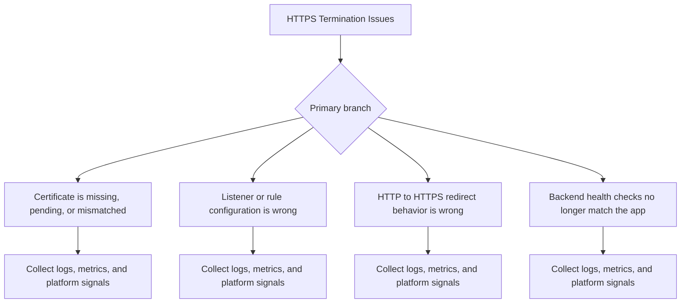
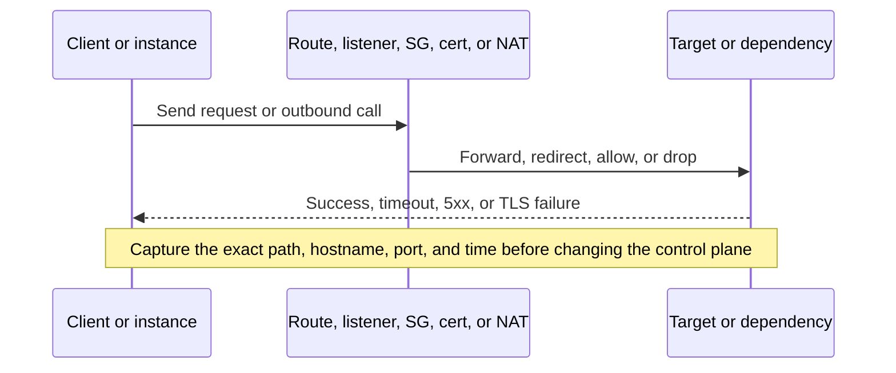

# HTTPS Termination Issues

## 1. Summary
HTTPS fails because certificate, listener, redirect, or backend health expectations no longer line up with the environment.



## 2. Common Misreadings
- Security groups alone explain all network behavior.
- One successful request proves the path is healthy.
- Every 5xx or timeout means the app is broken.
- If the certificate exists, HTTPS must work.
- Private networking failures cannot affect deployments.

## 3. Competing Hypotheses
- - H1: Certificate is missing, pending, or mismatched — Primary evidence should confirm or disprove whether certificate is missing, pending, or mismatched.
- - H2: Listener or rule configuration is wrong — Primary evidence should confirm or disprove whether listener or rule configuration is wrong.
- - H3: HTTP to HTTPS redirect behavior is wrong — Primary evidence should confirm or disprove whether http to https redirect behavior is wrong.
- - H4: Backend health checks no longer match the app — Primary evidence should confirm or disprove whether backend health checks no longer match the app.

## 4. What to Check First
### Metrics
- Separate client-facing symptoms from backend target-state symptoms.
- Check target health, ALB or VPC evidence, and EB health in the same time window.
- Treat route, listener, certificate, and SG evidence as first-class signals.

### Logs
- Read `nginx/access.log` for host, scheme, path, and status-code clues.
- Read `nginx/error.log` for connection-refused, timeout, or TLS-adjacent failures.
- Read `web.stdout.log` only after confirming traffic reached the app path.

### Platform Signals
- Run `eb health --environment-name $ENV_NAME --refresh` and capture target state early.
- Preserve route, listener, certificate, or subnet evidence before making changes.
- Compare one successful path with one failing path whenever the symptom is intermittent.

| Signal | Normal | Abnormal | Why it matters |
| --- | --- | --- | --- |
| Target state | Targets are healthy and routing behaves as designed | Targets time out, reject probes, or route unexpectedly | Narrowest signal for path issues |
| Request path | Host, scheme, and status code are consistent | Unexpected redirects, timeouts, or 5xx appear | Shows whether the client path and backend path align |
| Control-plane config | Listeners, routes, SGs, or NAT path match intent | A listener, route, SG, or NAT assumption drifted | Explains why healthy code suddenly becomes unreachable |
| Health color | Environment stays `Ok` or brief `Warning` | `Warning`, `Degraded`, or `Severe` persists | Shows when the path failure has become an availability incident |

## 5. Evidence to Collect
### Required Evidence
- First symptom timestamp in UTC.
- One healthy comparison sample if available.
- Relevant EB health color transitions (`Ok`, `Warning`, `Degraded`, `Severe`).
- Exact app version, platform branch, and environment name.

### Useful Context
- Whether the symptom started after deploy, config change, platform update, or traffic change.
- Whether the issue is isolated to one instance, one batch, one subnet, or the full environment.
- Any recent changes to health checks, listeners, routes, worker counts, dependencies, or deployment policy.

### CLI Investigation Commands
#### 1. Check EB health and target state

```bash
eb health --environment-name $ENV_NAME --refresh
aws elasticbeanstalk describe-environment-health --environment-name $ENV_NAME --attribute-names All
aws elbv2 describe-target-health --target-group-arn $TARGET_GROUP_ARN
```

Example output:

```text
instance-id           status   cause
i-xxxxxxxxxxxxxxxxx   Severe   Target.Timeout
TargetHealthDescriptions:
  - Target.Id: i-xxxxxxxxxxxxxxxxx
    TargetHealth.State: unhealthy
    TargetHealth.Reason: Target.Timeout
```

!!! tip
    Target health reason codes usually narrow the issue faster than application logs alone.

#### 2. Collect proxy logs and recent events

```bash
eb logs --environment-name $ENV_NAME --all
aws elasticbeanstalk describe-events --environment-name $ENV_NAME --max-items 20
```

Example output:

```text
Logs were saved to /var/folders/.../logs-20260407.zip
2026-04-07 11:17:41    WARN    Instance deployment detected networking errors.
```

!!! tip
    If proxy logs show timeouts but target health is also failing, keep both app-path and network-path hypotheses open.

#### 3. Inspect the most likely network control point

```bash
aws ec2 describe-route-tables --filters Name=association.subnet-id,Values=$SUBNET_ID_1,$SUBNET_ID_2
aws ec2 describe-security-groups --group-ids $ALB_SECURITY_GROUP_ID $INSTANCE_SECURITY_GROUP_ID
```

Example output:

```text
RouteTables:
  - Routes:
      - DestinationCidrBlock: 0.0.0.0/0
        NatGatewayId: nat-xxxxxxxxxxxxxxxxx
SecurityGroups:
  - GroupId: sg-xxxxxxxxxxxxxxxxx
```

!!! tip
    Preserve the first-known-bad route, listener, SG, or certificate state before changing it.


### Evidence Timeline


### Sample Log Patterns
```text
2026-04-07T20:11:10.018Z ERROR connect ETIMEDOUT 198.51.100.x:443
2026/04/07 20:11:12 [error] 4110#4110: *1011 upstream timed out (110: Connection timed out) while connecting to upstream
2026-04-07T20:11:14.010Z ERROR certificate or route expectation mismatch detected
2 <account-id> eni-xxxxxxxxxxxxxxxxx 10.0.x.x 198.51.100.x 45678 443 6 3 180 1712520670 1712520730 REJECT OK
```

### CloudWatch Logs Insights Queries with Example Output
#### Query 1. Find the earliest incident evidence

```sql
fields @timestamp, @message
| filter @message like /301|scheme=http/
| sort @timestamp asc
| limit 20
```

Example results:

| @timestamp | @message |
| --- | --- |
| 2026-04-07 09:15:06 | 301 |
| 2026-04-07 09:15:17 | scheme=http |

!!! tip
    How to Read This: The first row is usually the best root-cause anchor; later rows are often downstream consequences.

#### Query 2. Find the most visible failure signatures

```sql
fields @timestamp, @message
| filter @message like /hostname mismatch|invalid response/
| sort @timestamp desc
| limit 20
```

Example results:

| @timestamp | @message |
| --- | --- |
| 2026-04-07 09:15:21 | hostname mismatch |
| 2026-04-07 09:15:28 | invalid response |

!!! tip
    How to Read This: Compare these rows with EB health color transitions and deployment or traffic timing before acting.

## 6. Validation and Disproof by Hypothesis
### H1: Certificate is missing, pending, or mismatched

Confirm:
- Logs, metrics, and platform state all point directly at this branch.
- The first failing timestamp lines up with evidence expected for `Certificate is missing, pending, or mismatched`.

Disprove:
- The expected log or state change for this branch never appears.
- Another branch has earlier, stronger, and more direct evidence.

### H2: Listener or rule configuration is wrong

Confirm:
- Logs, metrics, and platform state all point directly at this branch.
- The first failing timestamp lines up with evidence expected for `Listener or rule configuration is wrong`.

Disprove:
- The expected log or state change for this branch never appears.
- Another branch has earlier, stronger, and more direct evidence.

### H3: HTTP to HTTPS redirect behavior is wrong

Confirm:
- Logs, metrics, and platform state all point directly at this branch.
- The first failing timestamp lines up with evidence expected for `HTTP to HTTPS redirect behavior is wrong`.

Disprove:
- The expected log or state change for this branch never appears.
- Another branch has earlier, stronger, and more direct evidence.

### H4: Backend health checks no longer match the app

Confirm:
- Logs, metrics, and platform state all point directly at this branch.
- The first failing timestamp lines up with evidence expected for `Backend health checks no longer match the app`.

Disprove:
- The expected log or state change for this branch never appears.
- Another branch has earlier, stronger, and more direct evidence.

## 7. Likely Root Cause Patterns
- A recent change shifted the failure into this playbook's domain.
- The earliest warning was ignored and later symptoms obscured the first cause.
- A platform, configuration, or dependency assumption drifted from the known-good state.
- The environment had too little safety margin for rollout, load, or path changes.

## 8. Immediate Mitigations
1. Preserve the first-failure evidence before retrying or restarting anything.
2. Contain user impact with the smallest safe rollback, scale, or routing change.
3. Change only one suspected variable at a time and re-check health colors, logs, and metrics.
4. Confirm that the symptom, not just the dashboard noise, has improved.

## 9. Prevention
- Keep environment configuration, health checks, and rollout assumptions under version control.
- Test the same path in staging with the same platform branch and deployment policy.
- Alert on the earliest signal for this failure mode, not only the final outage symptom.
- Review baselines regularly so abnormal behavior is obvious during incidents.

## See Also
- [Troubleshooting Playbooks Hub](../index.md)
- [Environment Launch Failed](../deployment-availability/environment-launch-failed.md)
- [Load Balancer Returns 5xx Errors](./load-balancer-5xx.md)

## Sources
- [Using Elastic Beanstalk with Amazon VPC](https://docs.aws.amazon.com/elasticbeanstalk/latest/dg/using-features.managing.vpc.html)
- [Application Load Balancer target group health checks](https://docs.aws.amazon.com/elasticloadbalancing/latest/application/target-group-health-checks.html)
- [Elastic Beanstalk logs](https://docs.aws.amazon.com/elasticbeanstalk/latest/dg/using-features.logging.html)
- [Troubleshooting Elastic Beanstalk](https://docs.aws.amazon.com/elasticbeanstalk/latest/dg/troubleshooting.html)
