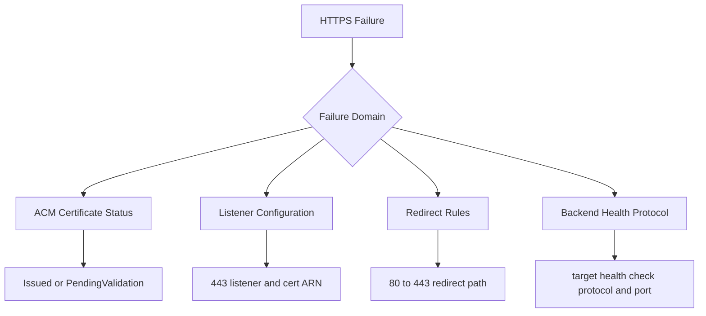

# HTTPS Termination Issues

## 1. Summary

HTTPS fails for an Elastic Beanstalk environment due to certificate, listener, redirect, or health-protocol mismatches.

- Primary symptom: TLS handshake failures, certificate warnings, or HTTP-only behavior.
- Primary risk: insecure traffic paths, browser trust failures, and outage for HTTPS-only clients.
- Typical blast radius: all public traffic routed through affected listener.
- Investigation goal: isolate whether ACM validation, certificate ARN, listener configuration, redirect behavior, or backend health protocol causes failure.



## 2. Common Misreadings

- "Certificate exists in ACM, so HTTPS should work." Certificate must be issued, in-region, and attached to listener.
- "Browser warning means expired cert only." Wrong domain, wrong ARN, or chain issues can produce warnings.
- "Redirect missing is minor." Inconsistent HTTP/HTTPS can break auth callbacks and security assumptions.
- "Backend protocol mismatch only affects health checks." It can trigger target unhealthy and broader outages.
- "Port 443 open on ALB is enough." Security groups and listener rules both must be correct.

## 3. Competing Hypotheses

| ID | Hypothesis | Mechanism | Predictive Signal |
|---|---|---|---|
| H1 | ACM certificate not validated | Cert remains unusable for TLS listener | ACM status `PENDING_VALIDATION` |
| H2 | Wrong certificate ARN | Listener serves unrelated cert/domain | Browser reports domain mismatch |
| H3 | Listener misconfigured | 443 listener absent or action misrouted | ALB listener list missing expected HTTPS config |
| H4 | HTTP to HTTPS redirect missing | Requests remain on HTTP unexpectedly | Port 80 listener forwards without redirect rule |
| H5 | Backend health check protocol wrong | Target checks use incompatible protocol/path | Target health fails after HTTPS changes |

## 4. What to Check First

1. Verify ACM certificate status and domain coverage.

```bash
aws acm describe-certificate --certificate-arn $CERTIFICATE_ARN
```

2. Inspect ALB listeners and default actions.

```bash
aws elbv2 describe-listeners --load-balancer-arn $LOAD_BALANCER_ARN
```

3. Validate listener rules for redirect behavior.

```bash
aws elbv2 describe-rules --listener-arn $HTTP_LISTENER_ARN
```

4. Confirm target group health protocol/port and status.

```bash
aws elbv2 describe-target-groups --target-group-arns $TARGET_GROUP_ARN
aws elbv2 describe-target-health --target-group-arn $TARGET_GROUP_ARN
```

5. Check security groups include inbound 443 from expected sources.

```bash
aws ec2 describe-security-groups --group-ids $ALB_SECURITY_GROUP_ID
```

## 5. Evidence to Collect

| Evidence | Command | Why it matters |
|---|---|---|
| ACM certificate state | `aws acm describe-certificate --certificate-arn $CERTIFICATE_ARN` | Confirms issuance, domain names, and validation state |
| ALB listener config | `aws elbv2 describe-listeners --load-balancer-arn $LOAD_BALANCER_ARN` | Verifies 443 listener, protocol, and attached certificate ARN |
| Redirect rule definition | `aws elbv2 describe-rules --listener-arn $HTTP_LISTENER_ARN` | Confirms consistent HTTP to HTTPS redirect behavior |
| Target health protocol details | `aws elbv2 describe-target-groups --target-group-arns $TARGET_GROUP_ARN` | Detects protocol mismatch after TLS changes |
| ALB security group ingress | `aws ec2 describe-security-groups --group-ids $ALB_SECURITY_GROUP_ID` | Ensures traffic on 443 can reach listener |

Collection notes:

- Confirm region of ACM certificate matches ALB region.
- Capture SAN list and compare against requested hostname.
- Record any browser or client TLS error code without exposing user-identifying metadata.

## 6. Validation and Disproof by Hypothesis

### H1: ACM certificate not validated

Validate:

- Certificate state is not `ISSUED`.
- DNS/email validation records not completed.

Disprove:

- Certificate is `ISSUED` and valid for required domain names.

### H2: Wrong certificate ARN

Validate:

- Listener references ARN for a different domain certificate.
- TLS handshake presents unexpected certificate CN/SAN.

Disprove:

- Listener ARN matches intended certificate and SAN coverage.

### H3: Listener misconfigured

Validate:

- 443 listener missing, disabled, or forwards to wrong target group.
- Listener action chain conflicts with desired host/path routing.

Disprove:

- Listener exists and routes correctly with valid certificate.

### H4: HTTP to HTTPS redirect missing

Validate:

- Port 80 listener forwards directly instead of redirecting to 443.
- Clients remain on HTTP without enforced upgrade.

Disprove:

- Redirect rule consistently sends HTTP traffic to HTTPS.

### H5: Backend health check protocol wrong

Validate:

- Target group health check protocol/path incompatible with backend service.
- Health failures begin after TLS or listener change.

Disprove:

- Health check protocol/path unchanged and targets remain healthy.

## 7. Likely Root Cause Patterns

- Certificate requested but validation never completed.
- ALB listener updated with stale or wrong certificate ARN.
- Redirect rules removed during listener edits.
- Security group hardening omitted inbound 443.
- Target group health checks switched protocol without backend support.

## 8. Immediate Mitigations

- Attach correct issued ACM certificate ARN to HTTPS listener.
- Restore HTTP to HTTPS redirect rule on port 80.
- Open required inbound 443 traffic in ALB security group.
- Revert recent listener/rule changes if outage is ongoing.
- If certificate validation pending, temporarily serve known-good certificate for affected domain.

```bash
aws elbv2 modify-listener --listener-arn $HTTPS_LISTENER_ARN --certificates CertificateArn=$CERTIFICATE_ARN
```

## 9. Prevention

- Manage certificates, listeners, and rules as code with review.
- Alert on ACM certificate expiration and validation failures.
- Include HTTPS and redirect checks in deployment smoke tests.
- Enforce standard listener templates per environment class.
- Validate target group health protocol after every TLS-related change.

## See Also

- [Load Balancer Returns 5xx Errors](./load-balancer-5xx.md)
- [VPC Connectivity Issues](./vpc-connectivity-issues.md)
- [Environment Launch Failed](../deployment-availability/environment-launch-failed.md)
- [Health Turns Red After Successful Deploy](../deployment-availability/health-red-after-deploy.md)
- [High Latency Under Load](../performance/high-latency-under-load.md)

## Sources

- [Configuring HTTPS termination at the load balancer](https://docs.aws.amazon.com/elasticbeanstalk/latest/dg/configuring-https-elb.html)
- [AWS Certificate Manager public certificates](https://docs.aws.amazon.com/acm/latest/userguide/acm-public-certificates.html)
- [Application Load Balancer listeners](https://docs.aws.amazon.com/elasticloadbalancing/latest/application/load-balancer-listeners.html)
- [Application Load Balancer listener rules](https://docs.aws.amazon.com/elasticloadbalancing/latest/application/listener-rules.html)
- [Application Load Balancer target group health checks](https://docs.aws.amazon.com/elasticloadbalancing/latest/application/target-group-health-checks.html)
