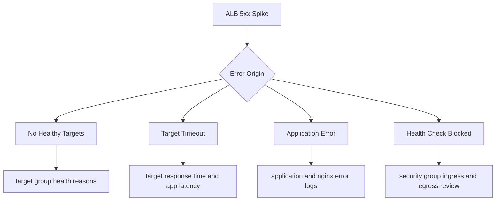

# Load Balancer Returns 5xx Errors

## 1. Summary

Application Load Balancer (ALB) surfaces 5xx errors while routing traffic to Elastic Beanstalk targets.

- Primary symptom: rising `HTTPCode_ELB_5XX_Count` or `HTTPCode_Target_5XX_Count` metrics.
- Primary risk: user-visible failures, retry storms, and rapid health degradation.
- Typical blast radius: all routes behind affected target group.
- Investigation goal: determine if failures come from no healthy targets, target timeouts, application exceptions, or security-group-blocked health checks.



## 2. Common Misreadings

- "ALB 5xx means ALB is broken." Many 5xx outcomes are backend target failures.
- "Target 5xx and ELB 5xx are identical." They represent different failure points.
- "Health checks are green, so no target issues." Transient or path-specific failures can still produce 5xx.
- "Nginx 502 only indicates proxy misconfiguration." It often reflects upstream app failures.
- "Security groups are unchanged, so not relevant." Drift in attached SGs can silently break health checks.

## 3. Competing Hypotheses

| ID | Hypothesis | Mechanism | Predictive Signal |
|---|---|---|---|
| H1 | No healthy targets | ALB has no routable healthy backend | Target group health shows all or most unhealthy |
| H2 | Target timeout | Backend response exceeds ALB timeout budget | `TargetResponseTime` rises with 504 patterns |
| H3 | Application error | App returns 5xx under specific paths/load | Target 5xx count rises with app error traces |
| H4 | Security group blocks health checks | ALB cannot probe target health port/path | Health check failures with timeout reason |

## 4. What to Check First

1. Separate ELB-level and target-level error metrics.

```bash
aws cloudwatch get-metric-statistics --namespace AWS/ApplicationELB --metric-name HTTPCode_ELB_5XX_Count --dimensions Name=LoadBalancer,Value=$LOAD_BALANCER_DIMENSION --statistics Sum --period 60 --start-time $START_TIME --end-time $END_TIME
aws cloudwatch get-metric-statistics --namespace AWS/ApplicationELB --metric-name HTTPCode_Target_5XX_Count --dimensions Name=LoadBalancer,Value=$LOAD_BALANCER_DIMENSION --statistics Sum --period 60 --start-time $START_TIME --end-time $END_TIME
```

2. Inspect target health state and reason codes.

```bash
aws elbv2 describe-target-health --target-group-arn $TARGET_GROUP_ARN
```

3. Pull ALB access logs (if enabled) and instance logs.

```bash
eb logs --environment-name $ENV_NAME --all
```

4. Check ALB and instance security group paths.

```bash
aws ec2 describe-security-groups --group-ids $ALB_SECURITY_GROUP_ID $INSTANCE_SECURITY_GROUP_ID
```

5. Correlate with enhanced health signals.

```bash
eb health --environment-name $ENV_NAME --refresh
```

## 5. Evidence to Collect

| Evidence | Command | Why it matters |
|---|---|---|
| ELB and target 5xx metrics | `aws cloudwatch get-metric-statistics --namespace AWS/ApplicationELB --metric-name HTTPCode_ELB_5XX_Count ...` | Separates front-door versus backend error origin |
| Target health reasons | `aws elbv2 describe-target-health --target-group-arn $TARGET_GROUP_ARN` | Identifies timeout, code mismatch, or connection errors |
| Target response latency | `aws cloudwatch get-metric-statistics --namespace AWS/ApplicationELB --metric-name TargetResponseTime ...` | Confirms timeout risk and backend slowness |
| Application and proxy logs | `eb logs --environment-name $ENV_NAME --all` | Maps 5xx spikes to stack traces or upstream reset signatures |
| Security group rules | `aws ec2 describe-security-groups --group-ids $ALB_SECURITY_GROUP_ID $INSTANCE_SECURITY_GROUP_ID` | Verifies required health check and request traffic paths |

Collection notes:

- Capture same 15-minute incident window across all evidence types.
- Include at least one raw target health JSON snapshot.
- Preserve one healthy-period comparison sample.

## 6. Validation and Disproof by Hypothesis

### H1: No healthy targets

Validate:

- Target health shows no healthy instances in group.
- ALB errors surge immediately after health transitions.

Disprove:

- Majority of targets healthy while errors persist.

### H2: Target timeout

Validate:

- `TargetResponseTime` climbs and ALB reports timeout-like behavior.
- Application logs show slow handlers or blocked downstream calls.

Disprove:

- Response time remains low while 5xx persists from another cause.

### H3: Application error

Validate:

- App stack traces align with failing endpoints and timestamps.
- `HTTPCode_Target_5XX_Count` rises with no health check connectivity issue.

Disprove:

- No app exceptions and failures are predominantly health-check/connectivity-related.

### H4: Security group blocks health checks

Validate:

- SG rules do not permit ALB-to-instance health port traffic.
- Target health reasons indicate timeout/unreachable.

Disprove:

- SG rules correct and health probes succeed consistently.

## 7. Likely Root Cause Patterns

- Health check path changed or now requires auth.
- Upstream app startup regression causes transient 502/504 bursts.
- Connection or thread pool starvation under burst traffic.
- Security group refactor removed ALB source SG ingress.
- Target deregistration/replacement events overlap with high load.

## 8. Immediate Mitigations

- Shift to known-good app version if error rate is sustained.
- Increase temporary capacity to reduce per-target pressure.
- Correct health check path and timeout if app readiness behavior changed.
- Reapply required security group rules for ALB-to-instance traffic.
- Enable access log analysis workflow if not already enabled.

```bash
aws elasticbeanstalk update-environment --environment-name $ENV_NAME --version-label $LAST_GOOD_VERSION
```

## 9. Prevention

- Alert separately on ELB 5xx and target 5xx metrics.
- Keep health endpoint lightweight, stable, and unauthenticated.
- Use canary verification after deployments before declaring success.
- Test SG and NACL rules in CI for required health-check paths.
- Track p95 latency and dependency timeout budget against ALB timeouts.

## See Also

- [Health Turns Red After Successful Deploy](../deployment-availability/health-red-after-deploy.md)
- [Immutable or Rolling Update Triggered Rollback](../deployment-availability/immutable-update-rollback.md)
- [High Latency Under Load](../performance/high-latency-under-load.md)
- [CPU or Memory Consistently at Capacity](../performance/cpu-memory-exhaustion.md)
- [HTTPS Termination Issues](./https-termination-issues.md)

## Sources

- [Application Load Balancer troubleshooting](https://docs.aws.amazon.com/elasticloadbalancing/latest/application/load-balancer-troubleshooting.html)
- [Target group health checks for ALB](https://docs.aws.amazon.com/elasticloadbalancing/latest/application/target-group-health-checks.html)
- [Application Load Balancer CloudWatch metrics](https://docs.aws.amazon.com/elasticloadbalancing/latest/application/load-balancer-cloudwatch-metrics.html)
- [Elastic Beanstalk enhanced health reporting](https://docs.aws.amazon.com/elasticbeanstalk/latest/dg/health-enhanced.html)
- [Elastic Beanstalk logs](https://docs.aws.amazon.com/elasticbeanstalk/latest/dg/using-features.logging.html)
