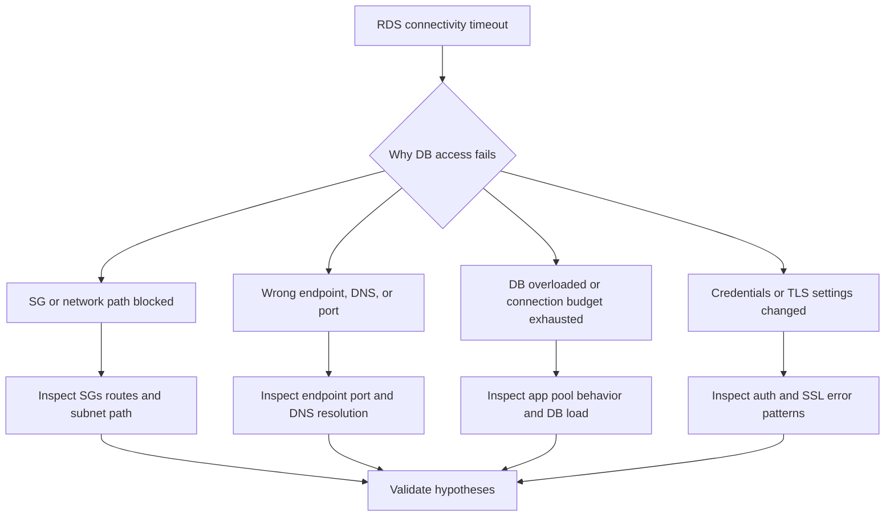

# RDS Connectivity Timeout

## 1. Summary

The application on Elastic Beanstalk times out while connecting to or querying Amazon RDS, causing request latency, 5xx errors, or failed startup. This is confusing because the symptom often appears in application logs only, while the root cause may be SG rules, subnet routing, DNS, credential drift, or exhausted database connections.



**Limitations**

-    DB-side metrics and logs may not be fully available from the EB host alone.
-    This playbook targets reachability and connection establishment, not query optimization.
-    Timeouts and authentication failures can be interleaved; read logs carefully.

**Quick Conclusion**

-    First determine whether the timeout is network, endpoint, connection-pool, or auth-related.
-    Compare one application timeout with the exact DB endpoint, port, and SG path in use.

## 2. Common Misreadings

-    "Database timeout means the database is down." App pool exhaustion or SG drift can look the same.
-    "The endpoint is correct because it has not changed." Failover, rotation, or env var drift can still matter.
-    "Security groups are broad enough." Wrong source SG or subnet path still blocks access.
-    "A connect timeout and auth error are the same class." They imply different mechanisms.
-    "If one app instance connects, all should connect." Subnet/AZ or node-local config can differ.

## 3. Competing Hypotheses

| ID | Hypothesis | Mechanism | Predictive Signal |
|---|---|---|---|
| H1 | SG or network path blocks DB access | EB instances cannot reach the RDS endpoint and port | Timeouts occur before authentication and SG review shows a gap |
| H2 | Wrong DB endpoint, DNS, or port | App is connecting to an incorrect or stale address | Logs show timeout to wrong host/port or DNS resolution problems |
| H3 | DB load or connection budget exhaustion | RDS accepts too slowly or app waits for a free DB connection | App pool wait time or DB connection pressure rises |
| H4 | Credentials or TLS settings changed | App appears to hang or repeatedly retries due to failed auth/TLS negotiation | Logs show auth, SSL, or certificate-related connect failures |

## 4. What to Check First

1. Pull application logs around the timeout.

```bash
eb logs --environment-name $ENV_NAME --all
sudo less /var/log/web.stdout.log
```

2. Confirm environment variables or connection settings.

```bash
aws elasticbeanstalk describe-configuration-settings \
    --application-name $APP_NAME \
    --environment-name $ENV_NAME
```

3. Review SG and subnet path between EB and RDS.

```bash
aws ec2 describe-security-groups --group-ids $INSTANCE_SECURITY_GROUP_ID $RDS_SECURITY_GROUP_ID
aws ec2 describe-route-tables --filters Name=association.subnet-id,Values=$SUBNET_ID_1,$SUBNET_ID_2
```

4. Inspect the RDS instance endpoint and port.

```bash
aws rds describe-db-instances --db-instance-identifier $DB_INSTANCE_IDENTIFIER
```

## 5. Evidence to Collect

### Required Evidence

-    App logs with exact timeout error text.
-    Current DB endpoint, port, and security group references.
-    EB instance SG and RDS SG rules.
-    Connection-pool or retry behavior from the app if available.

### Useful Context

-    Recent DB failover, rotation, credential, or certificate changes.
-    RDS engine type and whether proxying is in use.
-    Whether the issue affects startup only or all runtime queries.

### CLI Investigation Commands

```bash
aws elasticbeanstalk describe-configuration-settings \
    --application-name $APP_NAME \
    --environment-name $ENV_NAME
aws rds describe-db-instances --db-instance-identifier $DB_INSTANCE_IDENTIFIER
aws ec2 describe-security-groups --group-ids $INSTANCE_SECURITY_GROUP_ID $RDS_SECURITY_GROUP_ID
aws ec2 describe-route-tables --filters Name=association.subnet-id,Values=$SUBNET_ID_1,$SUBNET_ID_2
```

### CloudWatch Logs Insights Queries

```sql
fields @timestamp, @message
| filter @message like /timeout|could not connect|Connection timed out|ECONNREFUSED|ENOTFOUND|SSL/
| sort @timestamp asc
| limit 100
```

## 6. Validation and Disproof by Hypothesis

### H1. SG or network path blocks DB access

#### Evidence that SUPPORTS

| Evidence | Why it supports H1 |
|---|---|
| App times out before any auth-specific error | Network path is failing first |
| SG rules do not allow the EB source SG to the DB port | Reachability is blocked |

#### Evidence that DISPROVES

| Evidence | Why it disproves H1 |
|---|---|
| Required SG path is explicit and route posture is correct | Network block is less likely |
| App reaches auth or SQL-level errors | Transport path likely works |

#### Validation Commands

```bash
aws ec2 describe-security-groups --group-ids $INSTANCE_SECURITY_GROUP_ID $RDS_SECURITY_GROUP_ID
aws ec2 describe-route-tables --filters Name=association.subnet-id,Values=$SUBNET_ID_1,$SUBNET_ID_2
```

#### Normal vs Abnormal

| Signal | Normal | Abnormal |
|---|---|---|
| EB-to-RDS path | SG and route allow DB port traffic | Missing source-SG rule or broken route path |
| App connect behavior | Reaches DB quickly | Connect timeout before auth |

### H2. Wrong DB endpoint, DNS, or port

#### Evidence that SUPPORTS

| Evidence | Why it supports H2 |
|---|---|
| App is using a stale or incorrect endpoint value | It is connecting to the wrong destination |
| DNS resolution or port mismatch appears in logs | Endpoint settings are inconsistent |

#### Evidence that DISPROVES

| Evidence | Why it disproves H2 |
|---|---|
| App config exactly matches live RDS endpoint and port | Endpoint drift is unlikely |
| Failures persist after confirming correct endpoint | Another issue dominates |

#### Validation Commands

```bash
aws elasticbeanstalk describe-configuration-settings \
    --application-name $APP_NAME \
    --environment-name $ENV_NAME
aws rds describe-db-instances --db-instance-identifier $DB_INSTANCE_IDENTIFIER
```

#### Normal vs Abnormal

| Signal | Normal | Abnormal |
|---|---|---|
| Endpoint config | Matches active RDS endpoint and port | Stale hostname, wrong port, or bad DNS |
| Connect target | Correct DB destination | Wrong host or unresolved name |

### H3. DB load or connection budget exhaustion

#### Evidence that SUPPORTS

| Evidence | Why it supports H3 |
|---|---|
| App logs show pool wait or too many connections | App or DB connection budget is full |
| Connect latency rises under load, not at idle | Capacity pressure is causal |

#### Evidence that DISPROVES

| Evidence | Why it disproves H3 |
|---|---|
| Timeouts occur at idle with minimal DB use | Not load-driven |
| Network or auth errors fully explain failure | Connection budget is secondary |

#### Validation Commands

```bash
sudo less /var/log/web.stdout.log
aws cloudwatch get-metric-statistics --namespace AWS/ApplicationELB --metric-name RequestCount --dimensions Name=LoadBalancer,Value=$LOAD_BALANCER_DIMENSION --statistics Sum --period 60 --start-time $START_TIME --end-time $END_TIME
```

#### Normal vs Abnormal

| Signal | Normal | Abnormal |
|---|---|---|
| DB connect under load | Degrades gracefully | Pool wait, connection exhaustion, or sharp timeout growth |
| Idle behavior | Low-latency connect | Same timeout under no load is unlikely |

### H4. Credentials or TLS settings changed

#### Evidence that SUPPORTS

| Evidence | Why it supports H4 |
|---|---|
| Logs include auth or SSL failure hints | Transport is reached but negotiation fails |
| Issue began after secret rotation or TLS enforcement change | Change timing matches |

#### Evidence that DISPROVES

| Evidence | Why it disproves H4 |
|---|---|
| Pure connect timeout occurs before any auth negotiation | Network is more likely |
| Known-good credentials and TLS posture still fail identically | Look elsewhere |

#### Validation Commands

```bash
sudo less /var/log/web.stdout.log
aws elasticbeanstalk describe-configuration-settings \
    --application-name $APP_NAME \
    --environment-name $ENV_NAME
```

#### Normal vs Abnormal

| Signal | Normal | Abnormal |
|---|---|---|
| Auth/TLS negotiation | Clean connection establishment | SSL handshake, cert, or auth failure |
| Secret/config timing | Stable across rotations | Failures start immediately after credential/TLS change |

## 7. Likely Root Cause Patterns

| Trigger | Root Cause | Evidence | Fix |
|---|---|---|---|
| SG hardening | EB-to-RDS path blocked | Connect timeout and SG gap | Restore source-SG rule on DB port |
| Failover or env drift | Wrong endpoint | App config differs from live RDS endpoint | Update environment properties |
| Traffic surge | Pool or DB connection exhaustion | Pool wait and load-correlated timeout | Tune pool and protect DB capacity |
| Secret/TLS rotation | Auth/TLS mismatch | SSL or auth errors in app logs | Correct credentials and TLS settings |

## 8. Immediate Mitigations

1. Restore the minimal required SG path from EB instances to the RDS security group.

2. If environment variables drifted, update them with the correct endpoint or credentials.

```bash
aws elasticbeanstalk update-environment \
    --environment-name $ENV_NAME \
    --option-settings Namespace=aws:elasticbeanstalk:application:environment,OptionName=DB_HOST,Value=$DB_HOST
```

3. Reduce app concurrency or expensive DB traffic if the DB connection budget is exhausted.

4. Roll back the recent credential/TLS change if that is the clear trigger and policy allows it.

## 9. Prevention

1. Reference DB endpoints and secrets from controlled configuration, not ad hoc edits.
2. Use SG-to-SG rules rather than broad CIDR assumptions.
3. Track connection-pool wait and DB connection saturation as first-class metrics.
4. Test failover, secret rotation, and TLS changes in staging.
5. Keep health endpoints from depending on heavy DB calls unless necessary.

## See Also

-    [VPC Connectivity Issues](./vpc-connectivity-issues.md)
-    [High Latency Under Load](../performance/high-latency-under-load.md)
-    [Load Balancer Returns 5xx Errors](./load-balancer-5xx.md)

## Sources

-    https://docs.aws.amazon.com/elasticbeanstalk/latest/dg/using-features.managing.vpc.html
-    https://docs.aws.amazon.com/AmazonRDS/latest/UserGuide/Overview.RDSSecurityGroups.html
-    https://docs.aws.amazon.com/AmazonRDS/latest/UserGuide/USER_ConnectToPostgreSQLInstance.html
-    https://docs.aws.amazon.com/AmazonRDS/latest/UserGuide/CHAP_CommonTasks.Connect.EndpointAndPort.html
