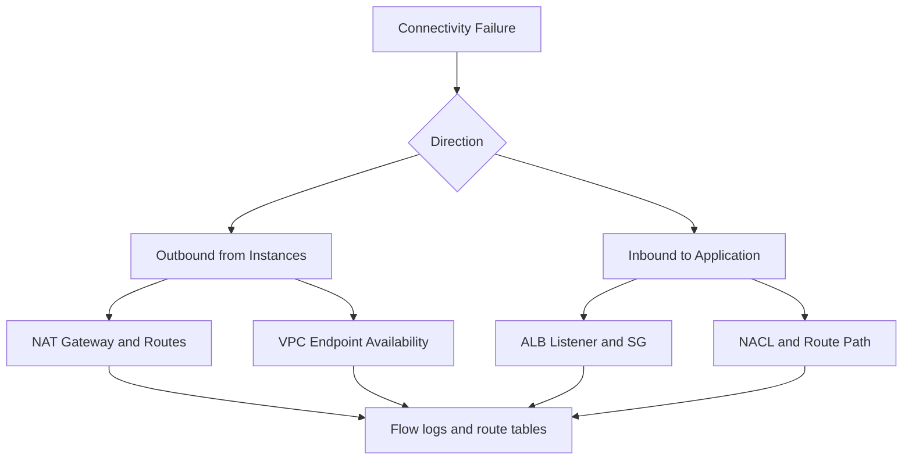

# VPC Connectivity Issues

## 1. Summary

Elastic Beanstalk environment cannot reach external services, or external systems cannot reach the environment as expected.

- Primary symptom: outbound calls fail, inbound traffic blocked, or intermittent network timeouts.
- Primary risk: startup failures, dependency outages, and user-visible availability incidents.
- Typical blast radius: one environment or all environments sharing VPC/network controls.
- Investigation goal: confirm whether NAT, route tables, security groups, NACLs, or VPC endpoints are missing or misconfigured.



## 2. Common Misreadings

- "Security groups are open, so network is fine." Route tables and NACLs can still block traffic.
- "Private subnet is safer and always works." Private subnets need NAT or VPC endpoints for outbound access.
- "One successful ping proves connectivity." Service-specific ports, DNS, and TLS can still fail.
- "NACLs are stateless like SGs." NACLs are stateless and require explicit return-path rules.
- "Endpoint exists, so service reachable." Endpoint policy and DNS settings can still block requests.

## 3. Competing Hypotheses

| ID | Hypothesis | Mechanism | Predictive Signal |
|---|---|---|---|
| H1 | Missing NAT gateway | Private instances lack internet egress path | Outbound calls to public endpoints timeout |
| H2 | Route table misconfigured | Subnet routes do not send traffic to IGW/NAT/endpoint | Flow logs show rejects or no route behavior |
| H3 | Security group too restrictive | Ingress/egress blocks required ports or peers | Connection refused/timeout on specific ports |
| H4 | NACL blocking | Stateless rules block request or response path | Intermittent or directional failures by subnet |
| H5 | VPC endpoint missing | Private traffic to AWS service requires endpoint/NAT | Calls to AWS APIs fail from private subnets |

## 4. What to Check First

1. Identify failing traffic direction and destination.

```bash
eb logs --environment-name $ENV_NAME --all
```

2. Validate subnet route tables.

```bash
aws ec2 describe-route-tables --filters Name=association.subnet-id,Values=$SUBNET_ID_1,$SUBNET_ID_2
```

3. Inspect NAT gateway state for private subnet egress.

```bash
aws ec2 describe-nat-gateways --filter Name=vpc-id,Values=$VPC_ID
```

4. Review security group ingress and egress.

```bash
aws ec2 describe-security-groups --group-ids $ALB_SECURITY_GROUP_ID $INSTANCE_SECURITY_GROUP_ID
```

5. Check NACL entries for involved subnets.

```bash
aws ec2 describe-network-acls --filters Name=association.subnet-id,Values=$SUBNET_ID_1,$SUBNET_ID_2
```

6. Confirm required VPC endpoints.

```bash
aws ec2 describe-vpc-endpoints --filters Name=vpc-id,Values=$VPC_ID
```

## 5. Evidence to Collect

| Evidence | Command | Why it matters |
|---|---|---|
| Route table mappings | `aws ec2 describe-route-tables --filters Name=association.subnet-id,Values=$SUBNET_ID_1,$SUBNET_ID_2` | Confirms next-hop for each subnet |
| NAT gateway status | `aws ec2 describe-nat-gateways --filter Name=vpc-id,Values=$VPC_ID` | Verifies outbound path from private subnets |
| SG rule set | `aws ec2 describe-security-groups --group-ids $ALB_SECURITY_GROUP_ID $INSTANCE_SECURITY_GROUP_ID` | Validates required ingress/egress |
| NACL entries | `aws ec2 describe-network-acls --filters Name=association.subnet-id,Values=$SUBNET_ID_1,$SUBNET_ID_2` | Detects blocked ephemeral/return traffic |
| VPC flow logs | `aws logs filter-log-events --log-group-name $FLOW_LOG_GROUP_NAME --start-time $START_EPOCH_MS --end-time $END_EPOCH_MS` | Shows accept/reject behavior by src/dst/port |

Evidence hygiene:

- Capture source subnet, destination IP/hostname, and port for each failed flow.
- Keep one successful flow sample for comparison.
- Mask private addresses in shared incident notes (`10.0.x.x`).

## 6. Validation and Disproof by Hypothesis

### H1: Missing NAT gateway

Validate:

- Private subnet route points nowhere for `0.0.0.0/0` or NAT is unavailable.
- Outbound internet requests fail consistently from private instances.

Disprove:

- NAT is healthy and route table points to correct NAT gateway.

### H2: Route table misconfigured

Validate:

- Required routes absent or associated to wrong subnets.
- Failures are subnet-specific and deterministic.

Disprove:

- Routes are correct and symmetric for expected path.

### H3: Security group too restrictive

Validate:

- Missing ingress/egress rule for required peer and port.
- Connection succeeds after temporary rule adjustment.

Disprove:

- SG rules already allow required traffic path.

### H4: NACL blocking

Validate:

- NACL lacks return-path ephemeral range or explicit allow entry.
- Flow logs show rejected packets on expected traffic path.

Disprove:

- NACL allows both request and response traffic explicitly.

### H5: VPC endpoint missing

Validate:

- Calls to AWS service fail in private subnet without NAT.
- Adding endpoint resolves connectivity without internet path.

Disprove:

- Endpoint exists and policy permits required actions.

## 7. Likely Root Cause Patterns

- Private subnet rollout omitted NAT route association.
- Security group refactor removed egress to dependency CIDRs.
- NACL hardened without ephemeral return-port allowances.
- VPC endpoint not provisioned for private-only architecture.
- Mixed subnet assignment causes partial connectivity behavior.

## 8. Immediate Mitigations

- Restore known-good route table associations for affected subnets.
- Re-enable critical SG rules for service recovery, then tighten safely.
- Add temporary NAT path for private workloads requiring internet egress.
- Create required interface/gateway endpoint for AWS service access.
- If impact is severe, move traffic to environment in known-good VPC.

```bash
aws ec2 replace-route --route-table-id $ROUTE_TABLE_ID --destination-cidr-block 0.0.0.0/0 --nat-gateway-id $NAT_GATEWAY_ID
```

## 9. Prevention

- Define VPC intent explicitly: public-only, private-with-NAT, or private-with-endpoints.
- Validate network controls in CI with route, SG, and NACL policy tests.
- Enable and retain VPC Flow Logs for all EB subnets.
- Keep standardized subnet and route modules to reduce drift.
- Add connectivity synthetic checks for critical dependencies.

## See Also

- [Environment Launch Failed](../deployment-availability/environment-launch-failed.md)
- [Load Balancer Returns 5xx Errors](./load-balancer-5xx.md)
- [HTTPS Termination Issues](./https-termination-issues.md)
- [Health Turns Red After Successful Deploy](../deployment-availability/health-red-after-deploy.md)
- [Instance Shows Degraded or Severe Health](../performance/instance-degraded-health.md)

## Sources

- [Using Elastic Beanstalk with Amazon VPC](https://docs.aws.amazon.com/elasticbeanstalk/latest/dg/using-features.managing.vpc.html)
- [VPC route tables](https://docs.aws.amazon.com/vpc/latest/userguide/VPC_Route_Tables.html)
- [NAT gateways](https://docs.aws.amazon.com/vpc/latest/userguide/vpc-nat-gateway.html)
- [Security groups for your VPC](https://docs.aws.amazon.com/vpc/latest/userguide/vpc-security-groups.html)
- [Network ACLs](https://docs.aws.amazon.com/vpc/latest/userguide/vpc-network-acls.html)
- [VPC flow logs](https://docs.aws.amazon.com/vpc/latest/userguide/flow-logs.html)
- [VPC endpoints](https://docs.aws.amazon.com/vpc/latest/privatelink/vpc-endpoints.html)
