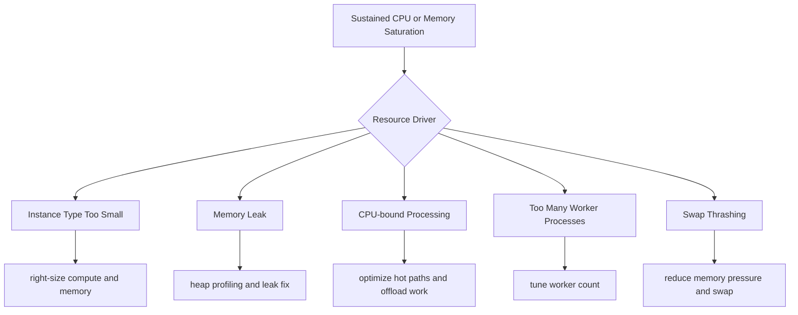

# CPU or Memory Consistently at Capacity

## 1. Summary

Instances run near CPU or memory limits for sustained periods, reducing headroom and increasing failure probability.

- Primary symptom: persistent high `CPUUtilization`, memory pressure, and elevated response times.
- Primary risk: request timeouts, OOM restarts, and degraded health transitions.
- Typical blast radius: full environment when all instances share same sizing and process model.
- Investigation goal: differentiate undersized instance class from software inefficiency and process overcommit.



## 2. Common Misreadings

- "High CPU means healthy utilization." Sustained saturation removes burst capacity and raises latency risk.
- "Scale-out alone will fix memory leaks." Leak behavior may propagate to new instances.
- "OOM killed one process only." Repeated OOM cycles destabilize the full request path.
- "More workers always improve throughput." Overcommitted workers can increase context switching and memory pressure.
- "Swap usage is normal." Active swap-in/out indicates serious memory contention.

## 3. Competing Hypotheses

| ID | Hypothesis | Mechanism | Predictive Signal |
|---|---|---|---|
| H1 | Undersized instance type | Baseline workload exceeds CPU/memory envelope | High utilization even at moderate request rate |
| H2 | Memory leak | Runtime heap or object retention grows continuously | Memory trend rises with uptime, periodic OOM events |
| H3 | CPU-bound processing | Expensive synchronous compute blocks request workers | CPU pinned while I/O remains modest |
| H4 | Too many worker processes | Process count overcommits CPU/memory | Lowering workers improves stability |
| H5 | Swap thrashing | Memory pressure forces heavy swap activity | Latency spikes with swap in/out and low free memory |

## 4. What to Check First

1. Confirm sustained saturation pattern.

```bash
aws cloudwatch get-metric-statistics --namespace AWS/EC2 --metric-name CPUUtilization --dimensions Name=AutoScalingGroupName,Value=$ASG_NAME --statistics Average Maximum --period 60 --start-time $START_TIME --end-time $END_TIME
```

2. Pull host-level snapshots from affected instances.

```bash
top
free -m
vmstat 1 10
```

3. Review application process model and worker configuration.

```bash
aws elasticbeanstalk describe-configuration-settings \
    --application-name $APP_NAME \
    --environment-name $ENV_NAME
```

4. Inspect application logs for OOM or GC pressure signals.

```bash
eb logs --environment-name $ENV_NAME --all
```

5. Correlate saturation with request volume.

```bash
aws cloudwatch get-metric-statistics --namespace AWS/ApplicationELB --metric-name RequestCount --dimensions Name=LoadBalancer,Value=$LOAD_BALANCER_DIMENSION --statistics Sum --period 60 --start-time $START_TIME --end-time $END_TIME
```

## 5. Evidence to Collect

| Evidence | Command | Why it matters |
|---|---|---|
| CPU trend and peaks | `aws cloudwatch get-metric-statistics --namespace AWS/EC2 --metric-name CPUUtilization ...` | Determines sustained versus burst saturation |
| Memory and swap behavior | `free -m`, `vmstat 1 10` | Distinguishes memory leak from transient load |
| Process-level usage | `top` or `htop` | Identifies hot process and worker overcommit |
| Runtime exceptions/OOM logs | `eb logs --environment-name $ENV_NAME --all` | Proves exhaustion impact on app stability |
| Request load baseline | `aws cloudwatch get-metric-statistics --namespace AWS/ApplicationELB --metric-name RequestCount ...` | Shows whether saturation is demand-driven or efficiency-driven |

Minimum evidence set:

- One 24-hour CPU chart and one incident-focused 1-minute chart.
- Memory snapshot at healthy state and degraded state.
- Worker/process count at runtime.
- At least one stack trace or OOM log line if present.

## 6. Validation and Disproof by Hypothesis

### H1: Undersized instance type

Validate:

- High CPU/memory occurs even at normal traffic baseline.
- Temporary larger instance class improves utilization and latency.

Disprove:

- Saturation occurs only with known abnormal code path or runaway process.

### H2: Memory leak

Validate:

- Memory steadily rises with uptime and resets on restart.
- Heap/profile data indicates retained objects without release.

Disprove:

- Memory usage plateaus and stays stable over long periods.

### H3: CPU-bound processing

Validate:

- Profiling shows hot code paths consuming most CPU time.
- Latency correlates with compute-heavy request types.

Disprove:

- CPU time mostly idle or blocked on I/O operations.

### H4: Too many worker processes

Validate:

- Worker count exceeds practical vCPU and memory budget.
- Reducing worker count lowers contention and improves latency.

Disprove:

- Worker count change has no measurable impact.

### H5: Swap thrashing

Validate:

- High swap activity coincides with response time degradation.
- Memory reclaim and major page faults increase sharply.

Disprove:

- Swap is minimal and not active during incident.

## 7. Likely Root Cause Patterns

- Instance family selected for cost, not sustained workload characteristics.
- Runtime defaults for worker concurrency exceed memory budget.
- Hidden CPU-heavy operations introduced in request path.
- Leak in cache/session/object lifecycle under long-lived processes.
- Swap enabled but masking severe memory pressure until latency collapse.

## 8. Immediate Mitigations

- Temporarily scale out and, if needed, scale up instance type.
- Reduce worker/process counts to match vCPU and memory budget.
- Disable non-essential high-cost features under incident mode.
- Restart degraded instances to recover while root cause remediation is underway.
- Apply temporary rate limiting for heavy endpoints to preserve core paths.

```bash
aws autoscaling update-auto-scaling-group --auto-scaling-group-name $ASG_NAME --max-size $TEMP_MAX_SIZE --desired-capacity $TEMP_DESIRED_CAPACITY
```

## 9. Prevention

- Set capacity budgets and enforce per-release performance gates.
- Maintain instance right-sizing reviews tied to real production metrics.
- Add profiling in pre-production and periodic production sampling.
- Tune worker defaults explicitly; avoid platform/runtime implicit defaults.
- Alert on sustained CPU, memory, and swap activity before user-visible latency grows.

## See Also

- [High Latency Under Load](./high-latency-under-load.md)
- [Instance Shows Degraded or Severe Health](./instance-degraded-health.md)
- [Health Turns Red After Successful Deploy](../deployment-availability/health-red-after-deploy.md)
- [Immutable or Rolling Update Triggered Rollback](../deployment-availability/immutable-update-rollback.md)
- [Load Balancer 5xx](../networking/load-balancer-5xx.md)

## Sources

- [Elastic Beanstalk monitoring with Amazon CloudWatch](https://docs.aws.amazon.com/elasticbeanstalk/latest/dg/using-features.monitoring.html)
- [Elastic Beanstalk enhanced health reporting](https://docs.aws.amazon.com/elasticbeanstalk/latest/dg/health-enhanced.html)
- [Amazon EC2 Auto Scaling target tracking](https://docs.aws.amazon.com/autoscaling/ec2/userguide/as-scaling-target-tracking.html)
- [Application Load Balancer CloudWatch metrics](https://docs.aws.amazon.com/elasticloadbalancing/latest/application/load-balancer-cloudwatch-metrics.html)
