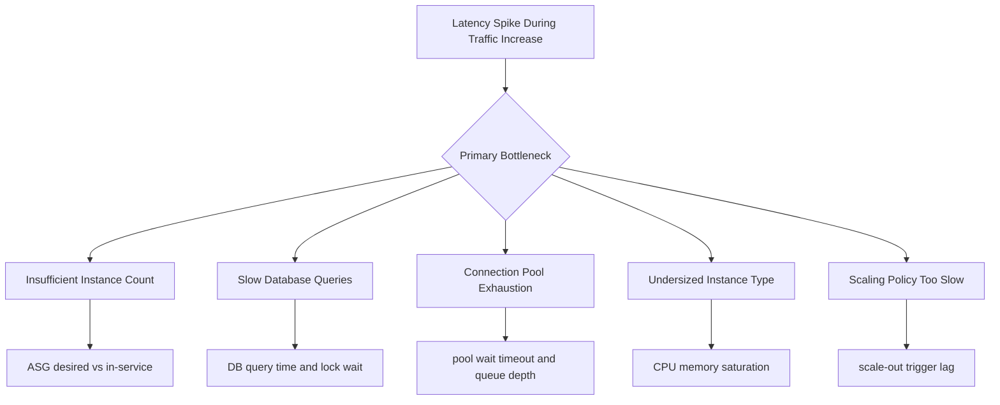

# High Latency Under Load

## 1. Summary

Response times rise sharply when traffic increases, even if the application appears healthy at low concurrency.

- Primary symptom: p95 and p99 latency spikes during traffic ramps.
- Primary risk: cascading timeouts, retries, and elevated 5xx rates.
- Typical blast radius: all requests on overloaded targets and shared data stores.
- Investigation goal: determine if bottleneck is capacity, database performance, connection pool pressure, instance sizing, or slow scaling policy response.



## 2. Common Misreadings

- "Average latency looks fine, so issue is minor." Tail latency drives user experience and timeout risk.
- "CPU is below 70%, so capacity is enough." Thread, connection, or I/O bottlenecks can dominate.
- "Database is healthy globally." A few hot queries can degrade only this workload.
- "Scale-out happened, so policy is good." Slow trigger and cooldown timing can still miss bursts.
- "ALB is the source of delay." ALB target response time reflects backend processing duration.

## 3. Competing Hypotheses

| ID | Hypothesis | Mechanism | Predictive Signal |
|---|---|---|---|
| H1 | Insufficient instances | Request concurrency exceeds serving capacity | In-service target count lags rising request volume |
| H2 | Slow database queries | Query plan, lock contention, or hot rows increase backend time | DB latency rises before app latency spike |
| H3 | Connection pool exhaustion | Worker threads wait for DB/HTTP connections | App logs show pool wait timeout or queueing |
| H4 | Undersized instances | CPU/memory limits throttle processing | CPUUtilization, memory pressure, or GC pause spikes |
| H5 | Scaling policy too slow | Alarm threshold, period, or cooldown reacts late | Scale events occur after latency peak |

## 4. What to Check First

1. Correlate latency with load and capacity in one timeline.

```bash
aws cloudwatch get-metric-statistics --namespace AWS/ApplicationELB --metric-name TargetResponseTime --dimensions Name=LoadBalancer,Value=$LOAD_BALANCER_DIMENSION --statistics Average p95 p99 --period 60 --start-time $START_TIME --end-time $END_TIME
aws cloudwatch get-metric-statistics --namespace AWS/ApplicationELB --metric-name RequestCount --dimensions Name=LoadBalancer,Value=$LOAD_BALANCER_DIMENSION --statistics Sum --period 60 --start-time $START_TIME --end-time $END_TIME
```

2. Check current and historical scaling behavior.

```bash
aws autoscaling describe-auto-scaling-groups --auto-scaling-group-names $ASG_NAME
aws autoscaling describe-scaling-activities --auto-scaling-group-name $ASG_NAME --max-items 100
```

3. Inspect application logs for queueing and timeout signatures.

```bash
eb logs --environment-name $ENV_NAME --all
```

4. Verify instance resource saturation.

```bash
aws cloudwatch get-metric-statistics --namespace AWS/EC2 --metric-name CPUUtilization --dimensions Name=AutoScalingGroupName,Value=$ASG_NAME --statistics Average Maximum --period 60 --start-time $START_TIME --end-time $END_TIME
```

5. Validate target response and error behavior at the load balancer layer.

```bash
aws cloudwatch get-metric-statistics --namespace AWS/ApplicationELB --metric-name HTTPCode_Target_5XX_Count --dimensions Name=LoadBalancer,Value=$LOAD_BALANCER_DIMENSION --statistics Sum --period 60 --start-time $START_TIME --end-time $END_TIME
```

## 5. Evidence to Collect

| Evidence | Command | Why it matters |
|---|---|---|
| ALB target response time | `aws cloudwatch get-metric-statistics --namespace AWS/ApplicationELB --metric-name TargetResponseTime ...` | Confirms backend latency, not client-side network noise |
| Request throughput | `aws cloudwatch get-metric-statistics --namespace AWS/ApplicationELB --metric-name RequestCount ...` | Provides demand curve for capacity comparison |
| Auto Scaling activity | `aws autoscaling describe-scaling-activities --auto-scaling-group-name $ASG_NAME --max-items 100` | Shows reaction lag and blocked scaling actions |
| EC2 resource metrics | `aws cloudwatch get-metric-statistics --namespace AWS/EC2 --metric-name CPUUtilization ...` | Detects compute saturation per scaling stage |
| Application timeout traces | `eb logs --environment-name $ENV_NAME --all` | Confirms pool wait, DB timeout, or dependency bottleneck |

Capture guidance:

- Collect at least 30 minutes before and after the spike.
- Use one-minute periods to avoid smoothing critical peaks.
- Compare one normal period and one incident period.

## 6. Validation and Disproof by Hypothesis

### H1: Insufficient instances

Validate:

- Desired/in-service instance count trails request increase.
- Per-instance request rate spikes while latency worsens.

Disprove:

- Adequate instance count exists, yet latency remains high.

### H2: Slow database queries

Validate:

- App logs show slow query warnings and request spans dominated by DB time.
- DB metrics indicate increased query latency or lock waits.

Disprove:

- Request latency is high with minimal DB time contribution.

### H3: Connection pool exhaustion

Validate:

- Pool acquisition timeouts appear under high concurrency.
- Thread/work queue depth rises while active connections hit pool max.

Disprove:

- Pool utilization remains below limit and no wait events occur.

### H4: Undersized instances

Validate:

- CPU or memory reaches sustained high levels during incident.
- Response improves after temporary vertical scaling.

Disprove:

- Resource metrics stay low while latency still spikes.

### H5: Scaling policy too slow

Validate:

- Scale-out alarms trigger only after latency spike starts.
- Cooldown or evaluation window delays additional scale actions.

Disprove:

- Scaling is timely and capacity rises before latency degradation.

## 7. Likely Root Cause Patterns

- Target tracking threshold set too high for bursty traffic profile.
- Cooldown prevents rapid successive scale-out actions.
- Application concurrency tuned for baseline traffic only.
- DB hot partition/query plan regression under increased cardinality.
- Pool sizes mismatch between app workers and backend connection limits.

## 8. Immediate Mitigations

- Pre-scale capacity before known traffic events.

```bash
aws autoscaling update-auto-scaling-group --auto-scaling-group-name $ASG_NAME --desired-capacity $TEMP_DESIRED_CAPACITY
```

- Lower scale-out threshold and shorten evaluation window cautiously.
- Increase max capacity temporarily to avoid saturation ceiling.
- Reduce per-request work: disable heavy synchronous features during incident.
- Add short-lived cache for expensive read paths.

## 9. Prevention

- Define SLOs around p95/p99 latency and tie alarms to early saturation indicators.
- Load-test with realistic burst patterns and dependency behavior.
- Right-size worker/process and connection pool settings per instance type.
- Tune Auto Scaling with faster scale-out and conservative scale-in.
- Review top slow queries and add indexing/query-plan safeguards.

## See Also

- [CPU and Memory Exhaustion](./cpu-memory-exhaustion.md)
- [Instance Degraded Health](./instance-degraded-health.md)
- [Health Turns Red After Successful Deploy](../deployment-availability/health-red-after-deploy.md)
- [Load Balancer 5xx](../networking/load-balancer-5xx.md)
- [VPC Connectivity Issues](../networking/vpc-connectivity-issues.md)

## Sources

- [Elastic Beanstalk monitoring with Amazon CloudWatch](https://docs.aws.amazon.com/elasticbeanstalk/latest/dg/using-features.monitoring.html)
- [Amazon EC2 Auto Scaling scaling policies](https://docs.aws.amazon.com/autoscaling/ec2/userguide/as-scaling-simple-step.html)
- [Target tracking scaling policies](https://docs.aws.amazon.com/autoscaling/ec2/userguide/as-scaling-target-tracking.html)
- [Application Load Balancer CloudWatch metrics](https://docs.aws.amazon.com/elasticloadbalancing/latest/application/load-balancer-cloudwatch-metrics.html)
- [Elastic Beanstalk enhanced health](https://docs.aws.amazon.com/elasticbeanstalk/latest/dg/health-enhanced.html)
