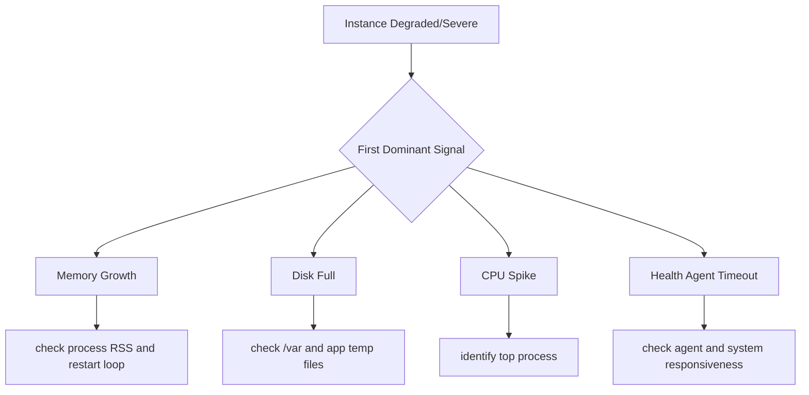

# Instance Shows Degraded or Severe Health

## 1. Summary

One or more instances in an Elastic Beanstalk environment report degraded or severe health while others may remain healthy.

- Primary symptom: `eb health --refresh` shows instance-level yellow/red state.
- Primary risk: localized issue spreads as load shifts to fewer healthy instances.
- Typical blast radius: starts at single instance, expands under load.
- Investigation goal: determine whether degradation comes from memory leak, disk saturation, CPU-intensive background process, or health agent communication timeout.



## 2. Common Misreadings

- "Only one instance is bad, ignore it." Single-node degradation often predicts fleet-wide failure.
- "Health severe means application bug only." Host-level resource issues can trigger severe state.
- "Restart fixed it, root cause solved." Restart may only reset symptoms for leaks and growth patterns.
- "CPU high means traffic high." Background jobs or runaway processes can consume CPU independently.
- "Disk usage is static." Logs, temp files, and crash dumps can fill disk rapidly.

## 3. Competing Hypotheses

| ID | Hypothesis | Mechanism | Predictive Signal |
|---|---|---|---|
| H1 | Application memory leak | Process heap grows over uptime, causing pressure/OOM | Memory rises monotonically per instance age |
| H2 | Disk full | Logs/temp/artifacts consume volume and block writes | High disk usage and write errors in logs |
| H3 | CPU spike from background process | Non-request process starves app workers | `top` shows non-web process dominating CPU |
| H4 | Enhanced health agent timeout | Agent cannot report due host overload or connectivity issue | EB health reports stale/timeout data from affected node |

## 4. What to Check First

1. Get current per-instance health state.

```bash
eb health --environment-name $ENV_NAME --refresh
aws elasticbeanstalk describe-instances-health --environment-name $ENV_NAME --attribute-names All
```

2. Collect logs for degraded instance.

```bash
eb logs --environment-name $ENV_NAME --all
sudo less /var/log/eb-engine.log
sudo less /var/log/web.stdout.log
```

3. Check host resource utilization directly.

```bash
top
df -h
free -m
```

4. Review EC2 metrics around degradation window.

```bash
aws cloudwatch get-metric-statistics --namespace AWS/EC2 --metric-name CPUUtilization --dimensions Name=InstanceId,Value=$INSTANCE_ID --statistics Average Maximum --period 60 --start-time $START_TIME --end-time $END_TIME
```

5. Compare degraded instance against healthy peer.

```bash
aws ec2 describe-instances --instance-ids $INSTANCE_ID $HEALTHY_INSTANCE_ID
```

## 5. Evidence to Collect

| Evidence | Command | Why it matters |
|---|---|---|
| Instance-level health reasons | `aws elasticbeanstalk describe-instances-health --environment-name $ENV_NAME --attribute-names All` | Distinguishes app latency, status code, and host metrics causes |
| Deployment/engine log | `sudo less /var/log/eb-engine.log` | Detects recurring deploy hooks, restart behavior, and failures |
| Process and resource snapshot | `top`, `free -m`, `df -h` | Confirms CPU, memory, and disk bottleneck domain |
| Application runtime output | `sudo less /var/log/web.stdout.log` | Shows OOM, fatal exceptions, or dependency backoff loops |
| CloudWatch per-instance metrics | `aws cloudwatch get-metric-statistics ...` | Establishes trend and recurrence, not just one-time sample |

Evidence checklist:

- Record instance age/launch time relative to symptom onset.
- Capture exact health status reason text.
- Save one stable-instance snapshot for baseline comparison.

## 6. Validation and Disproof by Hypothesis

### H1: Application memory leak

Validate:

- Resident memory increases steadily with uptime.
- Restart drops memory and temporarily restores health.

Disprove:

- Memory remains stable; degradation occurs without growth trend.

### H2: Disk full

Validate:

- Disk utilization approaches 100% at failure time.
- Logs show no space left on device errors.

Disprove:

- Disk has adequate free space during incident window.

### H3: CPU spike from background process

Validate:

- `top` identifies non-request process consuming majority CPU.
- CPU spike aligns with cron/job/runtime task schedule.

Disprove:

- No abnormal process dominates CPU; request workload correlates instead.

### H4: Enhanced health agent timeout

Validate:

- Health data from instance becomes stale/intermittent.
- Host is under pressure and agent updates are delayed.

Disprove:

- Agent data remains timely and issue maps clearly to app or resource bottleneck.

## 7. Likely Root Cause Patterns

- Memory leak in long-lived worker processes.
- Log growth policy missing, causing `/var/log` saturation.
- Background indexing/reporting task deployed on same instances as web tier.
- Worker count too high for instance memory footprint.
- Health checks degraded by host starvation during GC or swap pressure.

## 8. Immediate Mitigations

- Replace unhealthy instances by increasing desired capacity, then terminating degraded node.
- Reduce worker/process count to fit memory envelope.
- Purge non-critical temporary files and rotate oversized logs.
- Disable or reschedule heavy background jobs away from peak traffic windows.
- Scale out to reduce per-instance load while investigating.

```bash
aws autoscaling update-auto-scaling-group --auto-scaling-group-name $ASG_NAME --desired-capacity $NEW_DESIRED_CAPACITY
```

## 9. Prevention

- Add alarms for memory, disk, and instance health status transitions.
- Enforce log rotation and retention limits on instance filesystem.
- Separate background worker tier from web-serving tier when workload grows.
- Perform soak tests to detect memory growth over long runtimes.
- Create automatic remediation runbooks for single-instance severe health.

## See Also

- [CPU and Memory Exhaustion](./cpu-memory-exhaustion.md)
- [High Latency Under Load](./high-latency-under-load.md)
- [Health Turns Red After Successful Deploy](../deployment-availability/health-red-after-deploy.md)
- [Environment Launch Failed](../deployment-availability/environment-launch-failed.md)
- [VPC Connectivity Issues](../networking/vpc-connectivity-issues.md)

## Sources

- [Elastic Beanstalk enhanced health reporting](https://docs.aws.amazon.com/elasticbeanstalk/latest/dg/health-enhanced.html)
- [Elastic Beanstalk logs](https://docs.aws.amazon.com/elasticbeanstalk/latest/dg/using-features.logging.html)
- [Elastic Beanstalk monitoring with CloudWatch](https://docs.aws.amazon.com/elasticbeanstalk/latest/dg/using-features.monitoring.html)
- [Amazon EC2 Auto Scaling health checks](https://docs.aws.amazon.com/autoscaling/ec2/userguide/ts-as-healthchecks.html)
