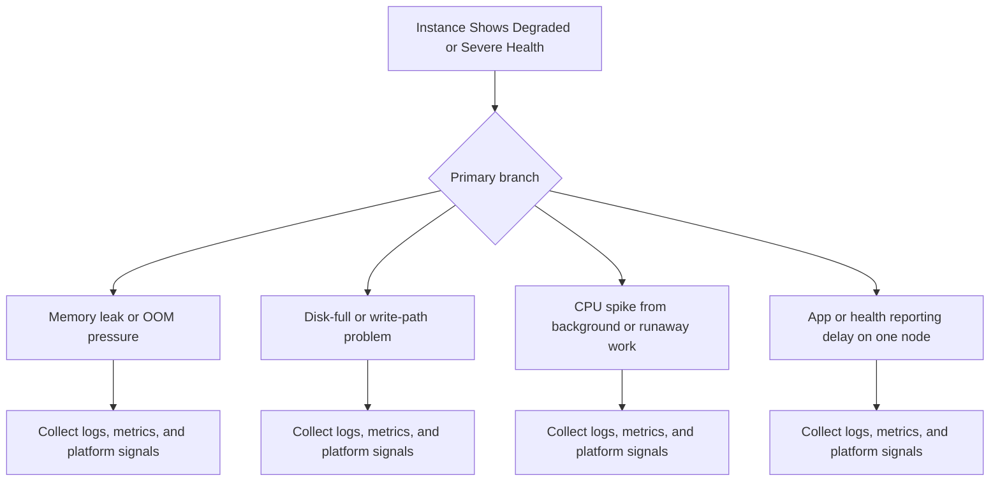
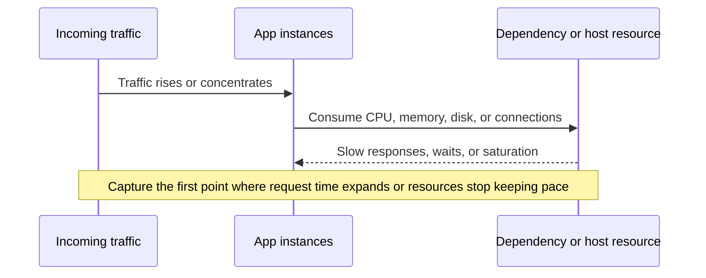

---
hide:
  - toc
---

# Instance Shows Degraded or Severe Health

## 1. Summary
One or more instances move to `Degraded` or `Severe` while other instances may stay `Ok`.



## 2. Common Misreadings
- Average latency is enough to judge user impact.
- Moderate CPU means there is no bottleneck.
- A restart proves the root cause is fixed.
- Only one slow route cannot affect the whole environment.
- Scale-out timing never matters once new instances appear.

## 3. Competing Hypotheses
- - H1: Memory leak or OOM pressure — Primary evidence should confirm or disprove whether memory leak or oom pressure.
- - H2: Disk-full or write-path problem — Primary evidence should confirm or disprove whether disk-full or write-path problem.
- - H3: CPU spike from background or runaway work — Primary evidence should confirm or disprove whether cpu spike from background or runaway work.
- - H4: App or health reporting delay on one node — Primary evidence should confirm or disprove whether app or health reporting delay on one node.

## 4. What to Check First
### Metrics
- Check one-minute TargetResponseTime and traffic in the same window.
- Check per-instance CPU, memory, and health rather than only environment averages.
- Check whether the issue appears only under concurrency or also at baseline.

### Logs
- Read `nginx/access.log` for slow requests and status codes.
- Read `web.stdout.log` for timeouts, slow paths, pool waits, or OOM clues.
- Read `nginx/error.log` when saturation reaches the proxy layer.

### Platform Signals
- Run `eb health --environment-name $ENV_NAME --refresh` to identify whether the issue is one instance or the fleet.
- Record whether health moves from `Ok` to `Warning`, `Degraded`, or `Severe`.
- Compare the incident window to one known-good baseline window.

| Signal | Normal | Abnormal | Why it matters |
| --- | --- | --- | --- |
| Tail latency | p95 and p99 remain close to baseline | p95 and p99 spike sharply and remain elevated | Shows user impact more clearly than averages |
| Host pressure | CPU, memory, and disk keep safe headroom | One or more hosts remain near saturation | Separates transient bursts from chronic pressure |
| Request-path logs | Few slow requests and no queueing signals | Timeouts, pool waits, OOM, or GC pressure appear | Shows whether performance is already failing into availability |
| Health state | Mostly `Ok` with brief `Warning` | Sustained `Warning`, `Degraded`, or `Severe` | Confirms when performance has become an incident |

## 5. Evidence to Collect
### Required Evidence
- First symptom timestamp in UTC.
- One healthy comparison sample if available.
- Relevant EB health color transitions (`Ok`, `Warning`, `Degraded`, `Severe`).
- Exact app version, platform branch, and environment name.

### Useful Context
- Whether the symptom started after deploy, config change, platform update, or traffic change.
- Whether the issue is isolated to one instance, one batch, one subnet, or the full environment.
- Any recent changes to health checks, listeners, routes, worker counts, dependencies, or deployment policy.

### CLI Investigation Commands
#### 1. Correlate latency, health, and traffic

```bash
eb health --environment-name $ENV_NAME --refresh
aws elasticbeanstalk describe-environment-health --environment-name $ENV_NAME --attribute-names All
aws cloudwatch get-metric-statistics --namespace AWS/ApplicationELB --metric-name TargetResponseTime --dimensions Name=LoadBalancer,Value=$LOAD_BALANCER_DIMENSION --statistics Average p95 --period 60 --start-time $START_TIME --end-time $END_TIME
```

Example output:

```text
instance-id           status   cause
i-xxxxxxxxxxxxxxxxx   Warning  Application requests are failing or timing out.
i-yyyyyyyyyyyyyyyyy   Ok       No data
Average: 1.42
p95: 4.87
```

!!! tip
    Use one-minute windows so spikes are not smoothed away.

#### 2. Pull proxy and application logs

```bash
eb logs --environment-name $ENV_NAME --all
aws logs start-query --log-group-name "/aws/elasticbeanstalk/$ENV_NAME/var/log/nginx/access.log" --start-time $START_EPOCH --end-time $END_EPOCH --query-string "fields @timestamp, @message | limit 20"
```

Example output:

```text
Logs were saved to /var/folders/.../logs-20260407.zip
queryId: 12345678-90ab-cdef-1234-567890abcdef
```

!!! tip
    `nginx/access.log` tells you that requests are slow; `web.stdout.log` tells you why.

#### 3. Inspect scaling and host pressure

```bash
aws autoscaling describe-scaling-activities --auto-scaling-group-name $ASG_NAME --max-items 20
aws cloudwatch get-metric-statistics --namespace AWS/EC2 --metric-name CPUUtilization --dimensions Name=AutoScalingGroupName,Value=$ASG_NAME --statistics Average Maximum --period 60 --start-time $START_TIME --end-time $END_TIME
```

Example output:

```text
Activities:
  - Description: Setting desired capacity to 8. StatusCode: Successful
Average: 71.4
Maximum: 92.1
```

!!! tip
    If scale-out starts only after p95 has already collapsed, autoscaling lag is part of the incident.


### Evidence Timeline


### Sample Log Patterns
```text
2026-04-07T14:03:11.934Z WARN request exceeded expected latency budget
2026-04-07T14:03:12.110Z ERROR connection pool timeout after 2000 ms
2026/04/07 14:03:13 [error] 4110#4110: *311 upstream timed out (110: Connection timed out) while reading response header from upstream
2026-04-07T14:03:14.220Z WARN host pressure increased on i-xxxxxxxxxxxxxxxxx
```

### CloudWatch Logs Insights Queries with Example Output
#### Query 1. Find the earliest incident evidence

```sql
fields @timestamp, @message
| filter @message like /out of memory|no space left/
| sort @timestamp asc
| limit 20
```

Example results:

| @timestamp | @message |
| --- | --- |
| 2026-04-07 09:15:06 | out of memory |
| 2026-04-07 09:15:17 | no space left |

!!! tip
    How to Read This: The first row is usually the best root-cause anchor; later rows are often downstream consequences.

#### Query 2. Find the most visible failure signatures

```sql
fields @timestamp, @message
| filter @message like /timed out|retrying dependency/
| sort @timestamp desc
| limit 20
```

Example results:

| @timestamp | @message |
| --- | --- |
| 2026-04-07 09:15:21 | timed out |
| 2026-04-07 09:15:28 | retrying dependency |

!!! tip
    How to Read This: Compare these rows with EB health color transitions and deployment or traffic timing before acting.

## 6. Validation and Disproof by Hypothesis
### H1: Memory leak or OOM pressure

Confirm:
- Logs, metrics, and platform state all point directly at this branch.
- The first failing timestamp lines up with evidence expected for `Memory leak or OOM pressure`.

Disprove:
- The expected log or state change for this branch never appears.
- Another branch has earlier, stronger, and more direct evidence.

### H2: Disk-full or write-path problem

Confirm:
- Logs, metrics, and platform state all point directly at this branch.
- The first failing timestamp lines up with evidence expected for `Disk-full or write-path problem`.

Disprove:
- The expected log or state change for this branch never appears.
- Another branch has earlier, stronger, and more direct evidence.

### H3: CPU spike from background or runaway work

Confirm:
- Logs, metrics, and platform state all point directly at this branch.
- The first failing timestamp lines up with evidence expected for `CPU spike from background or runaway work`.

Disprove:
- The expected log or state change for this branch never appears.
- Another branch has earlier, stronger, and more direct evidence.

### H4: App or health reporting delay on one node

Confirm:
- Logs, metrics, and platform state all point directly at this branch.
- The first failing timestamp lines up with evidence expected for `App or health reporting delay on one node`.

Disprove:
- The expected log or state change for this branch never appears.
- Another branch has earlier, stronger, and more direct evidence.

## 7. Likely Root Cause Patterns
- A recent change shifted the failure into this playbook's domain.
- The earliest warning was ignored and later symptoms obscured the first cause.
- A platform, configuration, or dependency assumption drifted from the known-good state.
- The environment had too little safety margin for rollout, load, or path changes.

## 8. Immediate Mitigations
1. Preserve the first-failure evidence before retrying or restarting anything.
2. Contain user impact with the smallest safe rollback, scale, or routing change.
3. Change only one suspected variable at a time and re-check health colors, logs, and metrics.
4. Confirm that the symptom, not just the dashboard noise, has improved.

## 9. Prevention
- Keep environment configuration, health checks, and rollout assumptions under version control.
- Test the same path in staging with the same platform branch and deployment policy.
- Alert on the earliest signal for this failure mode, not only the final outage symptom.
- Review baselines regularly so abnormal behavior is obvious during incidents.

## See Also
- [Troubleshooting Playbooks Hub](../index.md)
- [Health Turns Red After Successful Deploy](../deployment-availability/health-red-after-deploy.md)
- [Load Balancer Returns 5xx Errors](../networking/load-balancer-5xx.md)

## Sources
- [Elastic Beanstalk monitoring with Amazon CloudWatch](https://docs.aws.amazon.com/elasticbeanstalk/latest/dg/using-features.monitoring.html)
- [Elastic Beanstalk enhanced health reporting](https://docs.aws.amazon.com/elasticbeanstalk/latest/dg/health-enhanced.html)
- [Elastic Beanstalk logs](https://docs.aws.amazon.com/elasticbeanstalk/latest/dg/using-features.logging.html)
- [Application Load Balancer CloudWatch metrics](https://docs.aws.amazon.com/elasticloadbalancing/latest/application/load-balancer-cloudwatch-metrics.html)
