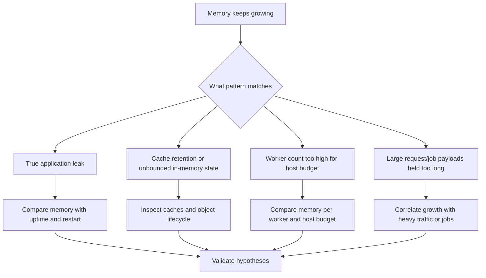

# Memory Leak Detection

## 1. Summary

Application memory usage grows with uptime until instances restart, degrade, or are killed by the kernel. This is confusing because the environment can recover temporarily after replacement, hiding the fact that the workload is fundamentally accumulating memory.



**Limitations**

-    Precise heap analysis is language-specific and may require tooling outside EB.
-    This playbook focuses on evidence patterns, not runtime-specific profiler commands.
-    Host replacement can hide long-term growth unless captured early.

**Quick Conclusion**

-    Compare memory against uptime and restarts first.
-    If new instances recover and old instances decay, assume a leak or unbounded retention pattern until disproved.

## 2. Common Misreadings

-    "High memory means more caching, so it is good." Unbounded growth is not healthy caching.
-    "Restart fixed it, so the incident is solved." Restart often only resets the timer.
-    "Scale-out removes memory risk." Leaks can replicate across more nodes.
-    "If CPU is fine, memory cannot be the issue." OOM and swap can happen without high CPU.
-    "Only app code leaks memory." Worker count and in-memory queues can mimic leaks.

## 3. Competing Hypotheses

| ID | Hypothesis | Mechanism | Predictive Signal |
|---|---|---|---|
| H1 | True application leak | Objects are retained unintentionally across requests | RSS grows with uptime and resets on restart |
| H2 | Unbounded cache or in-memory state | Cache/session/object store grows without eviction | Memory increases with traffic volume and does not plateau |
| H3 | Worker count exceeds safe memory budget | Per-worker overhead exhausts RAM under moderate load | Reducing workers lowers memory pressure quickly |
| H4 | Large request/job payload retention | Specific endpoints or jobs hold data too long | Memory spikes align with heavy operations |

## 4. What to Check First

1. Compare memory on old versus new instances.

```bash
aws ec2 describe-instances --instance-ids $INSTANCE_ID $HEALTHY_INSTANCE_ID
free -m
top
```

2. Pull logs for OOM or repeated restart evidence.

```bash
eb logs --environment-name $ENV_NAME --all
sudo less /var/log/web.stdout.log
```

3. Check health and rollout behavior.

```bash
aws elasticbeanstalk describe-instances-health --environment-name $ENV_NAME --attribute-names All
```

4. Review worker and runtime configuration.

```bash
aws elasticbeanstalk describe-configuration-settings \
    --application-name $APP_NAME \
    --environment-name $ENV_NAME
```

## 5. Evidence to Collect

### Required Evidence

-    Memory snapshot from an old degraded instance and a new healthy one.
-    Uptime/launch time for both instances.
-    App logs showing OOM, restart, or large-request patterns.
-    Current worker/process counts.

### Useful Context

-    Recent features that introduced caching, batching, or file processing.
-    Traffic patterns that correlate with growth.
-    Whether memory stabilizes or only ever increases.

### CLI Investigation Commands

```bash
aws ec2 describe-instances --instance-ids $INSTANCE_ID $HEALTHY_INSTANCE_ID
aws elasticbeanstalk describe-instances-health --environment-name $ENV_NAME --attribute-names All
aws elasticbeanstalk describe-configuration-settings \
    --application-name $APP_NAME \
    --environment-name $ENV_NAME
```

### CloudWatch Logs Insights Queries

```sql
fields @timestamp, @message
| filter @message like /OutOfMemory|Killed process|heap|memory|GC/
| sort @timestamp asc
| limit 100
```

## 6. Validation and Disproof by Hypothesis

### H1. True application leak

#### Evidence that SUPPORTS

| Evidence | Why it supports H1 |
|---|---|
| RSS grows monotonically with uptime | Retention is not bounded |
| Restart resets memory and health temporarily | Leak is time-dependent |

#### Evidence that DISPROVES

| Evidence | Why it disproves H1 |
|---|---|
| Memory plateaus after warmup | Growth may be expected cache warmup |
| New nodes saturate immediately regardless of uptime | Not a classic leak |

#### Validation Commands

```bash
free -m
top
sudo less /var/log/web.stdout.log
```

#### Normal vs Abnormal

| Signal | Normal | Abnormal |
|---|---|---|
| Memory curve | Warmup then plateau | Continuous growth with uptime |
| Restart effect | Similar steady-state memory returns | Memory drops sharply then regrows |

### H2. Unbounded cache or in-memory state

#### Evidence that SUPPORTS

| Evidence | Why it supports H2 |
|---|---|
| Growth follows traffic or cacheable workload volume | State retention is workload-driven |
| No eviction or TTL behavior is evident | Cache can only grow |

#### Evidence that DISPROVES

| Evidence | Why it disproves H2 |
|---|---|
| Cache footprint is capped and stable | Not unbounded state |
| Growth continues even without cache-heavy traffic | Look elsewhere |

#### Validation Commands

```bash
sudo less /var/log/web.stdout.log
aws cloudwatch get-metric-statistics --namespace AWS/ApplicationELB --metric-name RequestCount --dimensions Name=LoadBalancer,Value=$LOAD_BALANCER_DIMENSION --statistics Sum --period 60 --start-time $START_TIME --end-time $END_TIME
```

#### Normal vs Abnormal

| Signal | Normal | Abnormal |
|---|---|---|
| Cache behavior | Bounded memory footprint | Traffic-correlated growth without plateau |
| State lifecycle | Eviction or TTL visible | Ever-growing in-memory dataset |

### H3. Worker count exceeds safe memory budget

#### Evidence that SUPPORTS

| Evidence | Why it supports H3 |
|---|---|
| Memory pressure improves after reducing workers | Host budget was overcommitted |
| Per-worker overhead is large relative to instance RAM | Concurrency model is too aggressive |

#### Evidence that DISPROVES

| Evidence | Why it disproves H3 |
|---|---|
| Conservative worker count still leaks memory over time | Leak is in application state |
| Memory pressure is isolated to one request type | Not worker baseline overhead |

#### Validation Commands

```bash
aws elasticbeanstalk describe-configuration-settings \
    --application-name $APP_NAME \
    --environment-name $ENV_NAME
free -m
```

#### Normal vs Abnormal

| Signal | Normal | Abnormal |
|---|---|---|
| Worker baseline | Fits host memory budget | Idle baseline already too high |
| Tuning effect | Minor changes only | Significant relief after worker reduction |

### H4. Large request/job payload retention

#### Evidence that SUPPORTS

| Evidence | Why it supports H4 |
|---|---|
| Memory spikes align with file-processing or heavy endpoints | Payload lifecycle is too long |
| Growth is workload-event-driven, not just uptime-driven | Specific operation retains memory |

#### Evidence that DISPROVES

| Evidence | Why it disproves H4 |
|---|---|
| Growth continues during light traffic | Heavy payloads are not necessary to reproduce |
| No heavy jobs correlate with spikes | Another pattern dominates |

#### Validation Commands

```bash
sudo less /var/log/web.stdout.log
aws cloudwatch get-metric-statistics --namespace AWS/ApplicationELB --metric-name RequestCount --dimensions Name=LoadBalancer,Value=$LOAD_BALANCER_DIMENSION --statistics Sum --period 60 --start-time $START_TIME --end-time $END_TIME
```

#### Normal vs Abnormal

| Signal | Normal | Abnormal |
|---|---|---|
| Heavy request impact | Temporary increase then recovery | Large operations leave lasting memory growth |
| Traffic-memory link | Weak or bounded | Strong correlation with heavy jobs/endpoints |

## 7. Likely Root Cause Patterns

| Trigger | Root Cause | Evidence | Fix |
|---|---|---|---|
| Long runtime on same instance | True leak | Uptime-correlated RSS growth | Fix object lifecycle and add leak tests |
| New caching feature | Unbounded memory state | Traffic-correlated growth | Add eviction and move cache externally if needed |
| Aggressive concurrency change | Worker memory overcommit | Relief after reducing workers | Tune workers to available RAM |
| Heavy file/report workflow | Payload retention | Spikes tied to specific operations | Stream, chunk, or offload work |

## 8. Immediate Mitigations

1. Increase temporary capacity and rotate the worst instances only after capturing evidence.

2. Reduce worker count if baseline memory is clearly too high.

3. Disable or throttle the heaviest endpoints/jobs if they accelerate growth.

4. Shorten exposure by recycling instances under controlled conditions while the fix is prepared.

## 9. Prevention

1. Add long-duration soak tests focused on memory growth.
2. Keep in-memory caches bounded with explicit TTL or eviction.
3. Review worker memory budgets before concurrency changes.
4. Track per-instance uptime versus memory pressure in operational dashboards.
5. Add language-specific leak profiling to staging and incident response.

## See Also

-    [CPU or Memory Consistently at Capacity](./cpu-memory-exhaustion.md)
-    [Instance Shows Degraded or Severe Health](./instance-degraded-health.md)
-    [High Latency Under Load](./high-latency-under-load.md)

## Sources

-    https://docs.aws.amazon.com/elasticbeanstalk/latest/dg/health-enhanced.html
-    https://docs.aws.amazon.com/elasticbeanstalk/latest/dg/using-features.logging.html
-    https://docs.aws.amazon.com/elasticbeanstalk/latest/dg/using-features.monitoring.html
