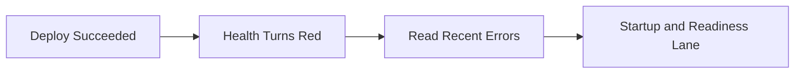
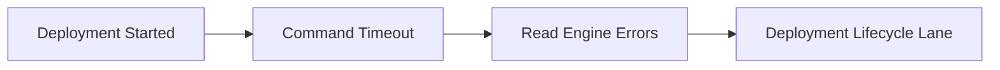
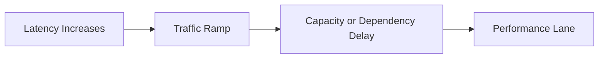
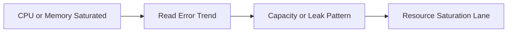
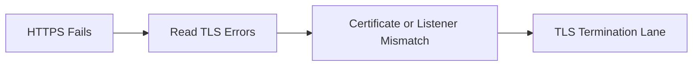

# Quick Diagnosis Cards

One-page reference cards for rapid incident triage. Each card maps: **Symptom → First Query → Platform Segment → Playbook**.

Use these when you have 60 seconds to identify the failure category.

## Card 1: Health Turns Red After Deployment



| Symptom | First Query | What to Look For | Platform Segment | Playbook |
|---|---|---|---|---|
| Health changes to red immediately after a successful deployment | <code>fields @timestamp, @message<br>&#124; filter @message like /error&#124;failed&#124;timeout/<br>&#124; sort @timestamp desc<br>&#124; limit 50</code> | Startup exceptions, failed health checks, readiness timeout, dependency connection errors | Instance startup and load balancer readiness boundary | [Health Turns Red After Deployment](./playbooks/deployment-availability/health-red-after-deploy.md) |

```bash
aws elasticbeanstalk describe-environment-health \
    --environment-name "$ENV_NAME" \
    --attribute-names "Status" "Color" "Causes" "InstancesHealth"

aws elasticbeanstalk describe-events \
    --environment-name "$ENV_NAME" \
    --max-records 50
```

## Card 2: Deployment Failed (Command Timeout)



| Symptom | First Query | What to Look For | Platform Segment | Playbook |
|---|---|---|---|---|
| Deployment stalls and fails with timeout or rollback events | <code>fields @timestamp, @message<br>&#124; filter @message like /error&#124;failed&#124;timeout/<br>&#124; sort @timestamp desc<br>&#124; limit 50</code> | Long-running hook commands, package install failures, Procfile startup timeout, repeated non-zero exit messages | Deployment engine, platform hooks, and application startup | [Deployment Failed](./playbooks/deployment-availability/deployment-failed.md) |

```bash
aws elasticbeanstalk describe-events \
    --environment-name "$ENV_NAME" \
    --max-records 100

aws elasticbeanstalk request-environment-info \
    --environment-name "$ENV_NAME" \
    --info-type "tail"
```

## Card 3: Load Balancer 5xx Errors


| Symptom | First Query | What to Look For | Platform Segment | Playbook |
|---|---|---|---|---|
| Users receive 502, 503, or 504 responses through the load balancer | <code>fields @timestamp, @message<br>&#124; filter @message like /error&#124;failed&#124;timeout/<br>&#124; sort @timestamp desc<br>&#124; limit 50</code> | Upstream timeout, target connection reset, unhealthy target messages, proxy or app 5xx bursts | Load balancer, target group, and proxy-to-app path | [Load Balancer 5xx Errors](./playbooks/networking/load-balancer-5xx.md) |

```bash
aws elbv2 describe-target-health \
    --target-group-arn "$TARGET_GROUP_ARN"

aws cloudwatch get-metric-statistics \
    --namespace "AWS/ApplicationELB" \
    --metric-name "HTTPCode_ELB_5XX_Count" \
    --dimensions Name=LoadBalancer,Value="$LOAD_BALANCER_DIMENSION" \
    --statistics Sum \
    --period 60 \
    --start-time "$START_TIME" \
    --end-time "$END_TIME"
```

## Card 4: High Latency Under Load



| Symptom | First Query | What to Look For | Platform Segment | Playbook |
|---|---|---|---|---|
| p95 and p99 latency rise sharply during traffic increases | <code>fields @timestamp, @message<br>&#124; filter @message like /error&#124;failed&#124;timeout/<br>&#124; sort @timestamp desc<br>&#124; limit 50</code> | Timeout bursts, queue wait messages, slow downstream calls, worker saturation, scale-out lag | Auto Scaling, instance capacity, and dependency response path | [High Latency Under Load](./playbooks/performance/high-latency-under-load.md) |

```bash
aws cloudwatch get-metric-statistics \
    --namespace "AWS/ApplicationELB" \
    --metric-name "TargetResponseTime" \
    --dimensions Name=LoadBalancer,Value="$LOAD_BALANCER_DIMENSION" \
    --statistics Average p95 p99 \
    --period 60 \
    --start-time "$START_TIME" \
    --end-time "$END_TIME"

aws autoscaling describe-scaling-activities \
    --auto-scaling-group-name "$ASG_NAME" \
    --max-items 20
```

## Card 5: Instance Health Degraded


| Symptom | First Query | What to Look For | Platform Segment | Playbook |
|---|---|---|---|---|
| One or more instances show degraded or severe health while others may stay green | <code>fields @timestamp, @message<br>&#124; filter @message like /error&#124;failed&#124;timeout/<br>&#124; sort @timestamp desc<br>&#124; limit 50</code> | Per-instance crash loops, health agent timeouts, disk pressure, process restart patterns | EC2 host state, enhanced health agent, and local application process | [Instance Health Degraded](./playbooks/performance/instance-degraded-health.md) |

```bash
aws elasticbeanstalk describe-instances-health \
    --environment-name "$ENV_NAME" \
    --attribute-names "All"

aws elasticbeanstalk describe-environment-health \
    --environment-name "$ENV_NAME" \
    --attribute-names "Causes" "InstancesHealth"
```

## Card 6: CPU/Memory Exhaustion



| Symptom | First Query | What to Look For | Platform Segment | Playbook |
|---|---|---|---|---|
| Instances remain near CPU or memory limits and health or latency worsens | <code>fields @timestamp, @message<br>&#124; filter @message like /error&#124;failed&#124;timeout/<br>&#124; sort @timestamp desc<br>&#124; limit 50</code> | OOM messages, GC pressure, swap activity symptoms, worker overcommit, sustained saturation | EC2 resource envelope and application worker model | [CPU/Memory Exhaustion](./playbooks/performance/cpu-memory-exhaustion.md) |

```bash
aws cloudwatch get-metric-statistics \
    --namespace "AWS/EC2" \
    --metric-name "CPUUtilization" \
    --dimensions Name=AutoScalingGroupName,Value="$ASG_NAME" \
    --statistics Average Maximum \
    --period 60 \
    --start-time "$START_TIME" \
    --end-time "$END_TIME"

aws elasticbeanstalk describe-configuration-settings \
    --application-name "$APP_NAME" \
    --environment-name "$ENV_NAME"
```

## Card 7: VPC Connectivity Issues


| Symptom | First Query | What to Look For | Platform Segment | Playbook |
|---|---|---|---|---|
| Instances cannot reach dependencies or inbound traffic cannot reach the application path | <code>fields @timestamp, @message<br>&#124; filter @message like /error&#124;failed&#124;timeout/<br>&#124; sort @timestamp desc<br>&#124; limit 50</code> | Connection timeout, DNS lookup failure, route mismatch, denied network path, missing NAT or endpoint | Subnets, route tables, NAT, security groups, and network ACLs | [VPC Connectivity Issues](./playbooks/networking/vpc-connectivity-issues.md) |

```bash
aws ec2 describe-route-tables \
    --filters Name=association.subnet-id,Values="$SUBNET_ID_1","$SUBNET_ID_2"

aws ec2 describe-security-groups \
    --group-ids "$ALB_SECURITY_GROUP_ID" "$INSTANCE_SECURITY_GROUP_ID"
```

## Card 8: HTTPS/SSL Termination Problems



| Symptom | First Query | What to Look For | Platform Segment | Playbook |
|---|---|---|---|---|
| Browser TLS warnings, HTTPS handshake failures, or missing redirect to HTTPS | <code>fields @timestamp, @message<br>&#124; filter @message like /error&#124;failed&#124;timeout/<br>&#124; sort @timestamp desc<br>&#124; limit 50</code> | Certificate validation problems, wrong domain served, missing 443 listener, broken redirect path, unhealthy HTTPS targets | ACM certificate, ALB listener, redirect rule, and target health protocol | [HTTPS/SSL Termination Problems](./playbooks/networking/https-termination-issues.md) |

```bash
aws acm describe-certificate \
    --certificate-arn "$CERTIFICATE_ARN"

aws elbv2 describe-listeners \
    --load-balancer-arn "$LOAD_BALANCER_ARN"
```

## See Also

-    [Troubleshooting Hub](./index.md)
-    [Troubleshooting Decision Tree](./decision-tree.md)
-    [Troubleshooting Mental Model](./mental-model.md)
-    [First 10 Minutes](./first-10-minutes/index.md)
-    [Troubleshooting Method](./methodology/troubleshooting-method.md)
-    [Playbooks Hub](./playbooks/index.md)

## Sources

-    https://docs.aws.amazon.com/elasticbeanstalk/latest/dg/troubleshooting.html
-    https://docs.aws.amazon.com/elasticbeanstalk/latest/dg/using-features.logging.html
-    https://docs.aws.amazon.com/elasticbeanstalk/latest/dg/health-enhanced.html
-    https://docs.aws.amazon.com/elasticbeanstalk/latest/dg/using-features.managing.elb.html
-    https://docs.aws.amazon.com/elasticbeanstalk/latest/dg/using-features.managing.vpc.html
-    https://docs.aws.amazon.com/elasticbeanstalk/latest/dg/configuring-https-elb.html
